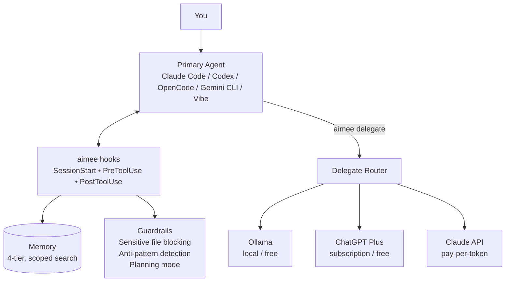

# aimee

**One front end for every AI coding tool. Memory, code intelligence, and cheaper
delegates that travel with you. Any model, any provider.**

aimee can sit in the path between you and your AI, or beside it. Route every turn
through aimee — point your tool's OpenAI- or Anthropic-compatible API at it, and it
runs the turn on any model: Claude, GPT, Gemini, Mistral, MiniMax, a local model,
or any compatible endpoint. Or attach aimee beside your tool over MCP, ACP, or a
plugin, where your tool keeps its own model and aimee adds memory, delegates, and
guardrails as tools and hooks. Both work with Claude Code, Codex, OpenCode, Gemini
CLI, and the built-in webchat. Your memory and context come with you, so switching
never starts from zero and never locks you to a vendor.

It does far more than remember:

- **Memory that compounds.** Every session starts already knowing what the last one
  learned. A curator pipeline distills facts into a typed knowledge base that scales
  from one developer to a whole company. See [How aimee learns](docs/KNOWLEDGE.md).
- **Code intelligence.** aimee indexes your codebase into a searchable symbol and
  call graph, so the AI can find callers, trace an edit's blast radius before it
  writes, and work from your code instead of re-reading it every session. Cross-repo
  indexing, one dependency graph spanning every repo you work across, lands shortly;
  see the
  [cross-repo dependency graph proposal](docs/proposals/pending/cross-repo-dependency-graph.md).
- **Delegates that cut your bill.** Route summarization, review, and boilerplate to
  the cheapest capable model. Local (Ollama) and subscription delegates cost nothing
  extra, and the primary agent gets back a compact result instead of raw content.
- **Cross-agent orchestration.** Hand aimee a written proposal and it runs the whole
  job unattended: design, plan, implement, review, PR. The primary agent manages and
  the delegates do the work.
- **Guardrails and isolation.** Sensitive files are blocked before the AI touches
  them, and every session runs in its own git worktree, so parallel work never
  collides.

Core services are C, sub-10ms, with no cloud dependencies.

## The problem

Every AI session starts from scratch. Your tool doesn't remember your
infrastructure, your preferences, your past mistakes, or what it did five minutes
ago in another session. You spend tokens re-explaining context, re-discovering your
codebase, and correcting the same errors again and again.

Nothing stops it from overwriting your `.env`, editing production configs, or
clobbering another session's work.

## What aimee does

aimee runs as a local server your tools connect to. In the path it runs your turns
over the OpenAI- or Anthropic-compatible ingress; beside your tool it intercepts
actions through hooks, MCP, ACP, and plugins. The CLI is `aimee`; browser chat is
`aimee-webchat`.



### Memory and a knowledge base that learns

A 4-tier memory system tracks project context, infrastructure, preferences, and
past outcomes. Facts are deduplicated, contradictions are detected, and stale
information decays. Every session starts already knowing what matters.

A curator pipeline extracts, synthesizes, judges, and promotes that into a typed
graph, and reflects on idle time to improve it. Point a team at a shared `aimee-kb`
and the whole team shares one knowledge base, across every domain.
See [How aimee learns](docs/KNOWLEDGE.md).

### Guardrails

Before every edit, aimee classifies the target. Sensitive files (`.env`,
credentials, private keys) are blocked before the AI touches them. Known
anti-patterns trigger warnings. Planning mode locks all writes until you're ready.

### Delegation that cuts your bill

Route summarization, formatting, review, and boilerplate to cheaper models. The
primary agent gets a compact result instead of raw content, so you save on the
delegate and on the primary's context. Local models (Ollama) cost nothing;
subscription delegates (ChatGPT Plus, `mistral-plan`) cost nothing extra. The
router picks the cheapest delegate that can do the job, and tracks cost and success
per delegate so routing improves over time.

```bash
aimee delegate review "Review this PR"     # routes to cheapest capable delegate
aimee delegate code --tools "Add tests"    # delegate with file read/write access
```

### Session isolation

Each session gets its own git worktree, state file, and branch. Run two in
parallel and they never clobber each other. Read-only delegates inspect the parent
worktree directly; write-capable delegates get isolated sibling worktrees.

### Any model behind your front end

aimee-server speaks the same wire formats your tools use, so you can point a tool's
front end at aimee and run every turn on aimee's configured primary model instead of
the tool's built-in vendor. The tool keeps owning its prompt, history, and tools;
aimee translates the wire format and swaps the model. Switch with
`aimee primary <agent>`; `GET /v1/models` lists what's selectable.

```bash
# Claude Code on any model (Anthropic Messages ingress):
aimee claude-proxy enable http://127.0.0.1:8910 <server-bearer>
ANTHROPIC_BASE_URL=http://127.0.0.1:8910 ANTHROPIC_AUTH_TOKEN=<bearer> claude
```

Codex (OpenAI Responses), OpenCode, and any OpenAI-compatible client work the same
way. Provider config is in the
[Technical Reference](src/README.md#deployment-and-operations) and the
[Manual](MANUAL.md#25-integrations). The memory, guardrails, and delegation are the
same on every front end, because they live in the server and KB, not the tool.

## Works with what you already use

| Tool | Integration | Run on any model | Setup |
|------|------------|------------------|-------|
| Claude Code | Full hook support + MCP | Yes, via the Anthropic ingress (`/v1/messages`) | `./install.sh` / `aimee claude-proxy enable` |
| Codex CLI | Full hook support + MCP + local plugin | Yes, via the OpenAI Responses ingress (`/v1/responses`) | `./install.sh` |
| OpenCode | TUI front end (`opencode attach`) | Yes, via the OpenAI-compatible ingress | `./install.sh` |
| Gemini CLI | Full hook support | Provider CLI | `./install.sh` |
| Mistral Vibe | Provider-CLI primary and subscription-plan delegates | Provider CLI | `aimee agent add <name> <endpoint> <model> --provider mistral` |
| GitHub Copilot | MCP server | Via the OpenAI-compatible model | `./install.sh` |
| VS Code | MCP tools in Copilot Chat, an ACP agent (`aimee acp-serve`), or aimee as an OpenAI-compatible model | Yes, via `/v1/chat/completions` or ACP | [VS Code guide](docs/VSCODE.md) |

Switch tools any time. Your memory and context stay.

## Why use aimee

- **Never start from zero.** Memory and context persist across sessions and tools,
  and compound into a knowledge base.
- **No lock-in.** Run any turn on any provider's model; switch with one command.
- **Lower bills.** Cheapest-capable delegate routing keeps the primary's context
  small; local and subscription delegates cost nothing extra.
- **Fewer mistakes.** Sensitive-file blocking, anti-pattern warnings, and planning
  mode catch problems before the AI writes them.
- **Team knowledge.** One shared KB distills what your whole organization knows.
- **Fast, local, private.** C services, sub-10ms hot paths, no cloud dependencies.

## Get started

aimee is a few services plus a thin client. Run the services in Docker (one
combined container) and install only the `aimee` CLI on each developer machine,
pointed at the server.

```bash
# 1. Run the stack (server + kb + Postgres + embedder)
git clone https://github.com/RakuenSoftware/aimee.git
cd aimee
docker compose -f compose.combined.yaml up --build -d

# 2. Confirm it's live (default bearer: aimee-local-dev; -k accepts the self-signed cert)
curl -k -H 'Authorization: Bearer aimee-local-dev' https://localhost:8743/v1/health
```

Then install the thin client (prebuilt Linux/macOS/Windows binaries ship with each
release), point it at the server with `aimee remote set https://host:8743 <token>`
(the server's `/v1` is TLS-only off-loopback with a self-signed cert, so set
`AIMEE_TLS_INSECURE=1` or trust the cert),
and register your tool's hooks with `./configure-hooks.sh`.

The [Quickstart](docs/QUICKSTART.md) walks the Docker server and thin-client setup
step by step. Every deployment topology, the from-source install, remote operation,
scaling, and performance live in
[Deployment and operations](src/README.md#deployment-and-operations).

## Quick start

```bash
# Store a fact the AI remembers across sessions
aimee memory store myhost "PVE at 10.0.0.1" --tier L2 --kind fact

# Search memory
aimee memory search "proxmox"

# Delegate routine work to a cheaper model
aimee delegate review "Review this PR for security issues"

# Scratch state for the current session
aimee wm set current-task "Review PR for security issues"

# Health
aimee status
```

## Documentation

| Document | Description |
|----------|-------------|
| [Quickstart](docs/QUICKSTART.md) | Run the combined server in Docker, then install the Linux/Windows/macOS thin client. |
| [How aimee learns](docs/KNOWLEDGE.md) | The knowledge base, self-learning pipeline, cross-domain synthesis, and delegation economics. |
| [kb LLM backends](docs/KB_LLM_BACKENDS.md) | Pointing aimee-kb at its embedding/reranking/synthesis backend (CPU/GPU `aimee-llm` container or external), the config surface, and tiers/dims. |
| [Manual](MANUAL.md) | Full user reference: install, config, command contract, feature guides. |
| [Architecture](docs/ARCHITECTURE.md) | Processes, storage/trust boundaries, layering, request lifecycles. |
| [Technical Reference](src/README.md) | Code internals, module map, server internals, RPC/HTTP surfaces, build system, and deployment/operations. |

Focused references:

| Document | Description |
|----------|-------------|
| [Command Reference](docs/COMMANDS.md) | Client command contract, flags, and options |
| [Storage Tiers](docs/STORAGE_TIERS.md) | DB1 + DB2 ownership boundaries (pgvector inside DB2) |
| [Structured PDF](docs/STRUCTURED_PDF.md) | Coordinate-anchored PDF evidence: text+geometry citations, table cells, visual crops, and OCR — the capability flags, retrieval surface, and access model |
| [Setting Up Delegates](docs/DELEGATES.md) | Configure delegate agents for task offloading |
| [Autonomous Development](docs/AUTONOMOUS_DEVELOPMENT.md) | Hand aimee a proposal; it builds the change end-to-end via the workflow engine |
| [Personas](docs/personas.md) | Built-in and custom agent identities, delegate policy, and how personas staff reviews |
| [Workflows](docs/WORKFLOWS.md) | The composable dev-lifecycle workflow engine, block catalog, and authoring |
| [Workspace Management](docs/WORKSPACES.md) | Multi-repo workspaces and session isolation |
| [Security Model](docs/SECURITY.md) | Threat model, trust boundaries, capability system |
| [Benchmarks](docs/BENCHMARKS.md) | Latency measurements and performance budget |
| [Compatibility](docs/COMPATIBILITY.md) | Supported OS, shell, and provider matrix |
| [VS Code Integration](docs/VSCODE.md) | Wire aimee into VS Code via MCP tools or as an OpenAI-compatible model |
| [Feature Status](docs/STATUS.md) | Implementation status of all features |

## License

aimee is Copyright (C) 2026 The aimee authors and is licensed under the
**GNU Affero General Public License v3.0** (AGPL-3.0). See [LICENSE](LICENSE) and
[NOTICE](NOTICE).

If the AGPL doesn't suit you, other licensing can be discussed. For commercial or
alternative terms, contact the aimee authors at <jbailes@gmail.com>.

Bundled third-party components (cJSON and the generated SDKs under `api/sdks/`) are
licensed separately; see [NOTICE](NOTICE).
