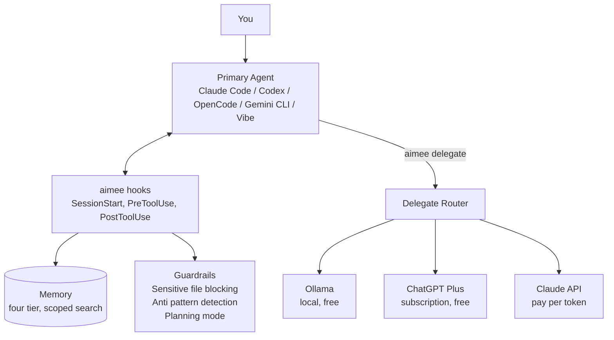

# aimee

**Your AI has no memory, no map of your code, and no brakes. Every session it starts blind,
bills you to relearn your repo, and can still overwrite your `.env`.**

**aimee fixes all of it, and goes further.** One memory across every tool. Your whole
codebase as a live graph. Any model, any provider. Cheap delegates for the grunt work.
Guardrails it cannot write past. Hand it a proposal and it ships the change itself: design,
build, review, PR. Your context follows you anywhere. Nothing locks you in.

The memory and the code index are a **hybrid vector-graph**: vector recall fused with a typed
knowledge graph and your code's call graph, ranked together. That is why it surfaces what the
plain vector search behind most AI memory misses, the caller three files away, the decision
from another session, the constraint that never shared a keyword with your query.

Point any tool's OpenAI or Anthropic compatible API at aimee and it runs the turn on any
model reachable over that wire: Claude, GPT, Gemini, Mistral, MiniMax, a model on your own
GPU, or any other OpenAI or Anthropic compatible provider. Or run aimee beside your tool over
MCP, ACP, or a plugin, where the tool keeps its own model and aimee adds the memory,
delegates, and guardrails as tools and hooks. If it speaks the Anthropic or OpenAI API, MCP,
or ACP, it works: Claude Code, Codex, OpenCode, Gemini CLI, aimee's own webchat, and anything
else on those protocols. Switch tools whenever you like. Your memory and context come with
you.

Core services are C, hot paths run in single digit milliseconds, and nothing phones home.

## What you get

**Memory that compounds.** Every session starts already knowing what the last one learned.
A curator pipeline distills raw sessions into a typed knowledge base, dedupes facts, flags
contradictions, and lets stale detail decay. Point a team at one shared kb and everyone
works from the same institutional memory. See [How aimee learns](docs/KNOWLEDGE.md).

**Your codebase as a map.** aimee indexes your code into a symbol and call graph. The AI
finds callers, traces an edit's blast radius before it writes a line, and works from the
graph instead of reading your files over again each session. The graph spans repositories, so one
dependency map covers every repo you work across.

**Delegates that cut the bill.** Send summarization, review, and boilerplate to the cheapest
model that can handle it. Local models on your GPU cost nothing. Subscription delegates like
ChatGPT Plus or a Mistral plan cost nothing extra. The primary agent gets a compact result
back instead of raw content, so you save twice, on the delegate and on the primary's
context. aimee also compresses what each turn sends upstream, so even your main model's bill
drops. It tracks cost and success per delegate and routes better over time.

**Run the models yourself.** aimee ships a self hosted inference stack: embeddings,
reranking, and synthesis baked into one CPU or GPU container. The knowledge base curates entirely
on your hardware with no outside API calls, and the same local model doubles as a free
delegate. Swap the model tier with a single image, or run the CPU build for retrieval on any
box. See [kb LLM backends](docs/KB_LLM_BACKENDS.md).

**Autonomous development.** Hand aimee a written proposal and it runs the job unattended:
design, plan, implement, review, open the PR. The primary agent manages, a panel of models
reviews the work, and the delegates do the building. See
[Autonomous Development](docs/AUTONOMOUS_DEVELOPMENT.md).

**Guardrails and isolation.** Sensitive files like `.env`, private keys, and production
configs are blocked before the AI can touch them. Known anti patterns raise warnings.
Planning mode freezes every write until you are ready. Each session runs in its own git
worktree, so two sessions never step on each other.

## The problem

Every AI session starts blank. Your tool does not remember your infrastructure, your
preferences, your past mistakes, or what it did five minutes ago in another window. You
spend tokens explaining context again, mapping your own codebase again, and correcting the
same errors over and over.

And nothing stops it from overwriting your `.env`, editing a production config, or
clobbering another session's work.

## What aimee does

aimee runs as a local server your tools connect to. In the path, it runs your turns over the
OpenAI or Anthropic compatible ingress. Beside your tool, it intercepts actions through
hooks, MCP, ACP, and plugins. The CLI is `aimee`. Browser chat is `aimee-webchat`.



### Memory and a knowledge base that learns

A four tier memory system tracks project context, infrastructure, preferences, and past
outcomes. Facts are deduplicated, contradictions are detected, and stale information decays.
Every session starts already knowing what matters.

A curator pipeline extracts, synthesizes, judges, and promotes that into a typed graph, and
reflects on idle time to improve it. Point a team at a shared `aimee-kb` and the whole team
shares one knowledge base, across every domain. See [How aimee learns](docs/KNOWLEDGE.md).

### Code intelligence

aimee builds a searchable symbol and call graph of your code, so the AI can find every
caller of a function, trace what an edit will touch before it writes, and answer from the
graph instead of reading the files over again. The graph is cross repo: one dependency map spans every
repository you work across, so a change in a shared library shows its blast radius in the
services that consume it. See [Code intelligence](docs/CODE_INTELLIGENCE.md).

### Guardrails

Before every edit, aimee classifies the target. Sensitive files like `.env`, credentials,
and private keys are blocked before the AI touches them. Known anti patterns trigger
warnings. Planning mode locks all writes until you are ready.

### Delegation that cuts your bill

Route summarization, formatting, review, and boilerplate to cheaper models. The primary
agent gets a compact result instead of raw content, so you save on the delegate and on the
primary's context. Local models (Ollama, or aimee's own GPU synth) cost nothing.
Subscription delegates (ChatGPT Plus, a Mistral plan) cost nothing extra. The router picks
the cheapest delegate that can do the job, and tracks cost and success per delegate so
routing improves over time. Every turn is also compressed on the way upstream, which trims
the primary model's bill on top of the delegate savings.

```bash
aimee delegate review "Review this PR"     # routes to cheapest capable delegate
aimee delegate code --tools "Add tests"    # delegate with file read/write access
```

### Run your own inference

aimee ships the retrieval and synthesis stack as one container: a Vulkan llama.cpp runtime
serving embeddings, reranking, and synthesis from models baked into the image. Run it on a
GPU and the knowledge base curates locally with no API calls, and the local model registers
as a free delegate the roundtable and the primary can call. Three tiers cover the range: a
CPU build for retrieval on any host, and two GPU builds whose synth model you pick with a
single image swap, no re-embed. See [kb LLM backends](docs/KB_LLM_BACKENDS.md) and
[synth tiers](docs/AIMEE_KB_SYNTH_TIERS.md).

### Session isolation

Each session gets its own git worktree, state file, and branch. Run two in parallel and they
never clobber each other. Read only delegates inspect the parent worktree directly. Write
capable delegates get isolated sibling worktrees.

### Any model behind your front end

aimee-server speaks the same wire formats your tools use, so you can point a tool's front end
at aimee and run every turn on aimee's configured primary model instead of the tool's built
in vendor. The tool keeps owning its prompt, history, and tools. aimee translates the wire
format and swaps the model. Switch with `aimee primary <agent>`. `GET /v1/models` lists what
is selectable.

```bash
# Claude Code on any model (Anthropic Messages ingress):
aimee claude-proxy enable http://127.0.0.1:8910 <server-bearer>
ANTHROPIC_BASE_URL=http://127.0.0.1:8910 ANTHROPIC_AUTH_TOKEN=<bearer> claude
```

Codex (OpenAI Responses), OpenCode, and any OpenAI compatible client work the same way.
Provider config is in the
[Technical Reference](src/README.md#deployment-and-operations) and the
[Manual](MANUAL.md#25-integrations). The memory, guardrails, and delegation are the same on
every front end, because they live in the server and kb, not the tool.

## Works with what you already use

| Tool | Integration | Run on any model | Setup |
|------|------------|------------------|-------|
| Claude Code | Full hook support, MCP | Yes, via the Anthropic ingress (`/v1/messages`) | `./install.sh` or `aimee claude-proxy enable` |
| Codex CLI | Full hook support, MCP, local plugin | Yes, via the OpenAI Responses ingress (`/v1/responses`) | `./install.sh` |
| OpenCode | TUI front end (`opencode attach`) | Yes, via the OpenAI compatible ingress | `./install.sh` |
| Gemini CLI | Full hook support | Provider CLI | `./install.sh` |
| Mistral Vibe | Provider CLI primary and subscription plan delegates | Provider CLI | `aimee agent add <name> <endpoint> <model> --provider mistral` |
| GitHub Copilot | MCP server | Via the OpenAI compatible model | `./install.sh` |
| VS Code | MCP tools in Copilot Chat, an ACP agent (`aimee acp-serve`), or aimee as an OpenAI compatible model | Yes, via `/v1/chat/completions` or ACP | [VS Code guide](docs/VSCODE.md) |

These are the common ones. Anything that speaks the Anthropic or OpenAI API, MCP, or ACP
works the same way. Switch tools any time. Your memory and context stay.

## Why use aimee

- **Never start from zero.** Memory and context persist across sessions and tools, and
  compound into a knowledge base.
- **No lock-in.** Run any turn on any provider's model, or your own, and switch with one
  command.
- **Lower bills.** Cheapest capable delegate routing keeps the primary's context small,
  upstream compression trims every turn, and local and subscription delegates cost nothing
  extra.
- **Fewer mistakes.** Sensitive file blocking, anti pattern warnings, and planning mode
  catch problems before the AI writes them.
- **Team knowledge.** One shared kb distills what your whole organization knows.
- **Yours to run.** C services, single digit millisecond hot paths, and an inference stack
  you can run entirely on your own hardware.

## Get started

aimee is a few services plus a thin client. Run the services in Docker (one combined
container) and install only the `aimee` CLI on each developer machine, pointed at the
server.

```bash
# 1. Run the stack (server, kb, Postgres, embedder)
git clone https://github.com/RakuenSoftware/aimee.git
cd aimee
docker compose -f compose.combined.yaml up --build -d

# 2. Confirm it's live (default bearer: aimee-local-dev; -k accepts the self signed cert)
curl -k -H 'Authorization: Bearer aimee-local-dev' https://localhost:8743/v1/health
```

Then install the thin client (prebuilt Linux, macOS, and Windows binaries ship with each
release), point it at the server with `aimee remote set https://host:8743 <token>` (the
server's `/v1` is TLS only off loopback with a self signed cert, so set `AIMEE_TLS_INSECURE=1`
or trust the cert), and register your tool's hooks with `./configure-hooks.sh`.

The [Quickstart](docs/QUICKSTART.md) walks the Docker server and thin client setup step by
step. Every deployment topology, the from source install, remote operation, scaling, and
performance live in [Deployment and operations](src/README.md#deployment-and-operations).

## Quick start

```bash
# Store a fact the AI remembers across sessions
aimee memory store myhost "PVE at 10.0.0.1" --tier L2 --kind fact

# Search memory
aimee memory search "proxmox"

# Delegate routine work to a cheaper model
aimee delegate review "Review this PR for security issues"

# Scratch state for the current session
aimee wm set current-task "Review PR for security issues"

# Health
aimee status
```

## Documentation

| Document | Description |
|----------|-------------|
| [Quickstart](docs/QUICKSTART.md) | Run the combined server in Docker, then install the Linux, Windows, or macOS thin client. |
| [How aimee learns](docs/KNOWLEDGE.md) | The knowledge base, self learning pipeline, cross domain synthesis, and delegation economics. |
| [kb LLM backends](docs/KB_LLM_BACKENDS.md) | Pointing aimee-kb at its embedding, reranking, and synthesis backend (an `aimee-kb` tier image or an external endpoint), the config surface, and the tiers and dims. |
| [Synth tiers](docs/AIMEE_KB_SYNTH_TIERS.md) | The three self hosted inference tiers, the plugin image swap, GPU runtime requirements, and the synth tuning knobs. |
| [Manual](MANUAL.md) | Full user reference: install, config, command contract, feature guides. |
| [Architecture](docs/ARCHITECTURE.md) | Processes, storage and trust boundaries, layering, request lifecycles. |
| [Technical Reference](src/README.md) | Code internals, module map, server internals, RPC and HTTP surfaces, build system, and deployment and operations. |

Focused references:

| Document | Description |
|----------|-------------|
| [Command Reference](docs/COMMANDS.md) | Client command contract, flags, and options |
| [Storage Tiers](docs/STORAGE_TIERS.md) | DB1 and DB2 ownership boundaries (pgvector inside DB2) |
| [Structured PDF](docs/STRUCTURED_PDF.md) | Coordinate anchored PDF evidence: text and geometry citations, table cells, visual crops, and OCR. The capability flags, retrieval surface, and access model. |
| [Code intelligence](docs/CODE_INTELLIGENCE.md) | The symbol and call graph, cross-repo dependencies, blast radius, graph audits, and how the AI queries it |
| [Setting Up Delegates](docs/DELEGATES.md) | Configure delegate agents for task offloading |
| [Autonomous Development](docs/AUTONOMOUS_DEVELOPMENT.md) | Hand aimee a proposal and it builds the change end to end via the workflow engine |
| [Personas](docs/personas.md) | Built in and custom agent identities, delegate policy, and how personas staff reviews |
| [Workflows](docs/WORKFLOWS.md) | The composable dev lifecycle workflow engine, block catalog, and authoring |
| [Workflow Actions](docs/WORKFLOW_ACTIONS.md) | The web page to author a proposal, run it autonomously, and watch its status/history |
| [Settings](docs/SETTINGS.md) | The web page for the server's typed runtime config — economizer levers, autonomous-dev knobs, tool-output condensation, and how each maps to `aimee.yaml` |
| [Workspace Management](docs/WORKSPACES.md) | Multi repo workspaces and session isolation |
| [Security Model](docs/SECURITY.md) | Threat model, trust boundaries, capability system |
| [Webchat git security](docs/WEBCHAT_GIT_SECURITY.md) | How webchat handles a webuser's git forge token at rest, in transit to git, and in the in browser editor, and where exposure is and is not closed |
| [Benchmarks](docs/BENCHMARKS.md) | Latency measurements and performance budget |
| [Compatibility](docs/COMPATIBILITY.md) | Supported OS, shell, and provider matrix |
| [VS Code Integration](docs/VSCODE.md) | Wire aimee into VS Code via MCP tools or as an OpenAI compatible model |
| [Feature Status](docs/STATUS.md) | Implementation status of all features |

## Community

Questions, help, and discussion happen on the **official aimee Discord**:
<https://discord.gg/FjGjvcgAqz>.

## License

aimee is Copyright (C) 2026 The aimee authors and is licensed under the **GNU Affero General
Public License v3.0** (AGPL-3.0). See [LICENSE](LICENSE) and [NOTICE](NOTICE).

If the AGPL doesn't suit you, other licensing can be discussed. For commercial or alternative
terms, contact the aimee authors at <jbailes@gmail.com>.

Bundled third party components (cJSON and the generated SDKs under `api/sdks/`) are licensed
separately. See [NOTICE](NOTICE).
