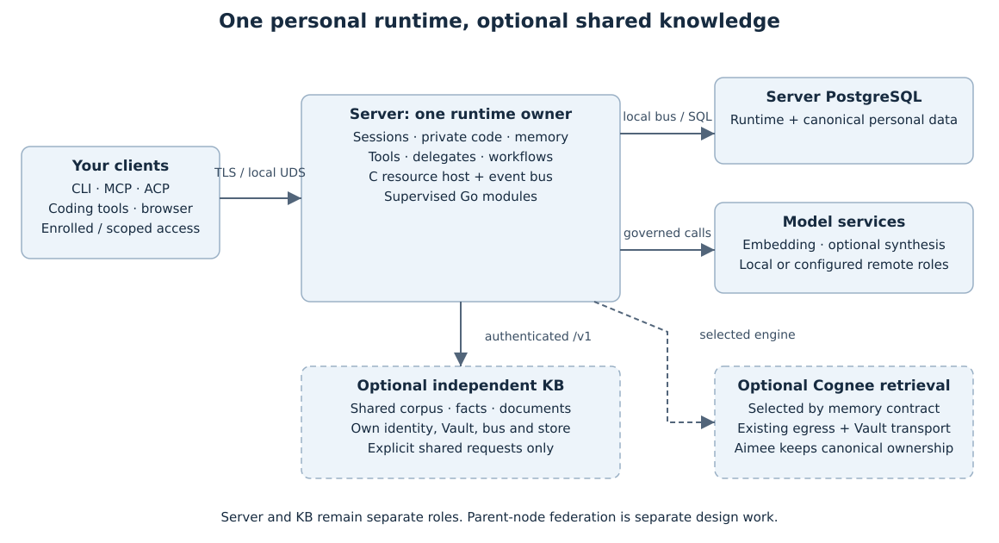

# aimee

Aimee gives your AI tools a persistent working environment. Your memory, code index, sessions
and workflows live in a runtime you operate, so changing a model or coding client preserves the
work around it. You keep the client and model you prefer; Aimee supplies the state and governed
execution behind them.

For a project, that means a new session can recover decisions you kept, inspect a published code
index and hand bounded work to a delegate. A correction updates the stored record and its revision;
future recall checks that revision before provider dispatch. You can carry the project's state
forward while choosing a different model for the next task.

The design puts ownership in the runtime. Aimee selects and authorizes memory, holds credentials,
and governs what an agent may read, execute, send and change. A model consumes the selected context
and proposes actions. Durable workflows retain their execution state across individual model
calls. You take on a server, its backups and its upgrades in exchange for control of that state.

## Security is part of the runtime

We assume a model, a prompt, retrieved text and a tool argument can all be hostile. Aimee puts
access checks in the services that own the data and the backends that execute the action. A model
cannot grant itself permission by asking for it, and a different UI cannot bypass those checks.

The shipped runtime makes specific, tested guarantees:

- **Data ownership stays explicit.** The thin client has no database linkage. Server reaches shared
  knowledge through KB's authorized API and has no direct access to its database. KB has no direct
  access to Server's personal database. A failed lookup cannot change the selected store.
- **Remote authority is checked per operation.** Network routes require an authenticated principal
  and declared capability. A shared bearer is read-only; remote writes require a KB-signed identity
  and a live per-user grant. Expired grants, replayed tokens and unavailable replay storage refuse
  the write. Credential-free KB access is restricted to process-local loopback and has no owner
  mutation authority.
- **Execution stays inside its grant.** Registered tools check schema, policy, assigned workspace
  and backend authority. Write-capable delegates require container isolation; failure to establish
  it refuses the delegate rather than falling back to the host. Containers receive no provider or
  forge credentials and no network access by default.
- **Credentials have an owner.** Provider and integration secrets live in the owning instance's
  Vault. Long-lived application containers carry no credential-shaped environment keys. Governed
  requests resolve credentials after authorization; ordinary delegate execution receives no copy.
- **Evidence can be checked.** New v2 WORM rows bind content, attribution and ordering in a
  verifiable chain. Historical v1 rows retain their explicitly partial coverage. An external
  witness is needed to establish evidence against a compromised host.

These guarantees cover the registered runtime paths. Operator-admitted native modules remain
trusted code. The managed composition gives Server the host Docker socket and therefore host
control; choose the standard composition when you manage model containers separately. Storage
volumes are not encrypted by default; LUKS is an explicit deployment option.

[Security](docs/SECURITY.md) defines the trust boundaries, and the
[claim register](docs/security-claims.json) ties each release claim to its enforcement owner,
negative tests and limits.

## Keep your harness and UI

Aimee's state belongs to your runtime, independent of the harness that calls it. A coding client
can use MCP tools over stdio; an agent UI can use the ACP bridge; a model-facing application can
connect through OpenAI Chat Completions or Responses, or Anthropic Messages ingress. A custom
application can call the named HTTP API or use a generated SDK. The browser is another client of
that same runtime.

This is the basis of compatibility with any harness or UI that implements one of those contracts.
It does not require a particular vendor's agent loop. Claude Code, Codex, VS Code, GitHub Copilot,
Claude Desktop and OpenCode have documented integration paths. New clients can use the shared
protocols without moving your memory or rebuilding the server around their UI.

The available integration determines what Aimee can observe and govern. Client hooks expose
session and tool events where the harness supports them. MCP governs calls made through Aimee;
it does not intercept actions a client executes independently. Protocol support also does not
supply a model with missing tool, image or streaming capabilities. See
[Compatibility](docs/COMPATIBILITY.md) for client coverage and
[Public API](docs/PUBLIC_API.md) for authentication and versioned contracts.

## Your runtime, with shared knowledge when you need it

A standalone **Server** owns one person's sessions, durable personal memory, private code index,
credentials, tools and delegates. Its Go workflow engine owns scheduling, retries, gates and durable
workflow runs. It works without a knowledge server.

An optional **KB** owns a shared corpus: memories, documents, facts, code graphs, evidence and
curation. Connecting one adds an explicitly selected shared store. Personal records stay on Server;
`--store kb` selects shared knowledge. A project name or failed private lookup cannot switch stores.

Both roles ship in one application image. Each instance retains its own immutable role, identity,
Vault, PostgreSQL store and event bus. The thin CLI runs on Linux, macOS and Windows and opens no
database. A unified node with parent connections remains separate design work; the current runtime
still has these two roles. See [Server and KB](docs/SERVER_AND_KB.md).

## What you can do

- **Keep and correct memory.** Personal and shared records retain versions, scope, provenance and
  lifecycle. The Memory Center supports correction proposals and attributed review. Current recall
  excludes hidden, expired and retired material. See [Knowledge](docs/KNOWLEDGE.md).
- **Ask about the code you are working on.** Published indexes supply symbols, callers, imports,
  text, vectors and blast radius. Private indexing stays on Server; shared code belongs to KB.
  Detached source spans describe a published snapshot, so rescan when the files change.
  See [Code intelligence](docs/CODE_INTELLIGENCE.md).
- **Delegate bounded work.** Route review and implementation to eligible agents, isolate their
  worktrees and containers, and apply capability, spend and execution constraints. A cheaper route
  is useful only when it fits the task; Aimee does not promise a universal cost reduction.
  See [Delegates](docs/DELEGATES.md).
- **Run repeatable workflows.** Definitions resolve to versioned execution snapshots. Runs preserve
  transitions, artifacts, human gates and terminal failures. See [Workflows](docs/WORKFLOWS.md).
- **Switch providers.** OpenAI, Anthropic, Gemini, Mistral, Bedrock and local endpoints feed a common
  request/response representation. Model capability and endpoint readiness still govern what works.
  See [Compatibility](docs/COMPATIBILITY.md).
- **Inspect the action trail.** The event bus orders governed actions and observations. WORM evidence,
  transactional mutation intents and delivery receipts expose distinct durability milestones.
  External witnesses are needed for evidence against a compromised host.
  See [Security](docs/SECURITY.md) and [WORM worker](docs/WORM_WORKER.md).

## Memory engines can change without changing ownership

The replaceable-memory implementation in [PR #3005](https://github.com/RakuenSoftware/aimee/pull/3005)
introduced a generic contract for the memory API and is merged into the integration tree. Native Aimee memory remains the default;
Cognee 1.6.2 is the first alternative retrieval engine. Aimee retains canonical records,
authorization, identity, audit and lifecycle. A replacement uses the existing module infrastructure.

Native memory passed deployed private/shared API and lifecycle checks in disposable containers.
The published testing image passed [119 Cognee checks](docs/validation/egress-vault-repair-2026-10-05.md),
including HTTP, CLI and MCP access, provider-outage recovery, derived-state cleanup and managed
subject erasure across both application stores. The fixture and erasure coverage limits are
recorded with the results. The first adapter bounds a retrieval scope to 256 eligible records
and refuses larger scopes explicitly. This implementation
is part of the 1.0.0 release work and is absent from the older 0.4.6 image. The
[contract and authoring guide](docs/modules/memory.md#memory-backend-contract) describes integration,
configuration and limits.

The separate [native-memory vLLM plugin](docs/NATIVE_MEMORY_PLUGIN.md) lets supported local models
consume selected Aimee records as native attention memory. That model-side delivery mechanism and
a replaceable retrieval engine solve different parts of the memory path. The current 0.3.2 candidate provides separate Gemma4 12B, Gemma4 26B A4B and Qwen3.8 27B
plugins on one shared runtime. Its server prerequisite and remaining publication gates are in the
[release preparation record](docs/releases/native-memory-v0.3.2/README.md).

## Start with one Server

Follow [Quickstart](docs/QUICKSTART.md) to generate private database credentials and start
`compose.yaml` with Docker Linux containers. It starts Server, a PostgreSQL service and local
embedding. Persistent storage is an ordinary Docker volume; LUKS is an explicit option.
A KB and synthesis model are optional.

Open <https://localhost:8443> and use the generated first-boot login from the application log.
The wizard configures your account, provider, local memory models, Git identity and workspaces.
Conversations open from the top session tabs. Connect a separately deployed KB in Settings when
shared knowledge is needed.

`compose.server-managed.yaml` lets the browser manage model containers through the host Docker
socket. Use the standard composition when you want to manage those containers yourself.
Back up each instance's home, Vault, database and audit evidence together before upgrading.

## 1.0.0 is the release target

This tree prepares **1.0.0**. The declared application series is `1.0`; release approval and
artifact publication remain separate from merging code. The memory contract, Cognee integration
and native-memory delivery described here belong to that release work.

The previous published application release is **0.4.6**, dated 2026-09-27. It does not contain
all of these changes. **0.3.0 was an intended release**, published on 2026-08-04. The later 0.4
series changed deployment and runtime boundaries; it did not invalidate that release.

Use [What's new](docs/WHATS_NEW.md) for the 1.0.0 scope and release history,
[Feature status](docs/STATUS.md) for implementation and qualification, and
[Upgrading](docs/UPGRADING.md) before reusing an older store. Current database startup refreshes
credentials but does not repair an obsolete database/role layout. The separate native-memory
plugin keeps its own version and publication status.

## Read further

The [documentation index](docs/README.md) maps the full set of guides.

| Task | Guide |
| --- | --- |
| Install, enroll and verify | [Quickstart](docs/QUICKSTART.md) |
| Operate CLI, browser and memory | [Manual](MANUAL.md) |
| Understand processes and trust | [Architecture](docs/ARCHITECTURE.md) |
| Deploy, back up or restore | [Deployment](docs/DEPLOYMENT.md) |
| Implement a memory backend | [Memory contract](docs/modules/memory.md#memory-backend-contract) |
| Connect an enrolled local vLLM model | [Native memory plugin](docs/NATIVE_MEMORY_PLUGIN.md) |
| Call a named API or configure a field | [Public API](docs/PUBLIC_API.md), [commands](docs/gen/cli-commands.md), [configuration](docs/gen/configuration.md) |
| Diagnose a failure | [Troubleshooting](docs/TROUBLESHOOTING.md) |
| Contribute code or review ownership | [Contributing](CONTRIBUTING.md), [owners](OWNERS.md), [technical reference](src/README.md) |

## Community and license

Questions and discussion: <https://discord.gg/FjGjvcgAqz>.

Copyright (C) 2026 The aimee authors. Licensed under the **GNU AGPL v3.0**. See
[LICENSE](LICENSE) and [NOTICE](NOTICE). Other terms can be discussed at <jbailes@gmail.com>.
Bundled components and generated SDKs may use different licenses; NOTICE lists them.
