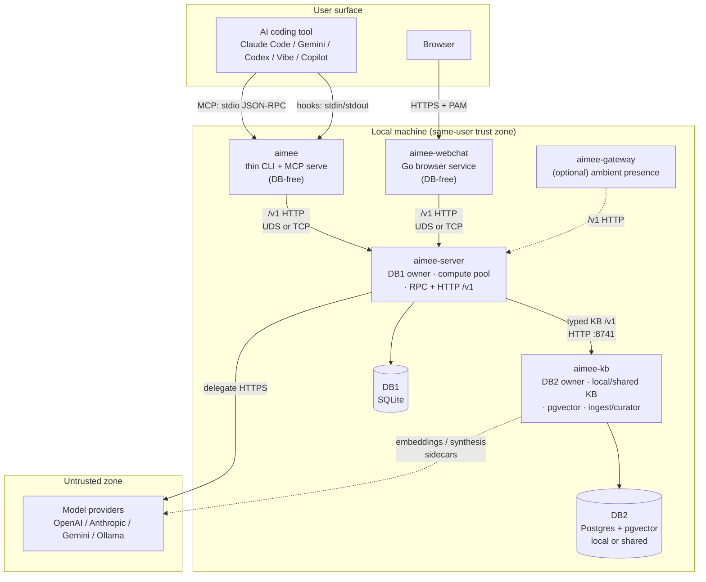
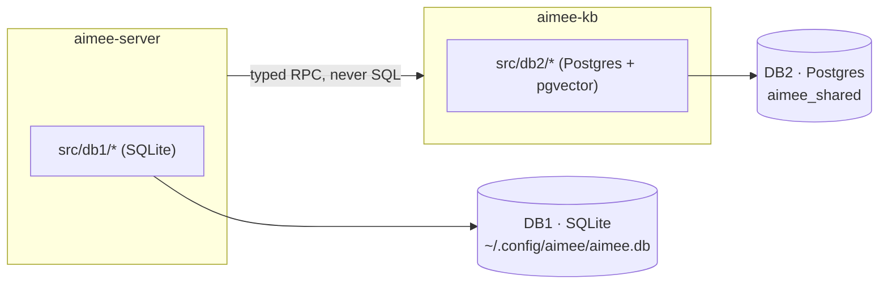
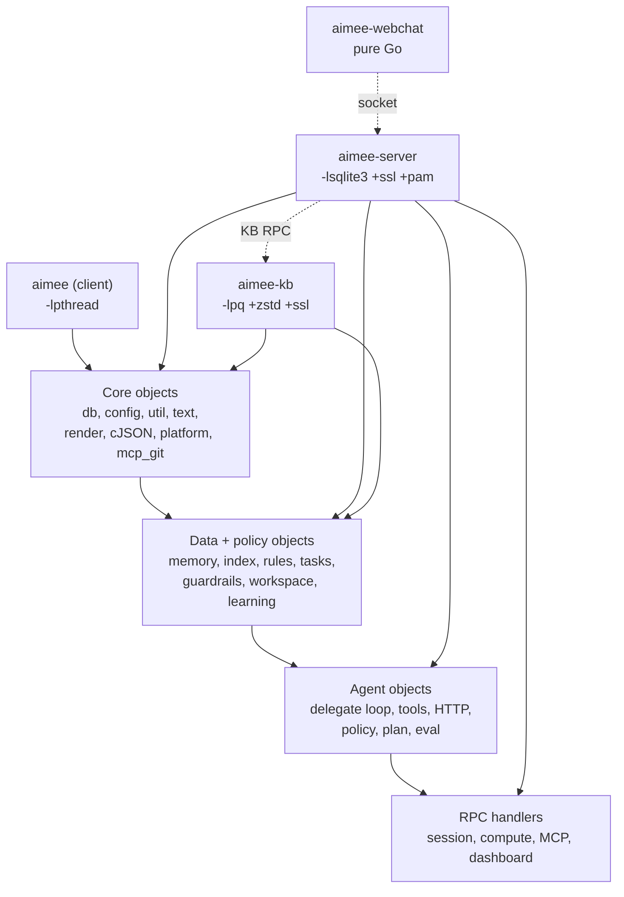
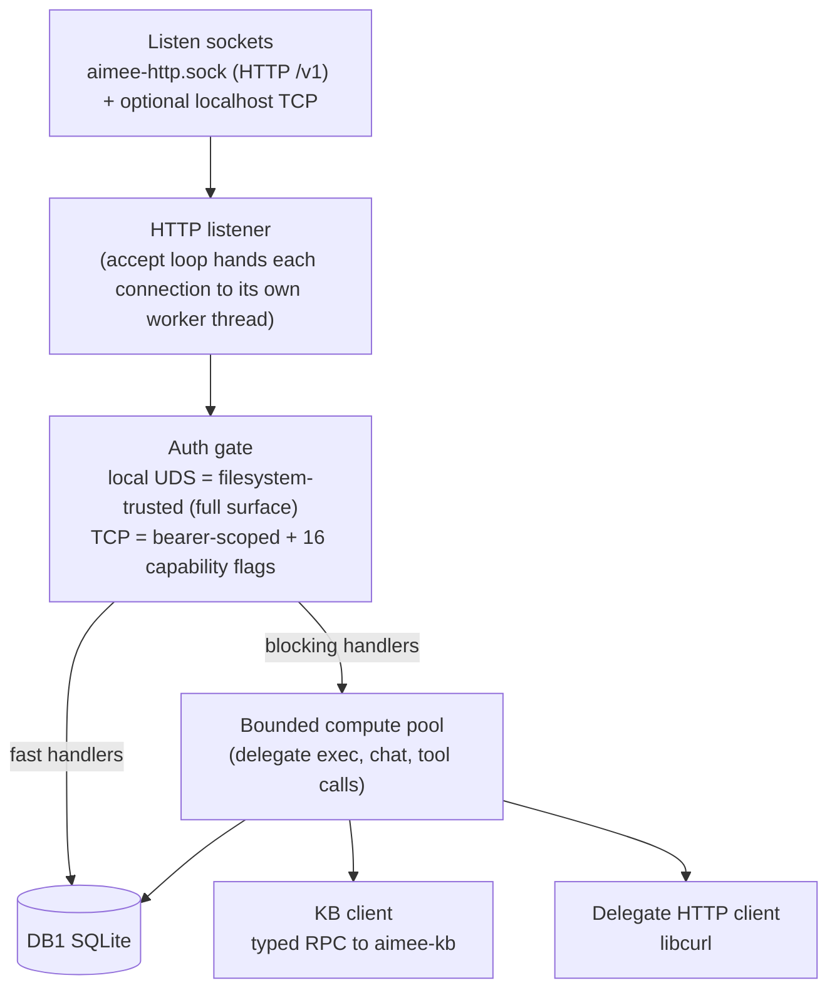
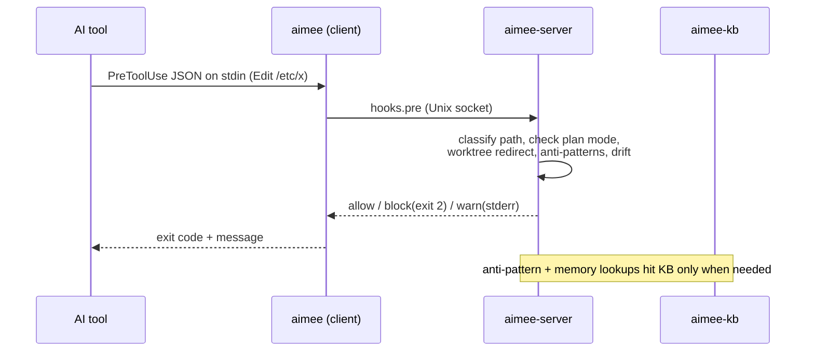
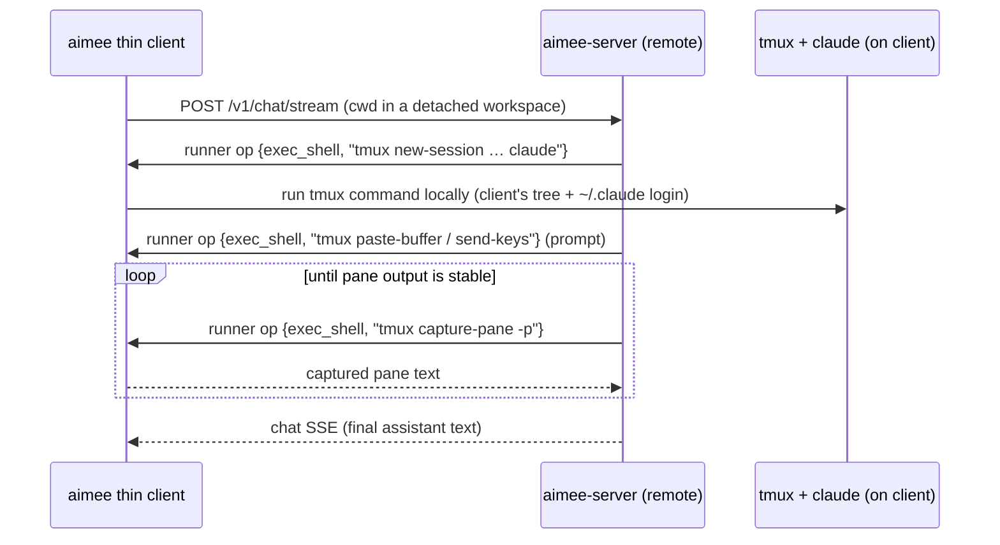
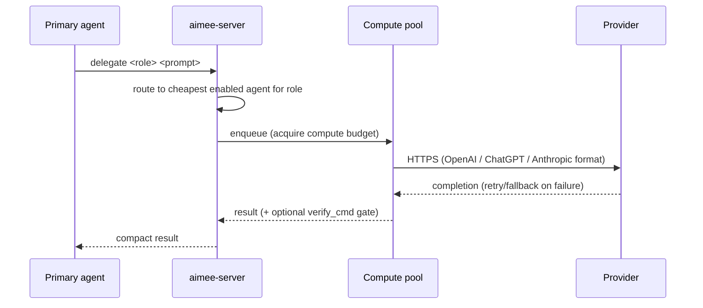

# aimee Architecture

This document describes the system architecture of aimee: its processes, trust
and storage boundaries, internal layering, and the lifecycle of a request as it
moves through the system. For a usage-oriented manual see
[`MANUAL.md`](../MANUAL.md); for code-level internals see
[`src/README.md`](../src/README.md).

---

## 1. Design goals

aimee is a local-first memory, safety, and delegation layer that sits between a
developer's AI coding tool and the work it performs. Its architecture is shaped
by four hard constraints:

1. **Invisible latency.** Hooks run in the critical path of every file edit, so
   the client must start and respond in milliseconds. This drives the thin
   client / persistent server split: a process that pays no database or
   connection cost on startup.
2. **Pinned storage ownership.** Knowledge must outlive any single session and
   may need to be shared across tools or hosts, while same-user runtime state
   stays local, private, and fast. This drives the DB1 / DB2 tier split with
   strict, compile-enforced ownership.
3. **Zero cloud dependencies for the core.** Everything required to run aimee,
   memory, guardrails, indexing, delegation routing, works on the local
   machine. External model providers are reached only when the user explicitly
   delegates.
4. **One install, many tools.** The same server backs Claude Code, Gemini CLI,
   Codex CLI, Mistral Vibe, and GitHub Copilot, so integration logic lives in
   one place and switching tools preserves all memory and context.

---

## 2. Process topology

aimee ships as **four primary artifacts** plus one optional gateway. Each is a
separate OS process with a distinct responsibility and a distinct linkage
profile (see §5).



| Artifact | Language | Owns | Links | Startup |
|----------|----------|------|-------|---------|
| `aimee` | C11 | nothing (thin client) | `-lpthread` only, **no** SQLite, **no** libpq | < 10 ms |
| `aimee-webchat` | Go | nothing (thin client) | pure Go (PAM via cgo) | fast |
| `aimee-server` | C11 | Local DB1 (SQLite), sessions, compute pool, delegate routing, hooks, MCP dispatch, HTTP /v1 | `-lsqlite3`, **never** libpq | persistent |
| `aimee-kb` | C11 | DB2 (Postgres + pgvector), memory inference, embeddings, code index, ingest/curator; local or shared by deployment | `-lpq`, **never** SQLite | persistent |
| `aimee-gateway` | C11 | optional ambient-presence delivery (Telegram/ntfy/webhook, STT/TTS) | minimal | optional |

The two **thin clients** (`aimee`, `aimee-webchat`) never touch a database.
They reach `aimee-server` over its `/v1` HTTP surface (the local `aimee-http.sock`
Unix socket by default, or a remote `host:port`) and forward typed requests.
This is what keeps the CLI startup under 10 ms and why hook checks add ~1 ms to a
tool call: the expensive state already lives in a warm, long-running server.

`aimee-server` is normally started by the installed service manager: systemd user
units on Linux, launchd on macOS, or the Windows service wrapper. The thin client
does not implicitly spawn a server for ordinary RPC commands; `aimee server
start` is the manual fallback for unmanaged environments.

---

## 3. Storage tiers (the DB1 / DB2 boundary)

aimee has exactly **two storage tiers**. They are pinned ownership boundaries,
not user-selectable backends. See [`STORAGE_TIERS.md`](STORAGE_TIERS.md) for the
canonical statement; this section explains why the boundary exists and how it is
enforced.



| Tier | Backed by | Owned by | Holds |
|------|-----------|----------|-------|
| **DB1** | SQLite (`~/.config/aimee/aimee.db`) | local `aimee-server` (`src/db1/`) | Local, same-user runtime state: sessions, working-memory key/values, conversation windows, checkpoints, durable delegate jobs, eval results, local caches, local interaction/learning signals, secrets. |
| **DB2** | Postgres + pgvector (`aimee_shared` by default) | `aimee-kb` (`src/db2/`) | Durable knowledge for the configured KB scope: memories, rules, KB metadata, tasks and decisions, code-index metadata, learning records, roadmaps, **plus** the dense vector collections derived from those records. |

Key consequences of the split:

- **DB1 is local.** `aimee-server` is a local, same-user process and DB1 holds
  local information for that server: sessions, secrets, working memory,
  checkpoints, local evidence, and operational state.
- **DB2 can be local or shared.** `aimee-kb` owns the Postgres knowledge store.
  In the default topology it can be a local single-user DB; in team or
  multi-host topologies it can be a shared KB. In either case, only information
  appropriate for the KB scope is reflected or promoted from DB1/server flows
  into DB2.
- **The vector tier is inside DB2.** It was originally a separate Qdrant sidecar
  and was folded into Postgres as the `vector` (pgvector)
  extension. Vectors share the same connection and transaction domain as the
  rows they embed, no separate service.
- **The boundary is compile-enforced.** `aimee-server` is built with
  `-DAIMEE_DB2_DISABLED` and never links libpq; `aimee-kb` is built with
  `-DAIMEE_DB1_DISABLED` and never links SQLite. `make check-linking` and
  symbol-boundary checks (`readelf`) fail the build if a `db2_*`/`PQ*` symbol
  appears in the server or a `db1_*`/`sqlite3_*` symbol appears in KB.
  `scripts/check_tier_deps.sh` enforces that code outside a tier calls only the
  typed public API, never a tier's storage handles.
- **One sanctioned cross-tier code edge: the WORM hash chain.** The append-only
  audit chain must produce byte-identical row hashes and checkpoint MACs whether
  a row is written by the server's SQLite store (`src/modules/audit/audit_worm.c`)
  or the KB's Postgres store (`src/db2/kb_audit_worm.c`). Both therefore share the
  engine-agnostic hash primitives in `src/modules/audit/audit_worm_chain.{c,h}` —
  a deliberate `db2/ → modules/audit/` include edge that does **not** breach the
  tier boundary. The edge is permitted **only as long as
  `src/modules/audit/audit_worm_chain.{c,h}` stays pure hashing** — SHA-256 only,
  no storage handle, `sqlite3`- and `libpq`-free, and header-self-contained.
  Reintroducing a storage-engine dependency there would re-create the layering
  violation this section exists to prevent, so it is forbidden.
  `src/tests/test_audit_worm_chain.c` pins the cross-engine hash vector against
  the real primitive so the two stores cannot silently drift.

The server reaches DB2 exclusively through the **KB client** (`src/server/
kb_client*.c`): a set of typed RPC wrappers that talk to `aimee-kb` over a Unix
socket (or HTTP on port 8741 in containerized deployments). The server holds no
SQL for DB2 and cannot bypass the boundary.

---

## 4. Internal layering

Within the C codebase, modules are organized into four layers. Lower layers must
not include headers from higher layers; the few tracked violations are listed in
[`OWNERS.md`](../OWNERS.md) and enforced by `src/tests/test_build_integrity.sh`.

```
Layer 3 · Commands + UI     cmd_*, cli_*, webchat, dashboard
Layer 2 · Agent             agent*, http_retry, delegate execution
Layer 1 · Data + Policy     memory*, index, extractors, rules, guardrails,
                            workspace, learning, kb_*
Layer 0 · Foundation        db, config, util, text, render, log, platform_*,
                            mcp_*, cJSON (vendored)
```

The layering is orthogonal to the storage-tier split: a Layer-1 data module like
`memory_logic.c` is linked into `aimee-kb` (because it owns DB2 logic), while a
Layer-1 policy module like `guardrails.c` is linked into `aimee-server`. Linkage
follows ownership; layering follows dependency direction. See
[`src/README.md`](../src/README.md) for the full module-to-binary map.

---

## 5. Linkage and dependency profiles

The build deliberately produces binaries with disjoint dependency graphs so that
the storage boundary cannot be violated even by accident.



| Library | Used by | Purpose |
|---------|---------|---------|
| SQLite3 | `aimee-server` only | DB1 local store |
| libpq | `aimee-kb` only | DB2 access (incl. pgvector) |
| libcurl / WinHTTP | `aimee-server` | delegate HTTP client |
| libssl / libcrypto | server, kb | TLS, auth provider support |
| libpam | server (Linux), webchat | PAM authentication |
| libsecret | server, kb (Linux, optional) | credential storage |
| libzstd | `aimee-kb` | payload compression |
| libm / libpthread | all C binaries | math, threads |
| cJSON | all C binaries | JSON (vendored, compiled in) |

The CMake build (`CMakeLists.txt`) mirrors the Makefile for Windows (MinGW) and
macOS cross-platform builds; the `src/Makefile` is canonical for development and
CI.

---

## 6. The aimee-server

`aimee-server` is the hub. It owns DB1, runs the compute pool, routes delegates,
serves hooks, and exposes both the internal RPC protocol and the public HTTP /v1
API.



Key properties:

- **Per-connection workers, bounded compute pool.** The HTTP accept loop hands
  each connection to its own detached worker thread, so a slow or streaming
  request never blocks the listener and independent `/v1` requests run
  concurrently. Heavyweight handlers (DB query, network, subprocess, delegate
  inference) additionally run on a bounded compute pool; a compute budget gate
  serializes heavyweight inference to bound resource use.
- **Transport.** Clients reach the server over its `/v1` HTTP surface: the
  always-on `~/.config/aimee/aimee-http.sock` Unix socket, plus an optional
  localhost TCP listener. Dispatch methods use dedicated `/v1` routes; the
  generic `POST /v1/rpc` endpoint is retired. Streaming chat uses
  `POST /v1/chat/stream`, whose body is a sequence of newline-delimited aimee
  events terminated by a final status object. (The legacy newline-delimited
  JSON-RPC socket was removed.)
- **Authentication.** The local UDS is filesystem-permission gated and fully
  trusted: it reaches the entire dispatch surface, with no token. The optional
  TCP listener requires a configured bearer token and is capability-scoped.
  Authorization is expressed as **16 capability flags** (chat, delegate,
  tool-execute, tool-bash, tool-write, memory-read/write, rules-read/admin,
  describe-read/admin, index-read/admin,
  session-read/admin, dashboard-read). Each method declares the capabilities it
  requires; unknown methods default to deny.
- **Rate limiting.** Auth failures are tracked per-UID (5 failures / 60 s →
  cooldown); the HTTP surface can rate-limit per source.
- **Graceful shutdown.** SIGTERM/SIGINT drains pending I/O, releases the socket,
  and records unclean-exit forensics to DB1.

See [`SECURITY.md`](SECURITY.md) for the full trust model and
[`src/README.md`](../src/README.md) for the RPC method catalog.

### The HTTP /v1 seam

Alongside the internal RPC protocol, the server exposes a native HTTP /v1 REST
surface (over `aimee-http.sock` or an optional localhost TCP port). It provides:

- **OpenAI-compatible inference**, `POST /v1/chat/completions`,
  `POST /v1/completions`, `POST /v1/embeddings`, `POST /v1/responses`, with
  SSE streaming where supported.
- **Native run management**, `POST /v1/runs`, `GET /v1/runs/{id}`,
  `GET /v1/runs/{id}/events` (SSE replay), `POST /v1/runs/{id}/stop`.
- **Read and control surfaces**, `GET /v1/health`, `/v1/version`,
  `/v1/capabilities`, `/v1/models`, `/v1/rules`, `/v1/notes`, `/v1/roadmap`,
  `/v1/agents`, `/v1/curiosity`, `/v1/kb/status`, `/v1/dashboard/*`, persona
  routes, plus `POST /v1/kb/search`, `/v1/memory/recall`, `/v1/notes/search`.
- **Auth**, UDS callers authenticate by peer UID; TCP callers present a bearer
  token, optionally `scope:`-prefixed to constrain capabilities. `X-Request-ID`
  is echoed; access is logged.

The server contract source of truth is
[`api/openapi-server-v1.yaml`](../api/openapi-server-v1.yaml). The KB contract is
[`api/openapi-v1.yaml`](../api/openapi-v1.yaml), with generated markdown at
[`docs/gen/api-v1.md`](gen/api-v1.md).

---

## 7. The aimee-kb service

`aimee-kb` owns DB2 and everything derived from it. It can run beside the local
server or as a shared/remote KB service. The server delegates all knowledge
operations to it via the KB client and sends only scoped knowledge artifacts,
not raw local runtime state.

A shared `aimee-kb` is the substrate for aimee's larger goal, a self-learning,
company-wide knowledge base that distills knowledge across every domain and
synthesizes across them. The mechanisms (curator pipeline, scope lattice,
knowledge graph, reflection, calibration) and the trajectory are described in
[How aimee learns](KNOWLEDGE.md); this section covers the service that runs them.

Responsibilities:

- **Memory pipeline**, store/recall/search over facts and conversation windows,
  deduplication, contradiction detection, temporal fact versioning, promotion
  and decay (the L0-L3 tier machinery).
- **Vector operations**, pgvector collections, embeddings (built-in or via an
  external `embedding_command` sidecar), reranking, release/repair/reconcile of
  vector state.
- **Code index**, symbol extraction across many languages, `find_symbol`,
  callers, structure, blast-radius, full-text code search.
- **Document ingest + curator**, staged document ingest, curator extraction of
  structured knowledge from prose/code/API docs, review queue.
- **Background workers**, ingest, embedder, curator, and index-update workers
  drain async queues.

It exposes its own HTTP /v1 surface (default port 8741) with ~40 endpoints
(`/v1/code/*`, `/v1/docs/*`, `/v1/search`, `/v1/ingest/*`, `/v1/entities/*`,
`/v1/reflections/*`, `/v1/maintenance/*`, etc.), used both by the server's KB
client and by containerized deployments. See [`api/openapi-v1.yaml`](../api/openapi-v1.yaml).

---

## 8. The webchat service

`aimee-webchat` is a standalone Go HTTP service that serves the browser UI built
from [`frontend/`](../frontend) (React 19 + Vite, bundled to a single HTML file).
It is a thin client: it holds no database and proxies everything to
`aimee-server` over the same `/v1` HTTP surface the CLI uses.

- **Auth**, PAM-backed login (`aimee-webchat` PAM service), SQLite-backed
  sessions with a TTL, login rate limiting, optional self-signed TLS.
- **Routes**, chat (SSE streaming via the socket), dashboard panels (proxied
  from the server), collab-rule review, channels (a local message board), and an
  OpenAI-compatible model endpoint.
- **Trust**, treated as a *semi-trusted* zone (see [`SECURITY.md`](SECURITY.md)):
  HTTPS + PAM, but not hardened to public-internet standards. Intended for
  same-host or trusted-LAN use.

---

## 8a. The kb console service

`aimee-kb-console` (`kb-console/*.go` + the second `frontend/` SPA) is a standalone
Go thin-client for administering a **shared/company `aimee-kb`**: dashboard,
accounts (client enrollment, certificate revocation, scopes, OIDC config), and
governance (decision records, the policy-verdict action audit). Unlike webchat it
fronts the **kb `/v1` directly** (so it works with no colocated `aimee-server`) and
uses **no PAM**: login is OIDC (with a presence-flag break-glass), and it holds a
scoped **console-admin** credential whose route allowlist the kb enforces
server-side (`src/kb/http/kb_route_acl.c`). Default-off; shipped as its own
`Dockerfile.kb-console` under the compose `console` profile. See
[`KB_CONSOLE.md`](KB_CONSOLE.md).

---

## 9. Request lifecycles

### 9.1 A pre-tool hook (the hot path)



The whole round-trip is ~1 ms at p50 because the client is already warm and the
server keeps DB1 and its KB connection open.

### 9.2 Session start

The thin client calls `session-start`; the server assembles a context brief
(code principles, rules, project-scoped facts, delegation hints, and, in
verbose mode, network info, recent delegations, capabilities) by querying DB1
and DB2-via-KB, and prints it to the tool's stdout. It also creates per-session
worktrees and state. See "Context assembly" in [`src/README.md`](../src/README.md).

### 9.3 Remote thin-client execution

When `aimee mcp-serve`, chat, or launch targets a remote `aimee-server`, the
client registers its current directory as a detached workspace, starts a
background `workspace serve` reverse channel, and routes file/exec operations
back to the client over `/v1/runner/poll` and `/v1/runner/respond`. The client
removes the detached workspace when the bridge exits or remote launch fails.
Delegate routes are exposed over `/v1/delegate/*`, but TCP access requires an
unscoped bearer and `aimee.api.remote_writes: full`.

#### Local-CLI agents run on the client

A `--provider claude` agent runs the **standard `claude` CLI over tmux**, not an
HTTP call, and **not** `claude -p` print mode: aimee drives an interactive tmux
session. That session, the `claude` process, its login (`~/.claude`), and the
working tree all live on the **client**, not on a remote/containerized
`aimee-server`. So when the active workspace is `detached`, the tmux session
driver (`cli_session`) marshals its tmux commands to the client over the **same
reverse channel** used for file/exec ops, rather than running tmux on the server
(which has no `claude` or tmux):



- **Reuses the existing exec seam.** The tmux commands ride the same
  `exec_shell` reverse-channel op as the bash tool; the client just runs them
  locally. No new client capability and no `claude -p`.
- **No credentials on the server.** `claude` authenticates with the client's own
  `~/.claude` login; no Claude credential is sent to or stored on the server.
- **Co-located unchanged.** When the workspace is not detached (the server is on
  the same host as the CLI), the tmux session runs locally exactly as before.
- **Claude via the CLI is primary-only by default.** Claude run via the `claude`
  CLI/tmux login (not an API key) is allowed as the interactive primary but is
  gated out of delegate routing whenever its per-agent **Primary Agent Only**
  flag (`primary_only` in `agents.json`) is set — the Web GUI pre-checks it when
  you add a claude-oauth subscription, because automating a personal Claude
  subscription as a delegate risks Anthropic account action. The routing above
  applies to the primary chat turn always, and to a Claude-CLI delegate only when
  you uncheck Primary Agent Only for it. The flag is a per-agent choice available
  to any agent, and replaced the former global `claude_cli_delegate_enabled`
  opt-in. See
  [DELEGATES.md](DELEGATES.md#claude-via-the-cli-is-primary-only-by-default) and
  [SECURITY.md](SECURITY.md).

### 9.4 A delegate task



Read-only delegates inspect the parent session's worktree directly;
write-capable delegates get isolated sibling worktrees so parallel work never
collides. `--background`/`--durable` delegates become server-owned jobs that
survive client disconnect. See [`DELEGATES.md`](DELEGATES.md).

---

## 10. Session isolation and worktrees

Each session gets its own git worktree, branch, and state file under
`~/.config/aimee/worktrees/<id>/<project>/`. Two sessions running in parallel
never clobber each other's working tree. The guardrail layer enforces this: a
write that targets a real workspace path which *has* a worktree is blocked and
redirected to the worktree path. Abandoned worktrees are garbage-collected by
`aimee worktree gc` (and optionally on a TTL). See [`WORKSPACES.md`](WORKSPACES.md).

---

## 11. Deployment topologies

| Topology | Shape | Notes |
|----------|-------|-------|
| **Containerized server + KB (recommended)** | `aimee-server` + `aimee-kb` run as separate containers brought up together with Postgres/pgvector and the `aimee-llm` CPU inference gateway (embeddings, reranking, synthesis); the server fronts `/v1` on `:8740` and reaches the kb over HTTP on `:8741`. Developers install only the cross-platform thin client and point it at the server. | `compose.server.yaml` (split stack); `Dockerfile.server`, `Dockerfile`, `Dockerfile.aimee-llm`. |
| **Single developer, source build** | All processes on one host from `install.sh`; service units keep server/KB running; DB1 in `~/.config/aimee`, DB2 in local Postgres. | Service-managed via `systemd/user/*.service` (Linux) or `service/com.aimee.*.plist` (macOS). KB starts first; server depends on it. |
| **Shared KB** | Multiple `aimee-server` instances (containerized or local) point at one `aimee-kb`/Postgres deployment over HTTP. DB1 remains per-user/per-machine; DB2 carries only project, workspace, global, or otherwise shareable knowledge. | Set `AIMEE_KB_API_URL` (+ optional bearer); promote scopes deliberately. |
| **KB-only container** | `aimee-kb` + Postgres/pgvector + a CPU inference gateway (embeddings, reranking, synthesis) via `compose.yaml`; KB binds `0.0.0.0:8741` and calls the gateway over HTTP. | The building block behind a shared/scaled KB; `Dockerfile`, `Dockerfile.aimee-llm`, `deploy/container/aimee.yaml`. |
| **Standalone server** | `aimee-server` only (SQLite DB1, no kb), via `compose.server-standalone.yaml`. | DB1-backed `/v1` endpoints with no shared knowledge until a kb is wired in. |

In every topology the contracts are identical: thin clients speak the `/v1`
protocol to the server (local `aimee-http.sock` or a remote `host:port`); the
server speaks the typed KB `/v1` HTTP API to `aimee-kb` (`AIMEE_KB_API_URL`; the
legacy Unix-socket KB transport was retired in #2747); the storage boundary holds.

---

## 12. Where to go next

- **Use it:** [`MANUAL.md`](../MANUAL.md), full command, configuration, and operations reference.
- **Hack on it:** [`src/README.md`](../src/README.md), module map, RPC catalog, memory internals, build system.
- **Trust model:** [`SECURITY.md`](SECURITY.md).
- **Storage contract:** [`STORAGE_TIERS.md`](STORAGE_TIERS.md).
- **Delegates:** [`DELEGATES.md`](DELEGATES.md) · **Workspaces:** [`WORKSPACES.md`](WORKSPACES.md).
