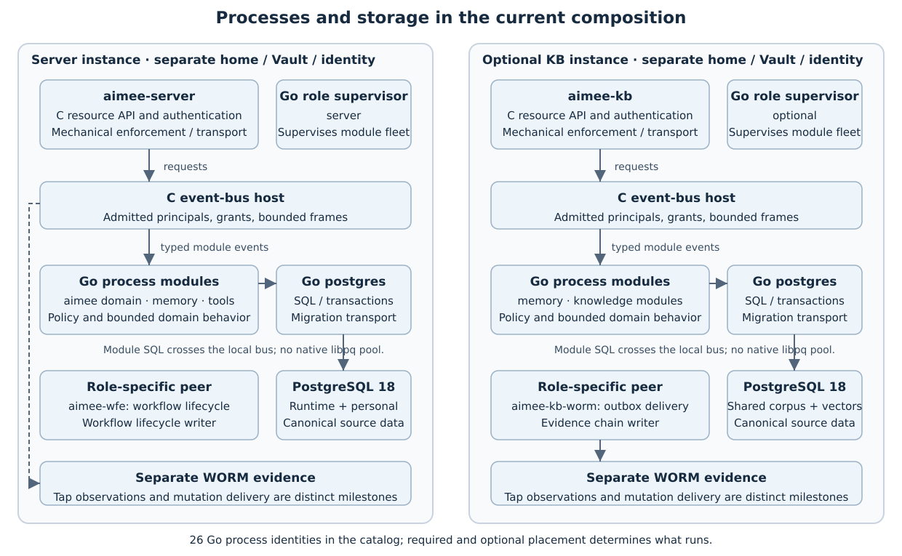
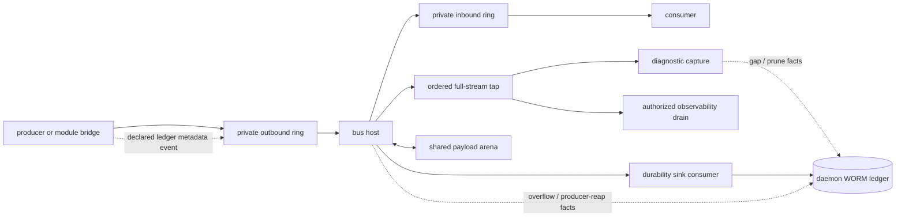
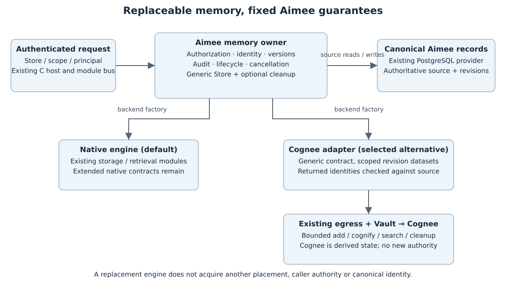

# Architecture

aimee is a local-first runtime between AI tools, model providers, code, and durable knowledge. It
keeps the thin client separate from stateful services and sends module events through each
instance's bounded bus. Server assists one human and owns durable personal memory; an optional KB
owns a shared corpus. [Server and KB](SERVER_AND_KB.md) is the canonical ownership guide.

## Processes

The diagram is a process/ownership view. SQL between modules crosses the local event bus; the
PostgreSQL provider alone owns the database connection. Optional modules depend on placement and
activation. A Go process identity is not a claim that every adjacent C resource handler has migrated.

Both containers use the same application image. A Go `server` or `kb` composition module
establishes the immutable first-boot identity and supervises the standard module processes.
Core's event bus rejects duplicate or conflicting roles. Both compositions deploy the same
PostgreSQL and memory implementations with independent databases, local Vaults, and model
identities. The existing C resource hosts remain during the transition of their domain handlers
into Go modules.

| Process | Owns | Does not own |
| --- | --- | --- |
| `aimee` | CLI parsing, local hooks, MCP/ACP stdio, client filesystem access | databases, server policy, provider credentials |
| Server composition | personal memory and code, sessions, agents, tools, policy, Vault, provider calls, `/v1` resource plane | shared KB corpus; `aimee-wfe` owns workflow lifecycle |
| `aimee-wfe` | workflow definitions, scheduling, artifacts, retries, gates, worktrees, forge lifecycle | agent credentials, KB data, general chat |
| KB composition | shared memory, documents, code graph, retrieval, curation, and its model services | Server personal memory, workflow state, another KB's corpus |
| `aimee-runtime-web` | browser auth, session proxying, UI delivery | product databases and workflow decisions |

`aimee-server` and `aimee-wfe` run as supervised peers in the server image. If either exits, the
container terminates both and fails. The C server returns `410 Gone` for retired workflow lifecycle
routes; there is one workflow writer.

The browser, KB console, and optional ambient gateway are clients. They do not bypass the service
that owns the data they display.

The diagram shows an optional KB connection. A standalone Server uses its own embedding and
optional synthesis services with no KB. Routing among several KBs remains a target topology.
See [KB fleet and model placement](KB_FLEET.md).

## Two transports

aimee has two distinct communication layers.

### Between processes and machines

Named `/v1` HTTP routes carry client, browser, server-to-KB, and provider traffic. Local clients use
a filesystem-protected Unix socket. Remote clients use TLS plus bearer or mTLS identity and route
capabilities. The generic `/v1/rpc` endpoint is retired.

The server-to-KB boundary is typed HTTP. `aimee-server` never links libpq or sends SQL. The KB never
opens DB1.

### Inside a daemon

The event bus carries typed module events. It is not a network transport and does not replace
authenticated `/v1` calls.

## Module doctrine

This is the target the migration is moving toward. Where it disagrees with the process table
above, the doctrine is the design and the table is the current state.

C owns exactly four things:

1. the event bus, for inter- and intra-module communication;
2. mTLS, MCP, and communication with the outside world;
3. the HTTP and related APIs that expose internal information;
4. the tap for auditing and governance.

C ends up a small codebase. Everything else, meaning all logic and all state, including registries,
queues, rendezvous, provider and turn binding, and policy, lives in a Go module under
`server-go/modules/`. A concurrency primitive is not transport: a condition variable or a
FIFO is logic, and belongs in Go as channels.

Modules get no HTTP APIs. A module never binds a socket and never accepts a connection.
`runtime-web` and `control-web` are modules and get no exemption: their HTTP surface belongs
to C, while their logic stays in the module and speaks only the bus.

Direct module-to-module communication is forbidden. Every exchange between modules goes over
the event bus, so that governance and auditing see all of it.

External communication is banned from every module, with two structural doors: communication
initiated from outside arrives over the event bus through C, and communication a module
initiates leaves through the `egress` module. Direction selects the door; it never grants a
module the right to open a connection itself. The required `egress` module now owns governed outbound HTTP/SSE for Go process modules,
including providers, embeddings, forge, roundtable, MCP and the Cognee adapter. PostgreSQL and
sandbox transports retain their declared resource-owner boundaries. Transitional C resource paths
remain explicit owners; their existence is not permission for a Go module to dial directly.
See [egress](modules/egress.md).

```mermaid
flowchart LR
    P[producer or module bridge] --> O[private outbound ring]
    O --> H[bus host]
    H --> I[private inbound ring]
    I --> C[consumer]
    H --> T[ordered full-stream tap]
    H <--> R[shared payload arena]
    T --> CAP[diagnostic capture]
    T --> OBS[authorized observability drain]
    P -. declared ledger metadata event .-> O
    H --> DS[durability sink consumer]
    DS --> WORM[(daemon WORM ledger)]
    H -. overflow / producer-reap facts .-> WORM
    CAP -. gap / prune facts .-> WORM
```

Each daemon creates one host. Admitted clients receive a read-only control region, their own queue
pair, and the shared arena. The host owns admission, sequence numbers, subscriptions, routing,
correlations, credits, and client reap.

The current load-bearing consumer is observability:

- governed actions;
- semantic guardrail events;
- server and KB memory mutations;
- vault credential access;
- sandbox isolation degradation;
- MCP and tool-call activity;
- tool completion outcomes.

The host tap writes its own ordered diagnostic stream. Ledger-classified module
calls emit bounded intent/reply metadata through the durable emitter, while
capture gaps, pruning, overflow, and producer reap use direct rare-event sinks.
Those WORM paths do not depend on capture being healthy. Capture can therefore
remain prunable without making an absent interval look idle.

Small events are inline. Large events use generation-checked arena leases. Backpressure is bounded;
a producer blocks or receives `would_block`, and shed delivery is represented by an overflow event.
There is no unbounded host queue.

See [Event bus](EVENT_BUS.md).

## Storage

Server and KB retain independent PostgreSQL stores. Within Server, the `aimee` domain module owns
runtime state and the Server placement of `memory` owns personal memory and private code. Within
KB, the KB placement of `memory` and other knowledge domains own the shared corpus.

The Go `postgres` module owns connections, transactions, and migration transport for both roles.
Go memory calls it over the local bus; native KB algorithms use session capabilities. Neither
native resource host links libpq. Thin clients and browser clients open no database. Cross-instance
knowledge operations use authenticated `/v1`, not SQL.

The DB2 process and native storage provider are retired. `DB1` survives in Server interfaces and
migration history; older reports use DB2 for the knowledge store. These names do not classify
personal memory as temporary or require shared physical storage. The common
[database contract](DB.md) does not merge deployment identities or existing stores.

Server and the separately credentialed KB WORM worker keep independent SQLite evidence chains.
KB PostgreSQL holds transactional outbox intents and delivery receipts; the worker constructs the
chain asynchronously. Bus observations, committed mutation intent, and chain delivery are separate
milestones. See [Storage ownership](STORAGE_TIERS.md) and [WORM worker](WORM_WORKER.md).

Standard compositions each deploy a separate PostgreSQL container with ordinary storage by default
and opt-in LUKS2. Local embedding is a separate service; synthesis is optional. Personal rows and
vectors stay on Server even when a shared KB is connected.

## Memory engine boundary

The native engine is the default. The replaceable-memory implementation in
[PR #3005](https://github.com/RakuenSoftware/aimee/pull/3005) adds Cognee as an alternative retrieval
engine; published 0.4.6 does not include it. Factories plug into the existing memory owner rather
than adding a provider supervisor or authority process. Extended native operations retain their
own contracts. See the [memory contract](modules/memory.md#memory-backend-contract).

## Request paths

### Local tool hook

1. The coding tool starts the thin client with a small JSON event.
2. The client sends it over the local Unix socket.
3. The server authenticates the socket by filesystem ownership.
4. Policy and guardrails return allow, deny, or context.
5. The action and verdict enter the event-bus audit path.

The client opens no database and starts no daemon. Warm state stays in `aimee-server`.

### Remote thin client

1. `remote.conf` resolves the server URL, certificate pin, bearer, and client identity.
2. Native TLS verifies the endpoint.
3. The server maps the principal to route capabilities and a write tier.
4. Read operations dispatch normally. A write needs an admitted write identity: the first owner's verified certificate-bound grant,
   or a KB-signed identity token with matching server/team trust and the user's exact grant.
5. Workspace and document commands upload bytes from the client; the server never resolves a path
   on the client's machine.

### Personal memory write and recall

1. A client calls Server's ordinary memory API with omitted `store` or `store=user`.
2. The host authenticates the caller and dispatches to the local Go memory owner.
3. The Server placement validates user scope and uses its local PostgreSQL provider.
4. Personal rows, revisions, proposals, and vectors stay in Server storage.
5. Go returns the complete record or budgeted recall envelope. A missing record or owner outage
   never causes a shared-store fallback.

### Shared memory write and recall

1. A client explicitly selects `store=kb` and supplies the intended project/workspace context.
2. Server authorizes the request and calls the configured KB's typed endpoint.
3. The KB host establishes verified caller context; the Go memory owner applies shared scope,
   authority, lifecycle, and retrieval policy through its local PostgreSQL provider.
4. A KB memory mutation and its required audit outbox intent commit together. The WORM worker
   delivers the intent to the chain separately.
5. Recall returns scoped evidence. Explicit shared-only recall skips personal composition; Server
   owns any separate context path that combines shared evidence with private identity/preferences.

Correction listing/review retains a KB default and needs explicit `store=user` for personal
proposals. Store selection is operation-specific; neither a numeric ID nor a failed lookup changes it.

### Delegate turn

1. The server admits a role/persona request against agent limits, budget, policy, and credentials.
2. The workspace authority selects a local, remote-runner, or isolated-container backend.
3. Provider requests become canonical IR, then one provider translation at the edge.
4. Tool calls pass schema, policy, worktree, and sandbox checks.
5. Tool activity and outcomes publish to the event bus.
6. The server returns a compact result and preserves the durable job, cost, and audit record.

### Workflow run

1. **Admit immutable input.** `aimee-wfe` validates and snapshots the definition and request.
2. **Persist before dispatch.** The scheduler writes the transition before starting work.
3. **Cross a typed resource boundary.** Agent and roundtable work calls the C server; credentials never enter
   the workflow rows in DB1.
4. **Confine each slice.** Every child gets its own worktree and branch.
5. **Keep evidence separate.** Verification, review, merge, and forge operations produce distinct artifacts.
6. **Stop at human authority.** A human gate parks until a browser or API decision arrives. The service stores
   a hashed approval artifact and lifecycle event, not a cryptographic principal signature. A crash
   resumes from the durable event log.

## Trust boundaries

The important boundaries are:

- **local user to local socket:** filesystem permissions are the identity;
- **remote client to server:** TLS, certificate pinning, bearer/mTLS identity, route capabilities,
  and write grants;
- **browser to server:** browser login, CSRF protection, principal propagation, and the same server
  authorization;
- **server to KB:** service bearer/TLS plus typed APIs;
- **workflow to resource plane:** local attested peer plus narrow internal operations;
- **agent to workspace:** assigned worktree and path policy;
- **delegate to host:** container/process sandbox, no ambient credentials, explicit egress;
- **service to provider:** vault resolution, provider allowlist, budget, rate, and egress policy;
- **module to bus:** admission, per-client rings, authorized event kinds, bounded flow control.

An admitted native bus module is trusted code. The shared arena is cooperative isolation, not a
sandbox. An external WORM witness is required if the threat includes full host compromise.

See [Security](SECURITY.md).

## Deployment shapes

| Shape | Use | Tradeoff |
| --- | --- | --- |
| Standard local Server | Single-user operation with local PostgreSQL and embedding | No KB or Docker-socket access required |
| Managed Server | Browser-managed local embedding and optional synthesis | Requires host Docker-socket access |
| Shared KB | Separate optional knowledge deployment using the same application image | Separate role, Vault, PostgreSQL, and access authority |
| KB fleet | Several capability-declaring KB containers | Target routing path; not integrated in this checkout |
| Local source install | Development and debugging | Host owns dependencies and services |
| Thin client | Developer machine | Needs a reachable Server |

The unified application image selects one role on first boot and cannot run both roles at once.
PostgreSQL and models remain separate service containers.

## Code boundaries

- `src/core/event_bus/`: event transport, arena, host, client, capture.
- `src/modules/`: owned C modules and public headers.
- `src/server/`: C resource plane and `/v1` handlers.
- `src/kb/`: KB resource host, knowledge adapters, and public routes.
- `server-go/`: role composition, memory and PostgreSQL owners, domain modules, workflow engine, and Go bus client.
- `runtime-web/`: browser-facing Go service.
- `frontend/`: browser application.
- `api/`: OpenAPI sources and generated SDKs.

[Technical reference](../src/README.md) covers build targets, linkage, tests, and source ownership.
