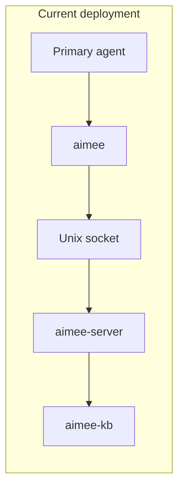

# Benchmarks

## Unified suite: provisioning & rollout validation

The unified benchmark suite (memory / coding / reasoning) ships its harness,
target adapters, pinned judge, and per-dataset loaders in-repo. Provisioning the
real datasets, judge model, and sandboxes, and running each track end-to-end, is
the **rollout-validation** half; see **[benchmarks/PROVISIONING.md](../benchmarks/PROVISIONING.md)**.

Key entry points:

- `benchmarks/provisioning.toml`: documented, hash-pinnable provisioning path
  for every catalog dataset.
- `benchmarks/check_provisioning.py`: coverage + hash-integrity gate
  (`--require-coverage`, `--verify-hashes`); wired into the `bench-smoke.yml` CI.
- `scripts/provision-benchmarks.sh`: manifest-driven fetcher (auto-fetches what
  it can, prints manual steps and the SHA-256 to pin).
- `benchmarks/compare_targets.py`: publishes a cross-target comparison report
  under `benchmarks/results/`.
- `benchmarks/suite/run-validation.sh`: one-command operator runbook
  (preflight → tracks → determinism → comparison → smoke budget).

## Memory Harness v2

The memory-quality benchmark harness now lives under:

- `benchmarks/memory/run.sh`
- `benchmarks/memory/BENCHMARK_RESULTS.md`
- `benchmarks/locomo/`
- `benchmarks/longmemeval/`
- `benchmarks/run-direct.sh`
- `benchmarks/run-llm.sh`
- `benchmarks/run-all.sh`
- `benchmarks/smoke.sh`
- `benchmarks/verify_scores.py`

These scripts produce per-question JSON artefacts and per-category or per-subset breakdowns. The generated reports are:

- `benchmarks/memory/BENCHMARK_RESULTS.md`
- `benchmarks/locomo/BENCHMARK_RESULTS.md`
- `benchmarks/longmemeval/BENCHMARK_RESULTS.md`

The canonical suite entry point for memory-quality work is:

```bash
./benchmarks/memory/run.sh
```

Verifier example:

```bash
python3 benchmarks/verify_scores.py benchmarks/results/locomo_aimee_direct_v<git-sha>.json
```

The LLM track routes answer generation and judging through `aimee delegate execute`, so the configured execute-role agent in `~/.config/aimee/agents.json` remains the source of truth.

## Comparative Baselines and Published-Score Calibration

### BM25 Parity

The **TrueMemory BM25 baseline** at **80.5% Cat 1-4 accuracy** on LoCoMo serves as the external anchor for all future lift claims. This ensures that reported improvements are measured against a reproducible external reference, not only against internal history.

#### Judge / prompt deltas

The aimee harness differs from TrueMemory's evaluation setup in the following ways:

| Dimension | TrueMemory | aimee harness |
|-----------|-----------|---------------|
| Judge model | GPT-4 (paper) | Configured execute-role agent (`~/.config/aimee/agents.json`) |
| Judge runs | 1 | 3 (majority vote) |
| Answer prompt | Paper-specific | `benchmarks/common/llm_eval.py::ANSWER_SYSTEM` |
| Top-K retrieval | Varies | `--top-k 100` default |
| Dataset version | LoCoMo-10 | `locomo10.json` |

Any variance larger than 1pp versus the anchor should be documented in
`benchmarks/locomo/BENCHMARK_RESULTS.md` with a short causal explanation.

#### Available baselines

| System | Script | Dependency |
|--------|--------|------------|
| BM25 | `bench_bm25_llm.py` | stdlib only |
| Dense (ChromaDB) | `bench_rag_chromadb_llm.py` | `chromadb`, `sentence-transformers` |
| Mem0 | `bench_mem0_llm.py` | `MEM0_API_KEY` + `mem0ai` |

Run all available baselines:

```bash
./benchmarks/run-llm.sh --systems bm25,rag_chromadb,aimee
```

The `rag_chromadb` and `mem0` systems skip cleanly with a help message when
their dependencies are absent, so the flag is safe to pass even in CI without
those packages.

## Performance Benchmarks

### Overview

This document captures the current benchmark baseline for aimee’s latency-sensitive paths. The focus is the work that sits directly between a primary agent and useful execution: hook checks, memory access, session initialization, and delegate routing data.

The current deployment mode is:

- **Thin client**: `aimee` and `aimee-webchat` talk to
  the local `aimee-server` over a Unix socket. DB1 stays in that local
  server; DB2 (incl. pgvector) stays in `aimee-kb`, which may be local or
  shared in non-default deployments.

The retired in-process command-dispatch path ran command handlers in forked
server children. That path is no longer a valid deployment mode because it let
client command code observe DB tiers directly. Unported commands now fail before
they reach the server until they have typed server/kb RPC routes.



## Methodology

Benchmarks are run with `benchmarks/run.sh` and measure wall-clock latency using `date +%s%N`. Each operation is executed `N` times, and the benchmark reports p50, p95, and p99 latency in milliseconds.

The benchmark suite covers the critical paths that most directly affect responsiveness:

- hook latency
- memory search
- session startup
- delegate routing data loading
- maintenance work on memory state

Example invocation:

```bash
cd aimee

# Through aimee-server (default)
AIMEE=aimee ./benchmarks/run.sh 100
```

Benchmark environment:

- **Platform:** Proxmox VE 8.x, Debian 13, Intel Xeon, 32GB RAM, NVMe SSD
- **Database contents:** ~30 memories, 39 network hosts, 15 workspace projects
- **Baseline date:** 2026-04-02

## Results

### Thin client

This is the default deployment model. The CLI connects to `aimee-server` over a Unix socket. First-call latency includes socket connection overhead, while subsequent calls can reuse the connection and benefit from warm tier-owned DB connections.

| Operation | p50 | p95 | p99 | Notes |
|-----------|-----|-----|-----|-------|
| Startup (version) | <1ms | 1ms | 5ms | Binary load + socket connect |
| Hook pre (Edit) | 1ms | 3ms | 19ms | Critical path: guardrail check |
| Hook pre (Bash) | 1ms | 2ms | 18ms | Critical path: guardrail check |
| Memory search | 7ms | 8ms | 18ms | DB2 lexical + pgvector dense retrieval |
| Memory list (L2 facts) | 1ms | 2ms | 4ms | DB2 memory list query |
| Agent network | 7ms | 8ms | 9ms | Load and format agents.json |
| Session-start | 8ms | 9ms | 13ms | Context assembly (rules + facts + network) |
| Memory maintain | 11ms | 15ms | 17ms | Promotion/demotion/expiry cycle |

#### Analysis

The thin client mode produces very low median latency for operations that benefit from a resident server process. Startup and hook checks are especially fast at p50, which is consistent with pushing the expensive initialization work into `aimee-server` and keeping tier-owned state warm.

The main cost of this architecture appears in tail latency rather than median latency. Hook checks show p99 values of 18-19ms despite 1ms p50, which indicates that the socket boundary and connection behavior occasionally dominate the critical path. This is not a throughput problem; it is a predictability problem at the tail.

Memory and session operations remain comfortably bounded. `Memory search` at 18ms p99 and `Session-start` at 13ms p99 suggest that the persistent process model is already doing what it should: keeping tier-backed retrieval and context-assembly work interactive without forcing a full initialization cycle on every call.

### Retired in-process dispatch

These numbers are retained as historical context only. The path used
generic command forwarding and forked command handlers that initialized tier
connections per call. That is no longer an allowed runtime boundary.

| Operation | p50 | p95 | p99 | Notes |
|-----------|-----|-----|-----|-------|
| Startup (version) | 2ms | 4ms | 4ms | Binary load + arg parse |
| Hook pre (Edit) | 4ms | 4ms | 6ms | Critical path: guardrail check |
| Hook pre (Bash) | 3ms | 4ms | 5ms | Critical path: guardrail check |
| Memory search | 10ms | 11ms | 12ms | DB2 lexical + pgvector dense retrieval |
| Memory list (L2 facts) | 3ms | 3ms | 4ms | DB2 memory list query |
| Agent network | 2ms | 3ms | 3ms | Load and format agents.json |
| Session-start | 3ms | 4ms | 4ms | Context assembly (rules + facts + network) |
| Memory maintain | 5ms | 6ms | 7ms | Promotion/demotion/expiry cycle |

#### Analysis

The retired in-process path was defined more by consistency than by absolute minimum p50 latency. Hook checks, memory access, and session-start all had narrow p50-to-p99 ranges, which meant the system behaved predictably from call to call.

That tighter spread was the main result. Startup was slower at p50 than the thin client (`2ms` versus `<1ms`), and memory search was also slower at median (`10ms` versus `7ms`), matching the expected cost of per-call tier initialization. But the tail remained tighter: for example, `Memory search` reached only `12ms` at p99, and hook checks stayed between `5ms` and `6ms` at p99.

The architecture no longer accepts this tradeoff because DB ownership is stricter than the benchmark convenience.

## Performance Budget

The following budgets define acceptable p99 latency for the key interactive paths:

| Path | Target | Rationale |
|------|--------|-----------|
| Hook pre-tool check | <10ms p99 | Blocks between primary agent and file edit |
| Session-start | <100ms p99 | Runs once at primary agent session start |
| Memory search | <20ms p99 | Interactive query from primary agent or delegate |
| Agent network | <10ms p99 | Delegate agent config file read |

Current results against budget:

- **Hook pre-tool check:** in-process passes comfortably; thin client exceeds the `<10ms p99` target in both measured hook cases (`18ms` and `19ms`).
- **Session-start:** both modes pass with substantial margin (`13ms` thin client, `4ms` in-process).
- **Memory search:** both modes pass (`18ms` thin client, `12ms` in-process).
- **Agent network:** both modes pass (`9ms` thin client, `3ms` in-process).

The current performance story is therefore not that the system is broadly slow. It is that one specific user-facing path, thin-client hook enforcement, has measurable tail-latency headroom to recover.

## Scaling Notes

- `Memory search` cost depends on DB2 lexical candidate generation, pgvector dense recall, and deterministic reranking. Benchmark baselines should be regenerated at larger corpus sizes rather than inferred from the current small-memory run.
- `Session-start` context assembly scales with the number of rules, facts, and network hosts included in injected context. The current assembly fits in a 32KB buffer. Delegate agent context assembly uses a separate 16KB budget.
- `Hook pre-tool check` is `O(1)` for path classification and `O(worktrees)` for worktree matching. As worktree count grows, this remains a likely source of incremental latency pressure even before tier-backed retrieval paths become significant.
- Worktree creation is deferred until first write access, so `Session-start` does not include git operations.

A practical reading of the current data:

- Database-backed operations are already well within budget at the current dataset size.
- Tail behavior is more sensitive to deployment architecture than median behavior.
- If the system scales up in memories, hosts, or worktrees, the first regressions to watch are likely to be hook tail latency and context assembly size rather than average-case search latency.

## Running Benchmarks

Run the benchmark suite from the repository root:

```bash
cd aimee

# Through aimee-server (default)
AIMEE=aimee ./benchmarks/run.sh 100
```

Use the benchmark output to compare p99 latency against the performance budget. In CI or local regression checks, the key question is whether each critical path remains below its budget threshold, not whether every percentile exactly matches this baseline.
