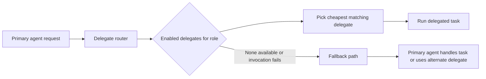
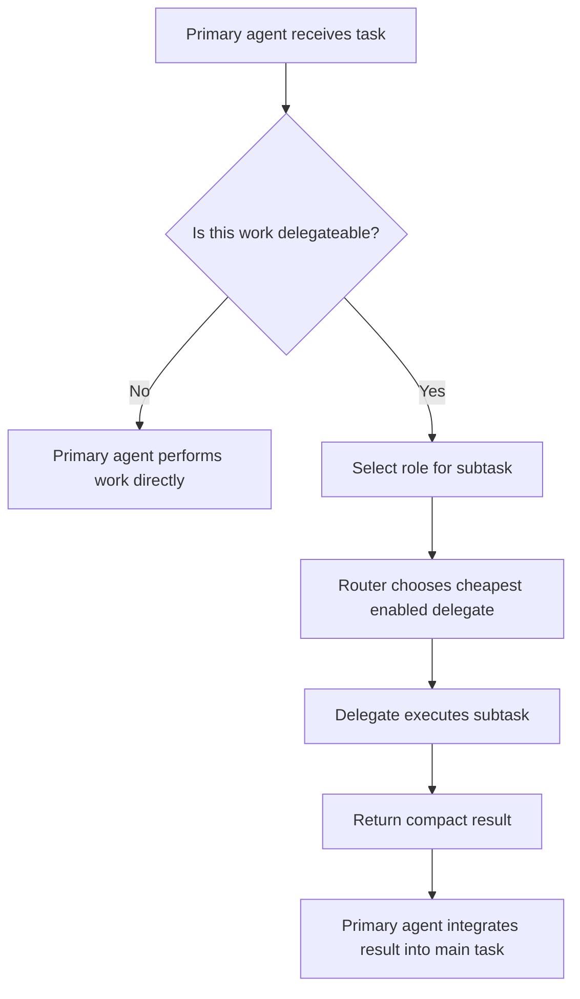

# Delegate Agents

> **Delegates ship configured.** A default roster (local + subscription-backed
> tier-0 agents) and the roundtable panel ship enabled, so
> `aimee delegate …` and `aimee delegate roundtable …` work on a fresh install
> with nothing to set up. This page is for adding your own providers, changing
> the panel, or understanding the routing.

## Quick Start

Delegation already works on a fresh install (see the note above), `aimee
delegate …` routes to the shipped roster. Use these commands only to **add your
own** local provider on top of the defaults:

```bash
# 1) Add a local delegate provider (optional, defaults already work)
aimee agent local local http://localhost:8080 --model MODEL --slots 4 --ctx 131072

# 2) Inspect the registered delegates and their routing data
aimee --json agent list

# Optional auto-detect helper for local Ollama/llama.cpp
./add-local-delegate.sh

# 3) Use aimee normally; the primary agent routes delegateable work automatically.
# See the Usage section below for realistic delegation scenarios.
```

`aimee` supports two kinds of agent:

- **Primary agent**: the AI coding surface you interact with directly, such as Claude Code, Gemini CLI, direct Codex, direct Mistral, or Codex CLI legacy mode
- **Delegate agents**: sub-agents used for offloaded work

The primary agent does not need delegate configuration. It integrates with `aimee` through hooks, provider adapters, remaining provider CLI routes, or direct primary-session adapters that inject memory, enforce guardrails, and manage session isolation. Delegate agents are optional and are configured separately.

## Primary Agent Constraint

Provider-native sub-agent tools are not Aimee delegation. Primary agents must
not use Codex `spawn_agent`, Claude `Agent`/`Task`, or similar remote-agent
launchers for delegated or parallel work. Use the Aimee MCP `delegate` tool or
`aimee delegate <role> "<task>"` instead.

The guard is always on: when a client surfaces a sub-agent tool through hooks
(including Claude Code's `Task`), Aimee blocks the call and points the agent at
`aimee delegate <role> --persona <persona>` or
`aimee delegate roundtable "<task>" --mode review`. Routing through Aimee
delegates keeps the work inside Aimee's session state, worktree isolation,
depth/spawn limits, routing, and audit trail.

## How It Works

Delegation exists so the primary agent can spend its attention on work that actually requires its strongest reasoning. Lower-cost or local delegate agents can handle routine work such as summarization, formatting, boilerplate generation, simple code review, and file transformations.

This reduces cost and keeps the primary agent focused on complex tasks.

Delegation saves primary-agent tokens in several ways:

- **Direct offloading**: when the primary agent delegates a summarization task, the full prompt and completion cost moves to the delegate. If that delegate is tier-0, the marginal cost is effectively zero.
- **Smaller context budget**: delegate agents receive a 16KB context budget, compared with 32KB for the primary agent, so each delegated call carries less background context.
- **Parallel execution**: multiple delegated tasks can run at the same time. The primary agent receives compact results instead of individually processing each input.
- **Automatic cheapest-model routing**: the router selects the cheapest enabled delegate that can satisfy the requested role.

For broader token-saving mechanisms beyond delegation, including memory injection, code index usage, project descriptions, and anti-pattern detection, see the [root README](../README.md#what-aimee-does).

### Routing flow



### Primary agent delegation flow



## Setup

### Configuration

> **Credential storage:** API keys and Codex/OAuth tokens are sealed in the
> server's **vault** (encrypted at rest), not held on clients. `aimee agent add
> <name> <endpoint> <model> --key K` seals `K` into the vault and refuses
> plaintext storage; the server's `agents.json` keeps the definition only. Codex
> tokens are vaulted via `aimee agent setup codex-oauth`. Configure agents once
> on the server, the vault is shared across clients. Migrate any leftover
> client-held `~/.config/aimee/agent-keys.json` with `aimee agent key import`
> (scrubs the plaintext copy by default; `--keep` to retain). See [THIN_CLIENT.md](THIN_CLIENT.md) and
> [SECURITY.md](SECURITY.md#agent-credential-custody-thin-client).

Use `aimee agent local` for local or LAN OpenAI-compatible runtimes such as
`llama-server` and Ollama. The command is idempotent: re-running it updates the
same delegate, probes `/v1/models`, probes llama.cpp `/slots` when available,
and writes both the delegate entry and the per-model concurrency limit.

```bash
# llama.cpp or another OpenAI-compatible endpoint
aimee agent local gemma http://192.168.1.103:8080 \
  --model gemma-4-26B-A4B-it-UD-Q5_K_XL.gguf \
  --slots 4 \
  --ctx 131072 \
  --default

# Auto-detect local runtime, recommend a model, then call aimee agent local
./add-local-delegate.sh

# Verify endpoint, model availability, slots, and a short completion
aimee agent probe gemma
```

> **Registering the deployment's own `aimee-kb-*` synth:** use the gateway port and the
> `aimee-synth` alias, not a raw GGUF filename:
> `aimee agent local local-synth http://<gw>:8742/v1 --model aimee-synth --provider openai`.
> The gateway runs auth-off on the internal bridge (`auth_type: none`). See
> [AIMEE_KB_SYNTH_TIERS.md](AIMEE_KB_SYNTH_TIERS.md).

Each delegate entry records:

- endpoint
- authentication
- model
- roles
- cost tier

in `~/.config/aimee/agents.json`.

`aimee agent local` also updates:

```text
~/.config/aimee/aimee.yaml
```

with `concurrency.per_model.<model> = <slots>`, so `aimee-server` can run
multiple delegate slots without hand-editing configuration. Running servers
refresh delegate concurrency when `agents.json` or `aimee.yaml` changes.

## Roles and Tiers

Every delegate agent is assigned one or more **roles** describing the kinds of tasks it can handle.

| Role | Description | Example use |
|------|-------------|-------------|
| `code` | Write or edit code | Implementation tasks |
| `review` | Analyze code or plans | Code review, anti-pattern extraction |
| `explain` | Explain concepts | Documentation, teaching |
| `refactor` | Restructure code | Cleanup, optimization |
| `draft` | Generate content | Test plans, commit messages |
| `execute` | Run agentic tasks | Multi-turn tool-use loops |
| `summarize` | Compress text | Session fold, window compaction |
| `format` | Reformat data | Context assembly when budget is tight |
| `search` | Find information | Documentation lookup |
| `reason` | Complex reasoning | Higher-difficulty analysis |

Delegates are also assigned a **cost tier**. Routing prefers the lowest-cost enabled delegate that matches the requested role.

| Tier | Meaning | Typical examples |
|------|---------|------------------|
| `0` | Free or subscription-backed | Local Ollama, Codex OAuth, Gemini OAuth, `mistral-plan`, MiniMax |
| `1` | Low-cost API | Cheap hosted models |
| `2` | Mid-cost API | Stronger general-purpose models |
| `3` | Expensive API | Premium reasoning-capable models |

This tiering allows `aimee` to send lightweight work to inexpensive models while still allowing stronger delegates for more demanding roles. A tier is a routing pool: when multiple enabled delegates at the same tier match the role, they remain eligible independently, and retryable failures can fall through to same-tier peers even if the explicit fallback chain is stale.

## Free-Delegate Economics

Aimee reports coordinated delegate runs using the
`free_delegate_expensive_supervisor` cost model. Under this model, tier-0
delegates are abundant compute and the primary supervising agent is the scarce
resource. A run can be token-negative overall while still being useful if it
reduces paid supervisor attention, manual integration, or serial review time.

The shared cost authority (`token_estimate_cost`) prices the self-hosted /
open-weight delegates aimee runs locally, minimax, mistral, and mimo, at a
**known zero**: free, but explicitly *priced* rather than *unknown*. This matters
because the delegate-economics path flat-rates only genuinely unknown models; a
known-zero price keeps these local delegates out of that fallback, so their
realized cost is reported as the $0 it actually is. A deployment that pays per
token for a hosted variant still overrides the zero with a real model-registry /
models.dev price.

The report is intentionally approximate. It separates estimated delegate tokens
from estimated supervisor prompt tokens, records tier distribution, structured
handoff validity, focused tests, manual integration markers, reviewer blocking
findings, and a plain-language verdict:

```text
Delegation report
  Cost model: free delegates, expensive supervisor
  Delegates: 5 total, 4 tier-0, 1 tier-1, 0 tier-2, 0 tier-3
  Delegate tokens estimated: 145000
  Supervisor prompt tokens estimated: 18000
  Focused tests run by delegates: 4/5
  Structured handoffs valid: 4/5 (invalid 1)
  Manual integration events: 3
  Verdict: likely net supervisor-token win
```

Tier-0-heavy runs may recommend broader delegation and redundant validation
when task risk warrants it. Mixed or expensive-only runs are reported more
conservatively so costly delegates are not used speculatively.

## Routing

The router evaluates delegates using three main pieces of information:

1. **Role match**: the delegate must support the requested role.
2. **Enabled state**: only enabled delegates are considered.
3. **Cost tier**: the cheapest enabled matching delegate is selected.

In practice, tasks such as `summarize`, `format`, and `draft` usually route to tier-0 delegates first. This means the primary agent often pays only for issuing the delegation request and reading the returned summary or result.

If no suitable delegate is available, or if the delegate invocation fails, the system falls back rather than blocking the main task.

## Usage

### Planning delegate work packets

Use `aimee delegate plan` to turn a proposal into reviewable work packets before
launching any delegates:

```bash
aimee delegate plan docs/proposals/pending/foo.md
aimee delegate plan docs/proposals/pending/foo.md --json
aimee delegate launch .aimee/delegate-plans/foo.json --parallel 4
```

The read-only planner writes a JSON plan to `.aimee/delegate-plans/` by default.
Each implementation packet includes owned files, read context, acceptance
criteria, verification commands, and `handoff_schema: delegate_result_v1`. Medium
and larger proposals also get a read-only reviewer packet with
`handoff_schema: delegate_review_v1`. `delegate launch` reads the reviewed JSON,
creates an execution plan, and enqueues implementation packets into a coord job
with each packet's `owned_files` as the task conflict set.

Durable one-off delegates are listed with `aimee jobs list`; inspect one with
`aimee jobs status <job-id>` and print its recorded result body with
`aimee jobs logs <job-id>`.

Coordinated implementation packets must use `handoff_schema: delegate_result_v1`.
Direct one-off delegates can opt into the same validation:

```bash
aimee delegate code "Implement the focused change." --handoff-json
```

With `--handoff-json`, the delegate is instructed to return only
`delegate_result_v1` JSON. Aimee validates the final response, retries once with
a repair prompt if the JSON is malformed, downgrades `status=done` to `partial`
when no passed focused verification is reported, and marks files outside
`owned_files` as `needs_supervisor_review`. `aimee job status` includes compact
handoff counts for done, partial, blocked, failed, and needs-supervisor packets.

### Source Authority

Delegates still use `find_symbol`, `code_search`, `aimee index`, and memory
search as the authoritative discovery layer. Those tools locate symbols, likely
files, prior decisions, and blast radius context.

Read-only delegates use the parent session worktree as their source checkout.
This includes review, validate, diagnose, explain, summarize, and other
inspection-only tasks. Only write-capable delegates get isolated sibling
delegate worktrees; branch-specific delegate checkouts are therefore a
write-delegate feature, not a read-only review mechanism.

A delegate with its own worktree can also be sandboxed: with `delegate_sandbox`
enabled it runs its file and shell tools inside a network-none container, and
you control the image it uses per project. See
[Delegate Sandbox](DELEGATE_SANDBOX.md).

File contents use a stricter authority order. Current source wins over derived
index snippets: source packets from `--files`, `--context-file`,
`--context-dir`, preloaded symbol context, and `read_file` from the delegate
worktree are authoritative when they conflict with indexed snippets.
Index-backed delegate tools annotate results with provenance/freshness metadata
where possible. `source_packet_current` means the hit came from source supplied
to the delegate. `worktree_differs_from_main` means the hit's file diverges
from the indexed main baseline, so the indexed hit is only a lead and the
delegate should inspect current source before editing or making content claims.
Main checkouts are force-scanned when their HEAD differs from the last
successfully indexed HEAD, and that marker advances only after the KB scan
succeeds.

`aimee job status` also includes a read-only patch coordinator brief for
delegate-launched coord jobs. The brief reports each implementation packet's
patch state, focused verification evidence, ownership violations, overlapping
changed files, stale-base metadata when delegates provide it, reviewer status,
and the recommended next command before manual integration. Reporting is
advisory: patches are not automatically accepted into the supervisor branch.

### When delegation helps

Delegation is most useful when the primary agent would otherwise spend expensive tokens on work that does not require top-tier reasoning.

Common examples:

- summarizing long logs before the main agent decides what matters
- reformatting generated data into a compact structure
- drafting commit messages or test plans
- reviewing multiple files in parallel for obvious issues
- doing simple transformations across a large set of files

### Realistic scenarios

#### Scenario: summarize several large outputs before planning a fix

You are investigating a failing build with multiple long log files. Instead of reading every log in full with the primary agent, delegate `summarize` work for each log, then let the primary agent compare the summaries and choose a remediation strategy.

This reduces primary-agent context usage and lets summaries run in parallel.

#### Scenario: use a local model to draft repetitive artifacts

You need a first pass at release notes, commit messages, and a test checklist after a refactor. A tier-0 local or subscription-backed `draft` delegate can generate those artifacts cheaply, and the primary agent can review and refine only the final output.

#### Scenario: parallel review of touched files

A change touches ten source files. Rather than having the primary agent inspect them sequentially, delegate `review` tasks across the files to collect likely issues, suspicious patterns, or missing tests. The primary agent then synthesizes the results and decides what to fix.

#### Scenario: context compaction during a long session

During a long coding session, use a `summarize` delegate to fold older context into a compact working summary. The primary agent keeps the essential facts without carrying the entire previous transcript.

### Practical usage notes

- Prefer tier-0 delegates for routine roles like `summarize`, `format`, and `draft`.
- Reserve higher-tier delegates for roles such as `reason` when the task genuinely benefits from stronger reasoning.
- Assign multiple roles to a delegate only when the model is actually suitable for those tasks.
- Keep at least one low-cost delegate enabled to maximize the benefit of automatic routing; keep multiple tier-0 delegates enabled when you want the zero-cost layer to absorb rate limits or provider-specific failures.

## Roundtable and ensemble (MoA)

> These are two of the three **ensemble** modes (a panel of agents). See
> [Ensembles](ENSEMBLE.md) for the full picture, including the templated
> turn-based session mode and how a delegate feeds a running session.

Two commands run a panel of models instead of one delegate and synthesize a
single answer. Both ship configured; the panel and aggregator are on by
default. They are also reachable under the `ensemble` verb —
`aimee ensemble aggregate` / `aimee ensemble roundtable`.

```bash
# Mixture-of-agents: fan out to diverse models, one aggregator synthesizes
aimee delegate aggregate "Design a migration plan for the auth schema"

# Multi-round collaborative drafting/review (review mode for a diff)
aimee delegate roundtable "Is this migration plan sound?" --mode review
```

`aggregate` runs the reference panel in parallel and an aggregator folds their
answers into one. `roundtable` runs multiple rounds, each round's panel sees the
prior round, and returns the best round's artifact. Both run through the delegate
core, so the work stays inside Aimee's session state, cost accounting, and audit
trail (not the host AI's own sub-agent tools, which are blocked).

> **Use `aimee delegate roundtable --mode review` (or the MCP `delegate.roundtable`
> tool) for a multi-model review gate, not hand-run per-model `aimee delegate
> review` jobs.** The roundtable panel runs each model **without file tools** and
> gives each panelist a **distinct persona** (security, architect, QA, contrarian
> reviewer, constructive reviewer), so weaker models review the artifact you give
> them instead of wandering the filesystem, and tool-less models (e.g. codex) can
> participate. `aimee delegate review --via M` is a *single, exploratory* review
> that runs tools-on so the reviewer can read the surrounding code, the right
> tool for "review the auth module", the wrong tool for a panel gate. The panel
> skips agents that cannot run as a server-side HTTP delegate (e.g. claude-CLI
> unless `claude_cli_delegate_enabled`) and falls back to another panelist if the
> aggregator model fails, so one flaky model does not collapse the synthesis.

The panel is configured under `ensemble` in `aimee.yaml`:

| Field | Meaning |
|-------|---------|
| `reference_models` | The panel: diverse model/agent names to fan out to |
| `aggregator` | Agent that synthesizes the panel's answers |
| `min_successful` | Minimum panelists that must answer before degrading (default 2) |
| `max_cost_usd` | Optional per-run cost cap in USD. **Unset/0 means no limit (the default).** Set a positive value to cap a run |

Cost is folded onto the originating session, so a roundtable run shows up in the
same cost accounting as the rest of that session's work.

### Partial-failure and degradation metadata

Large panels can lose participants mid-run (a provider 429s, a model times out).
Both `aggregate` and `roundtable` keep running on the survivors and report what
happened in the result rather than silently dropping the failures:

| Field | Meaning |
|-------|---------|
| `participants_total` | Reference models fanned out (the panel size) |
| `participants_failed` | Participants that returned no usable response (for `roundtable`, the count from the round whose artifact was selected, the `best_round`) |
| `degraded` | The run returned the best single candidate instead of a synthesized answer (e.g. fewer than `min_successful` answered) |
| `cost_capped` | The run stopped early because the observed cost reached `max_cost_usd` |
| `deadline_hit` *(roundtable)* | The per-run `deadline_ms` elapsed; the best artifact so far is returned |

`participants_failed > 0` with `degraded = 0` means the panel lost some members
but still had enough to synthesize, the answer is sound but thinner than a full
panel. `degraded = 1` means the result is a single survivor's answer.

## Configuration Reference

Delegates are stored in:

```text
~/.config/aimee/agents.json
```

The configuration contains each delegate's:

- provider type
- backend
- endpoint
- authentication
- model
- roles
- cost tier
- enabled state

### Provider types

The supported setup/provider names are:

- `codex` / `codex-oauth` (direct Codex OAuth adapter)
- `codex-cli` (legacy provider CLI route)
- `gemini-cli` (native Gemini adapter behind provider-CLI-compatible config)
- `gemini-oauth`
- `claude` / `claude-code` (tmux session running the installed `claude` CLI)
- `mistral` (direct Mistral HTTP adapter)
- `mistral-cli` (native Mistral adapter behind provider-CLI-compatible config)
- `mistral-plan` (native Mistral Vibe-compatible route)
- `minimax` (OpenAI-compatible HTTP delegate, commonly registered with `aimee agent add`)
- `gemini`
- `copilot`
- `openai`
- local delegates registered through `./add-local-delegate.sh`

### Local-CLI agents on a thin client

`claude` (a `--provider claude` agent runs the **standard `claude` CLI over
tmux**) needs the CLI executable, its login, tmux, and the working tree **on the
same machine as execution**. On a co-located server that is the server host. On
a **remote/containerized `aimee-server` driven by a thin client**, none of those
live on the server, they live on your machine.

So when the active workspace is `detached` (a thin client is serving it over the
reverse channel, see workspace client-push), aimee runs the standard `claude`
CLI over tmux **on the client**: the tmux session driver marshals its tmux
commands (`new-session`/`paste-buffer`/`capture-pane`/…) over the runner reverse
channel, so the session, the `claude` process, and its `~/.claude` login all live
on your machine, against your working tree. No Claude credential is ever sent to
or stored on the server. Co-located deployments are unchanged (the tmux session
runs locally). (`claude -p` print mode is **not** used.)

Practical notes:
- Configure it with `--provider claude` (which sets the tmux-cli backend, the
  endpoint argument is a placeholder and the model becomes `claude --model <m>`):

  ```bash
  aimee agent add claude claude sonnet --provider claude   # tmux-cli claude agent
  aimee config set provider claude                          # use it as the primary
  ```

  (`aimee agent setup` is reserved for the four built-in providers, `openai`,
  `anthropic`, `codex-oauth`, `claude-oauth`, so add a tmux-cli claude with
  `agent add --provider claude`.) The thin-client routing is automatic when the
  workspace is `detached`.
- If no client is currently serving the workspace, the CLI agent cannot run
  (there is nowhere with the binary), start the client for
  that root, or use an HTTP provider.

#### Claude via the CLI is primary-only by default

Claude run via the `claude` CLI / tmux login, authenticated by the **interactive
Claude subscription login, not an API key**, is **primary-only by default**. It
can be your interactive primary (via the web chat or `acp-serve`), but it is **not** eligible as a
delegate (neither auto-routed nor `aimee delegate … --via claude`). Attempting to
use it as a delegate fails with a message pointing you here.

This gate is **Claude-CLI-specific**. It does not affect any other agent: API-key
/ HTTP agents (`minimax`, `openai`, `anthropic` with a key, `gemini-cli`,
`mistral`, …) and other CLI agents (e.g. the Codex CLI) delegate normally.

> ⚠️ **Anthropic account-risk warning.** Using a personal **Claude subscription**
> (Pro/Max) to drive **automated / headless delegation** may violate Anthropic's
> terms of service and can result in **suspension or termination of your
> account**. The terms generally distinguish interactive use of a subscription
> from programmatic/automation use, which is what delegate fan-out is. For
> automated or delegated Claude workloads, use an **Anthropic API key** (billed
> per token) instead, add an `anthropic` agent with `--key`.

To opt in anyway, at your own risk:

```bash
aimee config set claude_cli_delegate_enabled true
```

This prints the warning once, at the time you enable it. With the flag on,
Claude-via-CLI may be routed to / selected as a delegate (and, on a thin client,
runs on the client exactly like the primary path above). Set it back to `false`
to restore the primary-only default. The default is `false`.

### Config format

The exact file content depends on the providers you register. `codex` and
`mistral` use direct HTTP adapters. `codex-cli` uses the provider CLI path.
`claude` runs the installed `claude` CLI in tmux. `gemini-cli`, `mistral-cli`,
and `mistral-plan` keep the provider-CLI configuration shape for routing
compatibility, but execute through native HTTP adapters without launching
`gemini`, `mistral`, or `vibe`.
Gemini native routes use `GEMINI_API_KEY` or `GOOGLE_API_KEY`; Mistral native
routes use `MISTRAL_API_KEY` or `~/.vibe/.env`.

A representative shape looks like this:

Provider-CLI entries are delegate agents for bounded offloaded work. Some
entries still spawn a local CLI; Gemini and Mistral entries bridge into Aimee's
native provider loop. Routing only requires `cli_cmd` for entries that still
spawn a CLI; native Gemini and Mistral routes are routable without a provider
binary on `PATH`.

```json
{
  "agents": [
    {
      "name": "local-summarizer",
      "provider": "openai",
      "endpoint": "http://localhost:11434/v1",
      "model": "qwen2.5-coder:7b",
      "roles": ["summarize", "draft", "format"],
      "tier": 0,
      "enabled": true,
      "auth": {
        "type": "none"
      }
    },
    {
      "name": "codex",
      "provider": "chatgpt",
      "endpoint": "https://chatgpt.com/backend-api/codex",
      "model": "gpt-5.4",
      "roles": ["code", "review", "explain", "refactor", "draft", "execute", "summarize", "format", "diagnose", "validate"],
      "tier": 0,
      "enabled": true,
      "auth": {
        "type": "codex-oauth"
      }
    },
    {
      "name": "claude",
      "provider": "claude",
      "backend": "tmux-cli",
      "cli_cmd": "claude",
      "roles": ["review", "reason", "explain"],
      "tier": 2,
      "enabled": true
    },
    {
      "name": "gemini-cli",
      "provider": "gemini",
      "backend": "provider-cli",
      "cli_kind": "gemini",
      "roles": ["code", "review", "explain", "refactor", "draft", "execute"],
      "tier": 0,
      "enabled": true
    },
    {
      "name": "mistral-cli",
      "provider": "mistral",
      "backend": "provider-cli",
      "cli_kind": "mistral",
      "roles": ["code", "review", "explain", "refactor", "draft", "execute"],
      "tier": 0,
      "enabled": true
    },
    {
      "name": "mistral-plan",
      "provider": "mistral",
      "backend": "provider-cli",
      "cli_kind": "mistral-plan",
      "roles": ["code", "review", "explain", "refactor", "draft", "execute"],
      "tier": 0,
      "enabled": true
    }
  ]
}
```

The important routing fields are:

- `provider`
- `backend`
- `cli_kind`
- `cli_cmd`
- `endpoint`
- `model`
- `roles`
- `tier`
- `enabled`
- `auth`

If you register a local delegate through `aimee agent local` or
`./add-local-delegate.sh`, Aimee writes this file for you. Routine lifecycle
operations are server-routed as well:

```bash
aimee agent add remote https://example.invalid/v1 model-id --auth-type bearer --key "$API_KEY"
aimee agent disable remote
aimee agent enable remote
aimee agent remove remote
```

## Cross-Verification

To verify a delegate setup, check both configuration and behavior.

### 1. Confirm the config file exists and contains the expected delegates

```bash
aimee --json agent list
```

Verify that:

- the delegate is present
- the expected roles are assigned
- `enabled` is set correctly
- the tier matches the intended routing priority
- endpoint and authentication values are correct

### 2. Confirm role coverage

Make sure the roles you expect to delegate are actually represented in the configured delegates. A low-cost delegate with `summarize`, `draft`, and `format` is usually the most immediately useful baseline.

### 3. Confirm routing intent

Review the configured tiers and ensure the cheapest appropriate delegate will be selected for each role. For example, if both a local summarizer and a premium reasoning model support `summarize`, the local summarizer should have the lower tier.

### 4. Confirm fallback expectations

If a delegate is disabled or unavailable, the system should still allow work to continue through fallback handling. Verify that your setup does not depend on a single fragile delegate for all roles.

### 5. Probe the live endpoint

```bash
aimee agent probe <name>
```

The probe checks model listing, slot discovery, and a short completion. Use
`--no-run` when you only want configuration and HTTP discovery checks.
