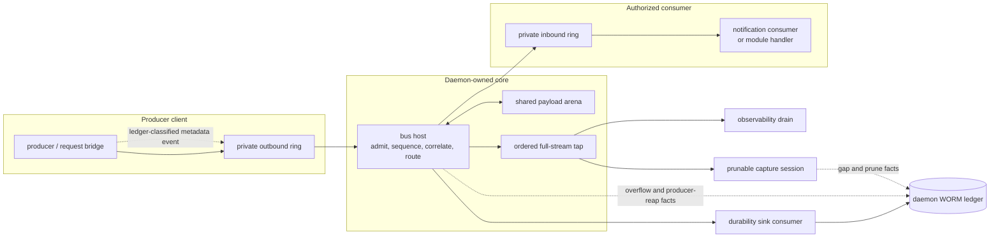
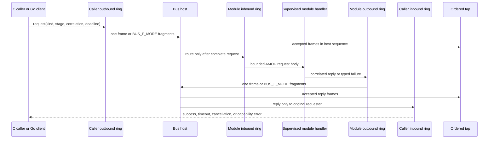
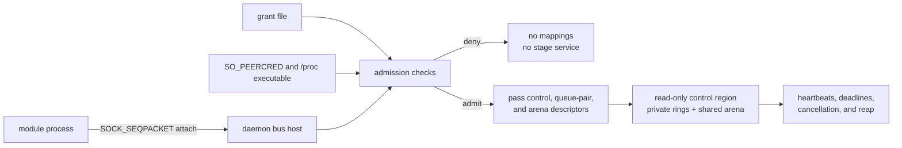

# Event bus

The event bus is the new spine inside `aimee-server` and `aimee-kb`. It replaces scattered
in-process side channels with one typed, ordered, bounded transport.

Today it carries observability and audit traffic as well as production module request/reply
decisions. It is also the contract that lets C and Go modules attach without sharing
implementation details.

## Why it exists

Before the bus, every new module needed its own queue, callback, logging path, and shutdown rules.
Completeness depended on finding every call site.

The bus gives each daemon one host, one private queue pair per client, and one
full-stream tap. The data plane and evidence plane are related but not the same
record:



The tap materializes the accepted stream for diagnostics. It is not the WORM
writer. Ledger-classified module calls and rare loss/capture-state facts reach
the durable sink through bounded paths that remain available when capture is
missing or broken.

That buys us:

- one place to order, observe, meter, and audit inter-module work;
- C and pure-Go clients with byte-for-byte conformance tests and no cgo;
- bounded backpressure instead of unbounded queues;
- point-to-point request/reply, fan-out events, cancellation, and typed capability errors;
- large payloads by shared-arena lease instead of another copy;
- capture files that preserve the accepted stream for inspection and audit replay;
- a clean path for policy checks, workflow events, telemetry, and separately shipped modules.

The last item is an extension surface, not a claim that every subsystem has moved already.

Twenty-three process identities now run in the Go multicall executable:
`config`, `memory`, `learning`, `routing`, `delegates`, `tools`, `workspace`,
`git`, `skills`, `response-composition`, `execution-policy`, `governance`,
`workflows`, `roundtable`, `kb-synthesis`, `runtime-web`, `control-web`,
`benchmarks`, `sandbox`, `economizer`, `postgres`, `aimee`, and `egress`.
Each keeps its existing event kind and AMOD body contract, but the supervisor now
starts an authenticated Go process for that identity. C adapters serve as parity
fixtures. DB2 remains the separately supervised C process in the current catalog;
it uses the same admitted bus contract rather than an in-process exception.

A moved stage is a bounded decision, and the storage-heavy or daemon
orchestration code around it stays where it was. The memory rerank, the
response-composition key, the roundtable verification rubric, and benchmark
IR scoring are all decisions of that shape.

- **Governance** moves the bounded response tool-policy decision. Parsed-response
  mutation and its broader identity/OIDC plane remain in their current C owners.
- **Workflows** moves only the pure advance admission classification. The Go WFE
  remains the sole lifecycle, persistence, scheduling, and transition owner.
- **KB synthesis** moves only the deterministic code-unit grounding gate. Curator
  queues, model calls, storage, linking, promotion, and scheduling remain in their
  current owners.
- **Runtime web** moves the bounded RPC-fault-to-HTTP-status decision. Listener,
  authentication, sessions, proxying, and assets remain provider-owned. The server
  places the returned status in its RPC error envelope, and the physical Go HTTPS
  provider consumes it without reimplementing the policy.
- **Control web** moves bounded console-admin and fleet proxy-route authorization.
  Its physical Go provider and isolated process consume the same policy package,
  and the KB requests console-admin decisions over its local event bus rather than
  keeping a duplicate C allowlist.
- **Benchmarks** scores the production `memory.benchmark` RPC. A missing or invalid
  module response fails the benchmark rather than falling back to local scoring.
- **Skills** matches trigger frontmatter. The filesystem resolver loads the bounded
  skill body, then guardrails requests the match over event `7682`. No local trigger
  parser exists on the production path, and a missing or malformed reply emits the
  conservative advisory rather than silently skipping it.
- **Learning** selects the signal sink. Before a signal is persisted or any reranker,
  supersede, rule, or workflow proposal is queued, the router requests the sink mask
  over event `6145`. A missing or invalid response aborts ingestion, and the C router
  keeps no local signal-to-sink table.
- **Memory** supplies pre-injection confidence over event `5893`. An unavailable or
  malformed response omits the context envelope, and the formatter rejects missing
  confidence rather than substituting a locally selected tier.
- **Execution policy** makes the final tool authorization decision over event `8449`.
  The C enforcement caller applies the verdict and fails closed on absence, timeout,
  cancellation, or malformed output, with no local fallback.

## What is on it now

The server and KB publish these through the observability bridge:

- governed action audit rows;
- semantic guardrail decisions;
- server- and KB-side memory mutations;
- vault credential access;
- sandbox isolation degradation;
- MCP and tool-call activity;
- tool completion outcomes.

Separately, production request/reply traffic uses the module bridge. This includes governance's
response tool-policy decision: the server sends the policy gate, tool names, and upstream stop
reason to the supervised governance process and applies only the returned decision. A missing,
failed, or malformed governance reply fails closed; the response path does not evaluate that
policy locally. Workflow advance admission follows the same rule: the server supplies the
authoritative binding, current stage/state, and replay nonce to the supervised workflows process.
Only an explicit successful module decision can reach the workflow engine; bus failure returns an
error without advancing the work item.

The observability bridge uses three wire kinds: governed actions, semantic guardrail events, and
generic durability events. The action row is PII-bounded; memory identities are fingerprinted before
publication. The consumer drains accepted events to their durable sinks. Graceful shutdown stops
publishers, drains the rings, flushes capture, then tears down the host.

Every supervised event kind declares `ledger`, `capture`, or `sampled` durability in
`src/modules/process-contracts.json`. `make lint` resolves the public `module_api.h` declarations,
requires a durability decision for every stage, verifies that every `ledger` kind reaches the generic
WORM emitter, and fails if it resolves zero kinds. Ledger-classified module requests and replies keep
event/stage/trace identity, body sizes, result, and a response digest. They do not keep raw request or
response bodies.

A full queue is never a silent success. Publishers retry bounded backpressure; a stuck consumer
increments a visible drop counter and logs the failure.

## Ordering and delivery

The host assigns a monotonic sequence number before routing. The tap sees accepted events in that
order. Producers keep FIFO order; consumers only receive event kinds they subscribed to.

`publish` success means the producer ring accepted the event. It does not mean a consumer has
finished its work. Callers that need read-after-write behavior use the bridge flush point.

Requests and replies use a correlation ID. A missing server returns `capability_absent`. A reply
goes only to its requester. Notifications fan out to the authorized observers registered for that
kind. Wire version 3 permits a correlated request or reply to span ordered inline fragments:
`BUS_F_MORE` is set on every non-final fragment, and the first frame without it completes the
message. The host keeps the route pending until the request is complete, and cancellation retires
any partial request or reply.



The sequence diagram shows transport completion, not business durability.
`publish` means the outbound ring accepted a frame; a synchronous module call
completes only when the correlated reply is reassembled and validated. Declared
ledger metadata is emitted beside this path without retaining raw bodies.

Each client has its own queue pair. One slow consumer does not create an unbounded host queue.
Kinds declare whether they block or may shed under pressure. Sheds become typed overflow records in
the ordered tap and rare durable `bus.overflow` rows. Reaping a producer with blocked work similarly
records `bus.producer_reaped` with the discarded sequence, event kind, and source slot.

## Payloads

Small payloads ride inside a ring slot. Trusted in-daemon publishers can put larger event payloads
in a lease in the shared arena:

1. the producer allocates and fills a span;
2. the frame carries its offset, length, and generation;
3. the host assigns references to the destination set;
4. each consumer releases its reference after reading;
5. the last release reclaims the span.

Generation checks reject stale references. Client reap releases abandoned references. Capture
materializes arena bytes into the record, so replay never depends on a live arena.

Arena allocation is for trusted code co-located with the host. Separately shipped module processes
do not allocate arena leases: the module protocol fragments request and reply bodies above the
negotiated inline budget and reassembles them at the endpoints. The current module-message limit is
16 MiB; an oversized or malformed stream is rejected and drained without being delivered to a
handler.

## Capture and replay

The host tap writes CRC-checked, length-framed capture files under `AIMEE_CAPTURE_DIR` when set, or
the aimee config directory otherwise. A record contains the original frame and materialized payload.
Retention keeps the newest 16 capture sessions and prunes older files when a new capture starts.

Replay is observational: it presents the exact accepted stream to an inspector. It does not execute
tools or drive a module again.

The durable WORM audit ledger remains the security record. Capture is the ordered diagnostic and
replay layer above it; it may be disabled, abandoned after an I/O or allocation failure, or pruned.
Each transition to `no_home`, `open_failed`, `write_failed`, or `sink_broken` writes a durable
`bus.capture.gap` row naming the capture session and last flushed sequence. Each pruned session writes
`bus.capture.pruned`. Server and KB health expose `capture_ok`, plus the reason, session, and last
sequence when capture is unavailable. Absence therefore does not masquerade as an empty period.

An off-host witness or anchor is still required for evidence against a fully compromised host.

## Completeness boundary

The durable coverage claim is exactly "what crossed the bus," not "every function call in the
daemon." Seven components remain `execution: core`: `module-runtime`, `ir`, `translation`,
`protocols`, `gateway`, `vault`, and `audit`. Calls among those components are ordinary in-process
calls and are not made observable merely by this bus record. Their existing explicit audit bridges
still apply, but this mechanism cannot claim to observe calls that never use the transport.

## Trust boundary

The v0 bus is Linux-only. The host creates anonymous `memfd` regions and admits clients over a Unix
`SOCK_SEQPACKET` socket, passing descriptors with `SCM_RIGHTS` only after admission.

The control region is read-only. Every admitted client maps only its queue pair plus the shared
arena; it cannot enumerate or map another client's rings. The arena is cooperative isolation for
trusted native modules, not a sandbox for hostile code.

The bus is intra-daemon. `aimee-server` and `aimee-kb` each host their own bus from the same
`libaimee-core-event-bus.a`; the thin client does not link it. Traffic between `aimee-server`, `aimee-kb`,
browsers, thin clients, and providers uses the authenticated `/v1` network surfaces through the
shared connection layer.

## Admitting a module process

A module process is not admitted because it connected. The host reads a policy directory at
`<config dir>/modules.d/<daemon>` and admits only principals granted there, so a module started
against a daemon with no matching grant is refused with `bus: attach denied` and never serves a
stage. Each grant is one `*.grant` file (any other suffix is ignored) of `key=value` lines:



| Key | Meaning |
| --- | --- |
| `version` | `1` |
| `principal_class` | principal class; module processes use `1` |
| `principal_ref` | the module's stable principal id, from `cmd/aimee-module/main.go` |
| `uid` | `self` to require the daemon's own uid, or a numeric uid |
| `executable` | absolute path of the module binary |
| `publish` / `subscribe` / `request` / `serve` | comma-separated event kinds, empty for none |

`serve` lists event KINDS, not stage ids. The kinds and stage ids for a module live in its
`module_api.h` (for git, `src/modules/git/include/aimee/git/module_api.h`).

Granting the git module on `aimee-server`, which serves six kinds (`7425` to `7430`):

```
# <AIMEE_HOME>/modules.d/server/git.grant
version=1
principal_class=1
principal_ref=13
uid=self
executable=/opt/aimee/aimee-module-git
publish=
subscribe=
request=
serve=7425,7426,7427,7428,7429,7430
```

One binary hosts every module and selects by its own name, so build it once and invoke it as
`aimee-module-<name>` with the daemon's bus socket:

```bash
go build -o aimee-module-git ./cmd/aimee-module
./aimee-module-git "$AIMEE_HOME/server-module-bus.sock"
```

Read the failure from both ends. The module says `bus: attach denied`; the daemon side shows up as
whatever depended on that stage, which is rarely phrased as a bus problem. A git module that never
attaches makes every forge call report that the git module could not be reached, and makes credential
resolution report that the credential-resolve stage could not be reached, because the stage that
answers "which workspace owns this checkout" is the module itself.

## Adding a consumer

Keep the contract small:

- assign a stable event kind and bounded schema;
- declare `ledger`, `capture`, or `sampled` durability and its reason in the process contract;
- choose notification or correlated request/reply;
- declare block or shed behavior;
- register only the observers that need the kind;
- keep action policy before delivery and storage off the hot path;
- add C/Go vectors when the wire contract changes;
- test shutdown, queue exhaustion, malformed frames, client reap, and capture replay.

Use `bus_client_publish` for ordinary inline events. Use the arena for a trusted co-located event
publisher that needs a lease. Use the module request API for module calls; it selects ordered inline
fragmentation when a request or reply exceeds the inline budget.

Code lives under `src/core/event_bus/`. The public C client is `bus_client.h`; the pure-Go client and
module process runtime are under `server-go/bus/`. Both runtimes implement the same AMOD envelope,
fragmentation, deadline, cancellation, heartbeat, and host-epoch behavior. The source headers hold
the wire and arena invariants.
