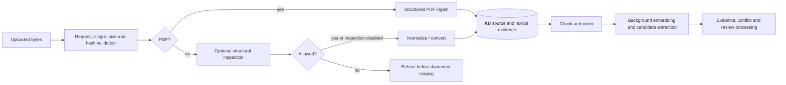

# Knowledge and memory

Server keeps one human's durable personal memory and private code. An optional KB turns shared
sessions, documents, code, and explicit facts into a scoped corpus with source evidence, retrieval,
and curation. Both use the same Go memory implementation in separate placements.
[Server and KB](SERVER_AND_KB.md) defines this boundary.

## Choose personal or shared memory

Ordinary memory commands default to Server's personal store. Select `--store kb` explicitly to
address shared knowledge; then use project/workspace scope to select the audience. The same numeric
ID can exist in both stores. A failed personal lookup or unavailable database never falls back to KB.

```bash
aimee memory store preference "I prefer concise progress updates"
aimee memory search "progress updates"
aimee memory recall --query "progress updates"
aimee memory get <user-id>

aimee memory store --store kb --project example staging_region "Staging is in eu-west-1"
aimee memory search --store kb --project example "staging region"
aimee memory get --store kb <kb-id>
```

Personal scope is instance-local `user`. KB memory accepts `global`, `workspace`, and `project`;
it rejects user-memory scope. Promotion to a broader audience needs an authorized write. Merely
connecting a Server to a KB does not publish its personal rows or vectors.

Working memory is session scratch in Server runtime state. Durable personal memory survives a
session; it does not need promotion to shared knowledge to become persistent.

## Record types

| Placement | Records and capabilities |
| --- | --- |
| Server | Personal memories, retained revisions, correction proposals, local recall and vectors, private code |
| KB | Shared memories and rules, typed facts, documents/chunks/assets, entities and decisions, code graph, provenance, curation and retrieval evidence |

Model-derived material carries source, confidence, time, and authority. Confidence scores do not
replace lifecycle or caller authority. Typed facts have their own candidate and review states;
episodic memory rows have a separate lifecycle.

## Ingest and curation

Document ingestion belongs to KB. Remote file commands upload bytes from the thin client; the
Server cannot open a path on the client's machine.



`AIMEE_KB_DOCUMENT_INSPECTION` enables bounded inspection of non-PDF raw bytes before conversion.
It checks package structure and hidden/active content. Non-clean dispositions fail before staging a
document row. The flag remains off by default while rollout evidence is collected.

The fast path commits source and lexical evidence. Background workers claim durable knowledge
queue rows for embeddings, typed artifacts, links, and synthesis. Availability of an optional model
does not imply that all stages ran. See [Curator pipeline](CURATOR_PIPELINE.md).

## Recall and freshness

The Go owner combines lexical, versioned dense, and graph candidates according to the selected
placement and operation. KB fact recall also checks relation sensitivity and the request's actual
need for personal information; a caller-supplied flag cannot grant unrelated sensitive content.

Current shared recall applies active lifecycle, suppression, valid-time intervals, configured utility
horizons, and derived-input currency before candidates can be served. Scope and row security remain
additional gates. Dense candidates must match the active embedding generation and current input
fingerprint; stale vectors cannot nominate changed source rows. Utility-horizon enforcement is
implemented but disabled by default.

An unavailable optional embedding provider can leave lexical recall available. A required database
read failure is an error, not an empty successful result. Personal/shared context composition happens
on Server, keeps personal data local, and budgets the final envelope. Explicit shared-only recall
skips personal composition.

See [Retrieval stack](retrieval-stack.md) and [memory behavior](MEMORY.md) for the exact contracts,
served views, source receipts, and provider-dispatch checks. Quality measurements require a pinned
corpus, policy, model identity, and configuration; old ranker results do not certify the current path.

## Typed facts and review

Typed facts are relationship triples checked against an ontology and source evidence. Go owns
assertion, authority admission, canonical identity, recall, and operator review. Model assertions
enter candidate state; ordinary fact recall selects serving states. A verified higher-authority
assertion or permitted review can change that state.

The KB console provides operator approve, reject, and undo. A model cannot acquire operator rank
from text or from the human's ambient login. Confidence and repeated exposure do not override an
active refusal. Automatic fact-maintenance code exists, but no production caller of its dispatch
operation was found at the reviewed commit; a configuration field alone does not establish a
running promotion loop.

The Go rejection consult and database backstop both protect refused facts, with a remaining
canonical-identity mismatch described in the [Atlas review](reviews/agent-memory-atlas-2026-09-29.md).
The same review records the effective runtime-role grant gap. Those limits matter when describing
protection against writers that bypass the Go owner.

## Corrections and history

KB corrections create a successor row and close the old validity interval while preserving scope,
authorship, and history. Personal corrections retain revisions in the personal store. Protected
content that a model cannot replace can produce a linked review proposal in either placement.

The correction review API requires verified user authority, the proposal ID, payload digest, and
exact expected version. Terminal decisions remain terminal for an identical draft. These operations
retain a shared-store default: pass `store=user` explicitly for personal proposal listing/review.
The backend exists; a correction-proposal UI caller was not found in `frontend` or `control-web`.
Typed-fact console review is a separate workflow.

An ordinary current read differs from history inspection. KB `get --as-of` inspects a named retained
version and labels valid-time applicability; it does not reconstruct belief time. Assertion search
has distinct world-valid and belief-time axes. Personal revision reads use exact owner/version
identity. Historical reads remain authorized, scoped operations and cannot revive erased or rejected
content. See [Memory](MEMORY.md#current-state-retrieval-validity).

## Memory lifecycle

Current recall excludes archived, rejected, superseded, suppressed, and expired records without
requiring the legacy `memory.lifecycle.enabled` / `hide_archived` flags. The Go eligibility predicate
is authoritative; those native accessors have no production caller in the reviewed tree.

Current direct-ID reads also apply eligibility. Historical inspection can admit retained archived,
superseded, and retired versions under its separate contract; it does not provide an unrestricted
read-by-ID escape. Retention, erasure, and authorization are distinct from relevance filtering.

Decision-log entries have their own lifecycle. The curator can mark an active decision `revisit_due`,
and governance listing exposes it. No consumer of that state was found in the Go memory context
path, so it should not be described as an automatic reminder delivered to the model.

## Audit and privacy

Memory writes are screened for credentials and sensitive patterns. This screening is narrower than
instruction-injection detection, which also runs at recall/materialization boundaries. Storing text
does not make its instructions trusted.

KB row mutations submit a content-free audit intent in the same PostgreSQL transaction. The WORM
worker later appends committed intents to the separate chain. Action events on the local bus are
additional observations; enqueue success is not a durable-delivery acknowledgment. See
[Storage ownership](STORAGE_TIERS.md) and [WORM worker](WORM_WORKER.md).

Each instance owns its embedding and optional synthesis endpoints. Standard Compose uses separate
model sidecars with instance identities. A remote embedding endpoint receives input text, so choose
placement according to the selected store's privacy and egress requirements.

## Current scope

Standalone Server personal memory, optional shared KB recall, operator typed-fact review, reviewed
memory corrections, revision-aware retrieval, and scoped curation are implemented. Model availability,
permissions, and individual policy modes still control which paths run. Multi-KB fleet routing remains
planned. The [status page](STATUS.md) and [Atlas review](reviews/agent-memory-atlas-2026-09-29.md)
separate current implementation from remaining qualification and improvement work.
