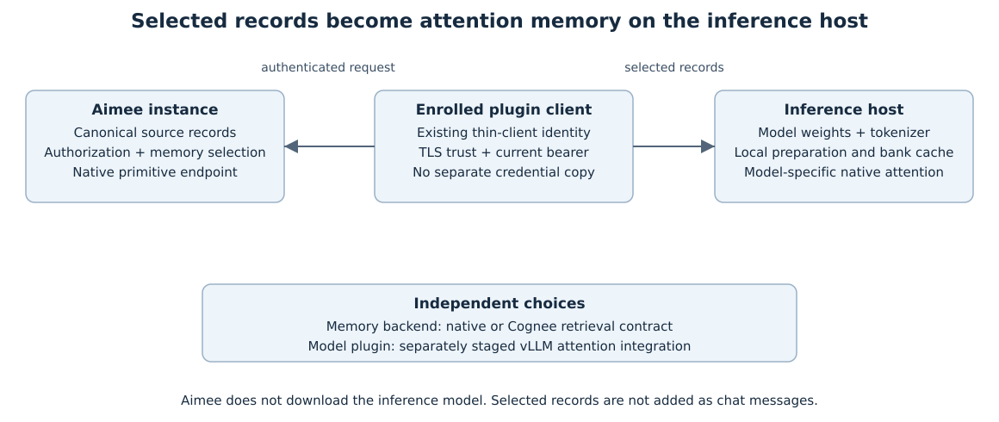

# Native memory with a local vLLM model

The native-memory plugins let a supported local model consume Aimee-selected records through its
attention state. Aimee owns the source records and their authorization. The inference host owns
model weights, preparation and cached native state; selected memory stays outside the chat prompt.



The current release candidate is **0.3.2 build 2, unpublished**. It replaces the generic 0.2.3
plugin with three dedicated adapters and one shared `aimee-native-runtime==0.3.2` dependency.
Its [release preparation record](releases/native-memory-v0.3.2/README.md) pins the wheel bytes and
lists the remaining server, signing and publication gates. The signed
[0.2.3 stage](releases/native-memory-v0.2.3/README.md) retains its original evidence.

## Choose the plugin for your checkpoint

| Model | Package and console command | Tested 0.3.2 checkpoint |
| --- | --- | --- |
| Gemma4 12B | `aimee-gemma4-12b` | Q4_K_M GGUF |
| Gemma4 26B A4B | `aimee-gemma4-26b` | Q3_K_M GGUF |
| Qwen3.8 27B | `aimee-qwen3-8-27b` | FP8 with 18 GiB CPU matrix offload |

These wheels require Linux x86-64, CPython 3.12, **glibc 2.39+ and vLLM 0.30.0**. Recorded
execution uses an RTX 5080, CUDA 13.0, Torch 2.13.0 and Triton 3.7.1, with single-GPU, text-only,
eager synchronous V1 serving and prefix caching disabled. The older 0.2.3 Q8/HIP results establish
coverage for those older bytes. They do not qualify the new packages on HIP or arbitrary checkpoints.

Each plugin carries its own Rust adapter and checked model binding. Common enrollment, selection,
supervision and vLLM integration live in the shared runtime. Co-installation preserves separate
namespaces; one serving process selects one adapter. Python/Cython remains the framework bridge.

## Install the reviewed candidate and enroll

**The commands below use locally supplied release wheels. Public release URLs are pending.**
Install the GPU runtime in a Python 3.12 environment, verify the supplied wheels using the
[release verifier](releases/native-memory-v0.3.2/verify_assets.py), then select your package:

```sh
python -m pip install --find-links /path/to/release-wheels 'aimee-gemma4-12b[gguf]==0.3.2'
# Alternatives: 'aimee-gemma4-26b[gguf]==0.3.2' or 'aimee-qwen3-8-27b==0.3.2'
```

The wheel directory must include the shared runtime and the pinned GGUF loader when you use the
`[gguf]` extra. Aimee binaries, model weights and vLLM are separate dependencies.

Create an invitation in Settings → Clients and enroll the standard thin client as described in
[Thin clients](THIN_CLIENT.md). Connect the selected model command to that profile:

```sh
aimee remote set https://your-aimee-endpoint INVITATION
aimee remote status
aimee-gemma4-12b connect-aimee --aimee-home /absolute/path/to/enrolled-profile
# Supply VLLM_API_KEY in the process environment or a private service environment file.
aimee-gemma4-12b serve --config ./serving.json
```

Use the matching console command for either other model. `--root /absolute/path` before a
subcommand selects a separate managed instance. The plugin retains the profile path and reads its
current bearer, certificate and TLS pin. A changed enrolled identity requires reconnecting and
restarting the instance. Serving requires a nonempty `VLLM_API_KEY` and binds to loopback.

## Bind preparation to the serving model

Your serving configuration identifies the local model directory, matching tokenizer and
`config.json`, checkpoint precision and host/device/disk memory budgets. Gemma GGUF configurations
also bind `gguf_weights`, `gguf_weights_sha256` and `gguf_weight_profile`. Keep Qwen on V1 with
prefix caching disabled and provide its complete attention and recurrent prefix. A bank prepared
for another checkpoint, precision or position protocol is rejected.

Cold or changed source is prepared through the resident model while admission is withdrawn.
Preparation loads no second model. Every selection rechecks current source authority, including
warm cache reuse. Gemma uses stock positive-position capture; older negative-position publications
must be re-encoded. The enrolled path currently selects personal memory. Shared organization
memory needs its separate authorization and selection contract.

The server needs `POST /v1/native/primitive` plus unique, bounded source export. Published Aimee
0.4.6 lacks that route. The application follow-up supplies the export repair described in
[release preparation](releases/native-memory-v0.3.2/README.md). Use a build containing that fix;
final release-image qualification and public plugin installation remain publication gates.

Storage and retrieval remain selected through the [memory backend contract](modules/memory.md#memory-backend-contract).
Changing native/Cognee retrieval and installing a model attention plugin are separate operations.
