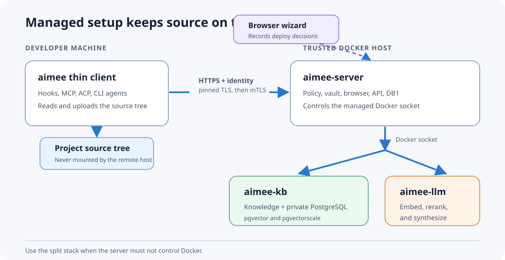
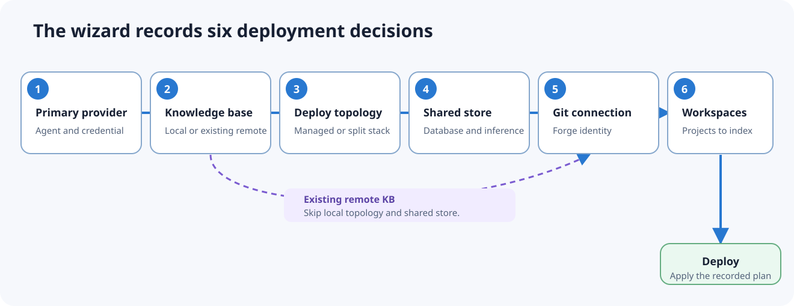

# Quickstart

Run the services on one machine. Install only the thin client where you write code.



## 1. Start the managed server

You need Docker with Compose v2. The managed server mounts the Docker socket so its browser wizard
can start the KB and inference containers.

```bash
git clone https://github.com/RakuenSoftware/aimee.git
cd aimee
docker compose -f compose.server-managed.yaml up -d
```

Open <https://localhost:8443> and sign in with:

```text
user:     aimee
password: aimee-local-dev
```

Run the setup wizard. It records six decisions: primary provider, knowledge base, deploy topology,
shared store, git connection, and workspaces. An existing remote KB skips the local topology and
store decisions.



The final **Deploy** step starts:

- `aimee-kb`, including private PostgreSQL 18, pgvector, and pgvectorscale;
- `aimee-llm`, with the selected inference tier.

Change `AIMEE_WEBCHAT_USER` and `AIMEE_WEBCHAT_PASSWORD` before exposing this host. The defaults are
for local setup only.

Check the containers:

```bash
docker compose -f compose.server-managed.yaml ps
docker compose -f compose.server-managed.yaml logs --tail=100 aimee-server
```

If the server must not control Docker, use the split stack instead:

```bash
docker compose -f deploy/compose/aimee.yaml up -d
```

The old combined image is gone.

## 2. Install the client

Download the binary for your platform from the latest GitHub release.

### Linux

```bash
install -Dm755 aimee-linux-x86_64 ~/.local/bin/aimee
export PATH="$PATH:$HOME/.local/bin"
aimee version
```

Use `aimee-linux-arm64` on ARM64.

### macOS

```bash
install -m755 aimee-macos-universal ~/.local/bin/aimee
xattr -d com.apple.quarantine ~/.local/bin/aimee 2>/dev/null || true
export PATH="$PATH:$HOME/.local/bin"
aimee version
```

### Windows

Rename the download to `aimee.exe`, put it in a directory on `PATH`, then open a new PowerShell:

```powershell
aimee version
```

The client is DB-free. It does not need PostgreSQL, SQLite, the KB, or model libraries.

## 3. Enroll the client

Use the server URL and the one-use bootstrap bearer:

```bash
aimee remote set https://server.example:8743 aimee-local-dev
aimee remote status
```

`remote set`:

1. connects to the private server certificate;
2. prints and stores its fingerprint;
3. trades the bootstrap bearer for a deployment bearer;
4. enrolls an individual mTLS certificate on Linux;
5. writes private state to `~/.config/aimee/remote.conf`.

Verify the fingerprint against the server through a second channel. Do not accept an unexpected
change. The bootstrap bearer stops authorizing ordinary routes after enrollment.

For a self-signed certificate during local setup, set `AIMEE_TLS_INSECURE=1` only for the enrollment
command. The stored fingerprint is the trust anchor after that. Do not leave insecure TLS enabled.

macOS uses Secure Transport and Windows uses Schannel. Automatic CSR enrollment is currently the
Linux path; configure the client certificate explicitly on the other platforms when the server
requires mTLS.

## 4. Verify the stack

```bash
aimee status
aimee kb status
aimee audit verify
```

Then test a durable write and read:

```bash
aimee memory store quickstart "Enrollment works"
aimee memory search "Enrollment works"
```

A remote write needs two permissions: the deployment must permit the write tier, and the signed-in
user must hold the matching grant. If reads work and writes return `403`, check both. Setting
`remote_writes=full` alone grants nobody access.

## 5. Add a workspace

Run this on the machine that holds the source tree:

```bash
cd /path/to/project
aimee workspace add .
aimee index scan .
aimee index overview
aimee index find main
```

The client uploads content to the server and KB. The remote server never reads `/path/to/project`
directly.

Large repositories ingest in chunks. Use `aimee kb status` and `aimee kb ingest status` to follow
the queue.

## 6. Connect a coding tool

Client setup registers the local MCP server and supported hooks. To keep global tool configuration
unchanged:

```bash
export AIMEE_NO_CLIENT_INTEGRATIONS=1
```

For manual MCP setup, use a stdio server with:

```text
aimee mcp-serve
```

The process inherits the enrolled remote target. It exposes memory, index, delegation, and other
allowed tools while all state remains on the server.

Use `aimee api status` for OpenAI- or Anthropic-compatible endpoint snippets. ACP editors use the
ACP bridge. The removed `aimee chat` TUI is not part of current builds.

## 7. Add delegates

List the seeded roster:

```bash
aimee agent list
aimee provider list --available
```

Probe an agent before relying on it:

```bash
aimee agent probe <name>
```

Run one task:

```bash
aimee delegate review --persona reviewer "Review the current diff"
```

Local API or OAuth credentials belong in the server vault, not `agents.json` or the project:

```bash
aimee vault unlock
aimee vault set <agent> <credential-name> <secret>
```

See [Delegates](DELEGATES.md) for local endpoints, API providers, CLI agents, roles, and sandbox
policy.

## 8. Back up before changing topology

The embedded KB database lives in the KB home volume. Export it before moving to external
PostgreSQL or replacing compose files:

```bash
./deploy/container/aimee-kb-db-export.sh --help
```

Also back up `~/.config/aimee/` from the server volume. Never run `docker compose down -v` while a
named volume is your only copy.

## Service commands

```bash
docker compose -f compose.server-managed.yaml ps
docker compose -f compose.server-managed.yaml logs -f
docker compose -f compose.server-managed.yaml restart
docker compose -f compose.server-managed.yaml down
```

`down` keeps named volumes. `down -v` deletes them.

## Next

- [Manual](../MANUAL.md)
- [Event bus](EVENT_BUS.md)
- [Security](SECURITY.md)
- [Workflows](WORKFLOWS.md)
- [What's new since v0.2.192](WHATS_NEW.md)
