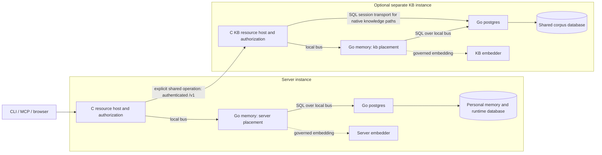

# Server and KB

**Server assists one human. KB serves a shared corpus.** Each is an independent instance with its
own identity, Vault, PostgreSQL store, event bus, and model configuration. Server works without a KB.
Connecting a KB adds an explicitly selected shared store; it does not relocate personal memory.

## Choose the owning instance

| Responsibility | Server | KB |
| --- | --- | --- |
| Sessions, agents, tools, provider credentials | Owns the human's runtime | No ownership of a Server's sessions or credentials |
| Workflow execution | Supervised `aimee-wfe` peer owns lifecycle | Supplies knowledge when requested |
| Personal memory | Durable `user_memories`, local vectors, user scope | Rejects user-memory scope |
| Private code | Local code index and vectors | Receives only code published to its corpus |
| Shared memory | Calls the selected KB through authenticated `/v1` | Owns `memories` in global, workspace, and project scopes |
| Documents, typed facts, shared graph, curation | Uses the KB's exposed operations | Owns the corpus and its background work |
| Database and models | Instance-local PostgreSQL and embedding; optional synthesis | Separate PostgreSQL and embedding; optional synthesis |
| Administration | Runtime browser workspace | KB administration and review console |

A scope selects an audience within a store. It does not select a deployment. For ordinary memory
commands, `store=user` selects Server and `store=kb` selects the configured KB. A project name,
working directory, numeric ID, or failed private lookup cannot switch the destination.



The diagram shows memory ownership and the native KB algorithms using the same PostgreSQL provider. Each instance has its
own bus. Network authentication connects the instances; no shared bus or cross-instance SQL
connection is implied. Embedding arrows summarize governed provider calls, not direct socket access
from the memory module.

## Shared code, separate state

Both roles ship in the same application image. First boot persists the selected role and UUID in
`instance-identity.json`. A later boot with the opposite role is refused. The role supervisor
requires the role, configuration, PostgreSQL, and memory modules and rejects a conflicting role.

The same pure-Go memory executable runs in each composition. `AIMEE_MODULE_PLACEMENT=server`
accepts only the instance-local `user` scope; `kb` accepts `global`, `workspace`, and `project`.
Placement is explicit and validated. The presence of a table cannot grant another placement.

The Go memory module owns memory policy, retrieval, and mutations. It uses the PostgreSQL module
through the local bus and holds no DSN. The C hosts authenticate and transport requests. Native KB knowledge algorithms use session
capabilities to reach the same Go PostgreSQL provider. Both roles have retired native libpq pools;
remaining C domain code does not imply a second database provider.

`DB1` remains a name in Server interfaces and migration history. The former `DB2` process and
namespace have been retired; the knowledge schema now lives under `src/modules/kb/c/`. Older
reports use DB2 for that KB schema. They do not distinguish
volatile from durable memory: personal memory is durable too. The
[shared database contract](DB.md) consolidates implementation and schema compatibility; it does
not authorize merging Server and KB installations or their volumes.

Source contracts: [role identity](../server-go/modules/module-runtime/identity/),
[Server composition](../server-go/modules/server/role.go),
[KB composition](../server-go/modules/kb/role.go),
[memory placement](../server-go/modules/memory/scope.go), and
[Server store selection](../src/server/server_memory.c).

## Select memory deliberately

```bash
# Personal memory on Server; no KB needed.
aimee memory store preference "I prefer concise progress updates"
aimee memory search "progress updates"
aimee memory recall --query "progress updates"

# Shared knowledge; requires a configured KB and permission for this scope.
aimee memory store --store kb --project example staging_region "Staging is in eu-west-1"
aimee memory search --store kb --project example "staging region"
aimee memory get --store kb <kb-id>
```

The corresponding Server API field is `"store":"user"` or `"store":"kb"`. Ordinary get,
store, search, list, and recall default to personal storage. Correction-proposal listing and review retain a shared-store default when `store` is omitted;
pass `store=user` explicitly for personal corrections. Advanced shared operations have their
own contracts; see the [manual](../MANUAL.md#memory) and [memory module](modules/memory.md).

IDs are local to their store. Personal row 42 and shared row 42 are different records. Preserve
scoped handles and the store selector when passing results between tools. A missing record is a
missing record in the selected store; an unavailable owner is an error, not an invitation to try
another store.

Server also owns a context-composition path that combines an allowed shared recall envelope with
personal identity and preferences. Personal values override matching shared keys in those sections,
and Go budgets the composed response. Personal rows stay on Server. Explicit shared-only recall
skips this composition. Cross-store composition is not an atomic snapshot of both databases.

## Deploy and recover independently

Use [compose.yaml](../compose.yaml) for Server. It starts the application, a PostgreSQL container,
and a local embedding sidecar. Synthesis is optional. The managed variant adds Docker-socket access
for managing models; it does not install a KB.

Use [compose.kb.yaml](../compose.kb.yaml) in a distinct Compose project for shared knowledge. The
KB uses the same image with a different immutable role and its own volumes and credentials. Some
volume suffixes retain Server names for compatibility; the Compose project supplies their separate
namespace. Never layer the KB file onto an existing Server home or store.

Both roles default to ordinary Docker storage. LUKS is an explicit deployment option. Model
endpoints and identities belong to the instance using them, including when remote providers are
configured. Connecting a KB does not move Server's personal vectors to the KB embedder.

Back up each instance's home, Vault, database, workspaces, and audit evidence as a matched set.
Restore into the same role. Preserve the separately credentialed KB WORM worker's ledger as described
in [WORM worker](WORM_WORKER.md). See [deployment](DEPLOYMENT.md) for enrollment, volumes, ports,
and recovery procedures.

## Diagnose the selected boundary

| Symptom | First checks |
| --- | --- |
| Personal recall unavailable | Server memory attachment, `server` placement, local PostgreSQL, then local embedding |
| Personal lookup returns no record | Personal store and ID, current lifecycle and validity; do not search KB implicitly |
| Shared recall unavailable | KB selection, enrollment and service credentials, KB health, KB memory and store |
| Shared results omit a record | Authorized project/workspace, lifecycle, validity, evidence visibility, embedding freshness |
| Semantic lane unavailable | Selected instance's embedding identity, dimension, active generation, and provider readiness |
| Role mismatch at startup | Persisted identity and Compose project/volumes; do not rewrite the identity to bypass it |

An absent optional embedder can leave lexical retrieval available. A required SQL read failure must
remain a failure. KB availability and local personal-memory availability are separate checks.

## Limits to keep explicit

- **One configured KB path.** Fleet selection remains planned; a fleet design is not a shipped router.
- **Placement-specific capabilities.** Personal recall does not imply local support for KB document
  curation, typed-fact review, structured directives, or every historical query.
- **Application and database authority.** Verified caller scope and model/user authority still need
  enforcement inside each placement. Separate containers alone do not prove correct database grants.
- **Versioned evidence.** [The Atlas review](reviews/agent-memory-atlas-2026-09-29.md) distinguishes
  the reviewed commit and the remaining gaps after the latest upstream update.
