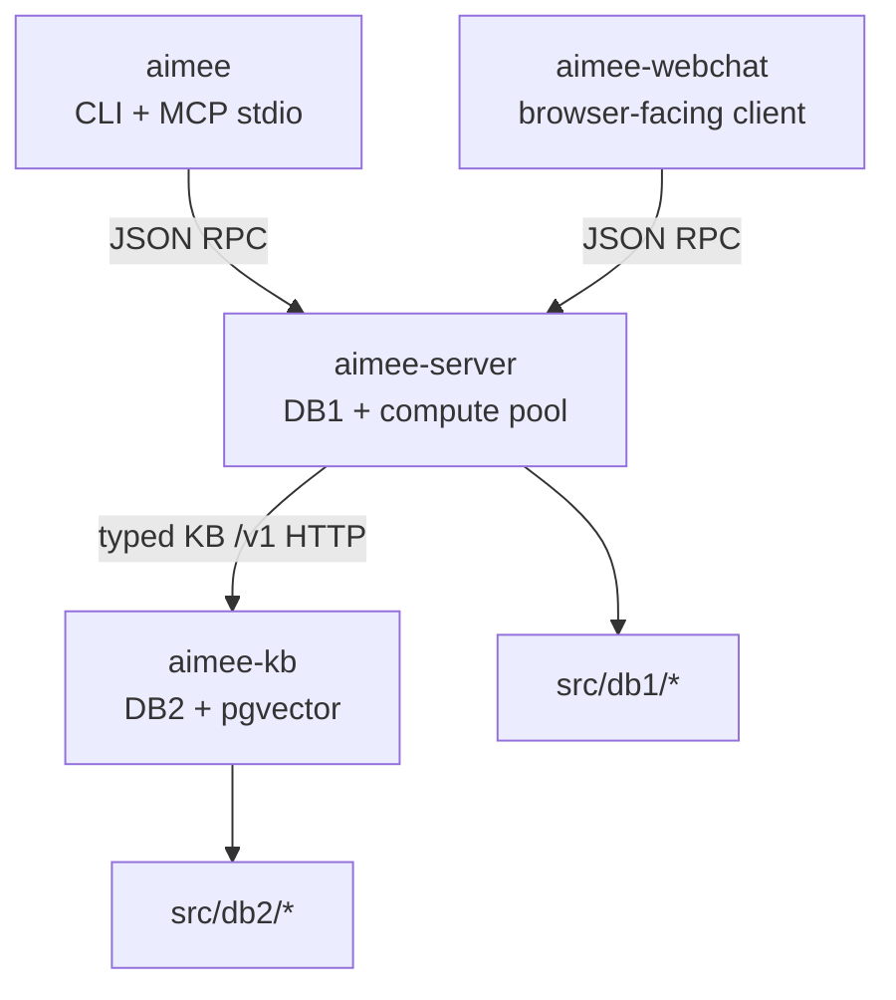

# Feature Status

This document tracks implemented features in the codebase. It is a
feature-tracking reference rather than a complete roadmap.

## Core System

| Feature | Status | Description | Key files |
|---------|--------|-------------|-----------|
| Tool registry with JSON schema validation | Done | Registers tools centrally and validates tool inputs against JSON schemas before execution. | agent_policy.c, db2/tool_registry.c |
| Plan IR (structured execution plans for delegates) | Done | Represents delegate work as structured plans so execution can be reasoned about and inspected consistently. | agent_plan.c |
| Execution transactions (file checkpoints, rollback) | Done | Protects file-editing operations with checkpoints and rollback support for safer execution. | agent_tools.c |
| Policy-as-code guardrails (primary + delegate agents) | Done | Applies codified safety and workflow rules to both primary and delegated agent execution. | agent.c |
| Deterministic replay (delegate execution trace) | Done | Records delegate execution traces so runs can be replayed and debugged deterministically. | agent.c |
| Eval harness with task suites | Done | Provides a repeatable evaluation harness for running the agent against defined task suites. | agent_eval.c |
| Confidence calibration and abstention | Done | Lets the agent estimate confidence and abstain when reliability is too low. | agent.c |
| Prometheus metrics (textfile collector) | Done | Exposes operational metrics in Prometheus textfile format for external scraping. | agent.c |
| Repo contract (.aimee/project.yaml) | Done | Loads per-project build, test, lint, and risk-path rules from a repository contract file. | agent.c |
| Environment introspection | Done | Detects available tools, platform details, and execution environment capabilities at runtime. | agent.c |
| Change manifests | Done | Produces structured records of changes made during an execution session. | agent.c |
| Hard/soft/session directives | Done | Supports multiple directive scopes so durable rules and per-session guidance can coexist. | agent_coord.c, cmd_rules.c |
| Two-phase plan mode (--plan) | Done | Supports planning-first execution with an explicit plan mode before acting. | agent_plan.c |
| ChatGPT backend endpoint (delegate provider) | Done | Integrates a ChatGPT-backed provider for delegate agent execution. | cmd_agent.c, agent_context.c, agent.c |
| Model fallback (delegate: gpt-5.4 -> gpt-5.4-mini) | Done | Falls back to a secondary model when the preferred delegate model is unavailable. | agent_context.c, agent.c |
| Extra HTTP headers (ChatGPT-Account-ID) | Done | Sends required account-scoped HTTP headers for backend requests. | agent_http.c, agent_types.h |
| JWT claim extraction (account_id) | Done | Extracts account identity from JWT claims for downstream request handling. | cmd_agent.c |
| Workspace manifest (YAML) | Done | Stores workspace configuration in YAML for discovery and management commands. | workspace.c |
| No-subcommand launch (exec primary agent) | Done | Allows the default CLI entrypoint to launch the primary agent directly without an extra subcommand. | main.c |
| Setup/quickstart provisioning | Done | Provides setup flows to provision the local environment for first use. | cmd_core.c |
| Workspace add/remove | Done | Adds and removes repositories from the managed workspace set. | cmd_core.c |
| Bootstrap script (setup.sh) | Done | Includes a bootstrap script for initial environment and dependency setup. | setup.sh |
| Standalone Go webchat | Done | `aimee-webchat` serves the browser UI, handles auth/session storage, and proxies live work to `aimee-server`. | webchat/, server.c |
| Network inventory | Done | Loads configured network host inventory for delegate routing. | cmd_agent.c, agents.json |
| Personas (8 built-in + custom) | Done | Named identity/voice + delegate policy, settable per session and used to staff roundtable panels and workflow steps. See [personas.md](personas.md). | persona.c, prompts.c |
| Webchat top-nav + per-tab projects | Done | One tab per tool (Chat/Dashboard/Workflows/Projects/Editor); each tab selects its own git project. | frontend/src/App.tsx, frontend/src/components/ProjectPicker.tsx |
| Webchat git projects + per-host credentials | Done | Clone repos (HTTPS or SSH-form URLs normalized to HTTPS); per-host tokens + GitHub OAuth device flow stored in the server vault. | git_project.c, git_host_cred.c, git_oauth_github.c |
| In-app VS Code editor | Done | Per-user `code-server` supervised by the server, reverse-proxied at `/vscode/`, opened on the selected project. Default-on. | webuser_editor.c, webchat/vscode.go |
| Workflow engine (authoring + execution) | Partial | Block catalog, typed-graph validation, canonical versioning, advance/gates/roundtable/human-approval, and the webchat composer are done; **no user-facing run trigger yet**. See [WORKFLOWS.md](WORKFLOWS.md). | src/workflow/wfe_*.c |

## Memory System

| Feature | Status | Description | Key files |
|---------|--------|-------------|-----------|
| Artifact-aware memory (linking, staleness) | Done | Associates memories with artifacts and tracks when recalled information may be stale. | cmd_memory.c, memory_core.c, db2/memory_payload.c |
| Workspace-scoped memory recall | Done | Restricts memory recall to the active workspace so unrelated repositories do not pollute context. | cmd_hooks.c |
| DB2 memory lexical search | Done | Adds DB2-owned lexical indexing so stored memories can be searched efficiently by content. | db2/memory_query.c, memory_core_search.inc |

## Delegate Agent System

| Feature | Status | Description | Key files |
|---------|--------|-------------|-----------|
| Delegate agent tool-use loop | Done | Runs delegated agents through a full tool-using execution loop rather than a single response pass. | agent.c |
| Delegate tool execution (bash, read, write, list, verify, git_log) | Done | Exposes the core execution toolset needed for delegated agents to inspect and modify repositories. | agent_tools.c |
| Ephemeral SSH (delegate agents) | Done | Provides short-lived SSH material to delegates so remote access stays scoped to the task. | agent.c |
| Context injection (primary agent via hooks, delegate agents via agent_context) | Done | Injects execution context differently for primary and delegated agents while preserving the same working model. | agent.c, cmd_hooks.c |
| Multi-delegate coordination (planner/critic/worker) | Done | Coordinates multiple delegate roles so planning, critique, and implementation can be split across agents. | agent_coord.c |
| Quorum voting (across delegate agents) | Done | Compares outputs from multiple delegates and resolves decisions through quorum-based agreement. | agent_coord.c |
| Roundtable / ensemble (MoA) | Done | `aimee delegate aggregate` fans out to a panel and an aggregator synthesizes one answer; `aimee delegate roundtable` runs multiple rounds. Runs through the delegate core; cost folds onto the originating session. Panel/aggregator ship configured. | delegate_ensemble.c |
| Sub-agent tool block (delegates, not agents) | Done | Blocks the host AI's own sub-agent launchers (Claude `Task`, Codex `spawn_agent`) and points the agent at `aimee delegate`. Always on. | guardrails_orchestrator.c, cli_main.c |
| Model-derived output limits | Done | Delegate/ingress output token caps come from the model registry rather than a fixed default. | model_registry.c |
| Durable delegate jobs (create, heartbeat, resume) | Done | Persists delegate job state so work can survive interruptions and be resumed later. | agent_jobs.c |
| Per-turn heartbeat updates (delegate agents) | Done | Emits heartbeat updates during delegate execution so long-running work remains observable. | agent.c, agent_jobs.c |
| Project descriptions (via delegate agent) | Done | Uses a delegate agent to generate or refresh project descriptions from repository context. | cmd_describe.c, workspace.c |

## Session Isolation

| Feature | Status | Description | Key files |
|---------|--------|-------------|-----------|
| Per-session state files | Done | Stores transient session state in isolated files rather than sharing one global state blob. | config.c, cmd_hooks.c |
| Git worktree isolation (primary + delegate agents) | Done | Keeps read-only delegates in the parent worktree and gives write-capable delegates isolated sibling worktrees to reduce interference and conflicts. | cmd_hooks.c, guardrails.c |
| Session-scoped tier state | Done | Tags DB1/DB2-backed state with session identifiers so concurrent sessions stay isolated. | db1/session_state.c, db2/memory_payload.c |
| Worktree path enforcement | Done | Enforces path boundaries so agents only operate within their assigned worktree locations. | guardrails.c |
| Stale session pruning | Done | Cleans up expired session state and abandoned worktrees to keep the environment healthy. | cmd_hooks.c |
| Session management CLI (list, show, close) | Done | `aimee session list` shows active sessions; `aimee session show <id>` reads one session; `aimee session close <id>` closes a session through the server. | cmd_infra.c |
| Worktree base-branch detection | Done | New worktrees branch from the workspace's current checked-out branch instead of always defaulting to main. | workspace.c |
| Configurable stale-session threshold | Done | Stale-session cleanup threshold defaults to 4 hours and is configurable via sessions.stale_threshold_secs. | config.c, cmd_hooks.c |
| Active-session and worktree caps | Done | sessions.max_sessions and sessions.max_worktrees caps trigger proactive cleanup then warn when still exceeded. | config.c, cmd_hooks.c, workspace.c |

| Memory search includes facts | Done | Ensures memory search results include L2 facts alongside conversation windows. | cmd_memory.c, memory_core_search.inc, db2/memory_query.c, server_state.c |
| Delegation pattern promotion | Done | Auto-promotes recurring delegation patterns from agent_log to L2 facts. | memory_logic.c |
| Richer delegation feedback | Done | Captures detailed feedback from delegate executions for pattern learning. | agent.c |
| Enhanced session-start context (primary agent) | Done | Expands session-start injection with project context, delegation history, and capabilities. | cmd_hooks.c |

## Code Intelligence

| Feature | Status | Description | Key files |
|---------|--------|-------------|-----------|
| C/C++ extractor | Done | Extracts C and C++ code structure for symbol-aware analysis and navigation. | extractors_extra.c |
| Lua extractor | Done | Extracts Lua code structure for the same symbol-aware analysis pipeline. | extractors_extra.c |
| Extractor test suite | Done | Verifies extractor behavior with automated tests covering supported language parsers. | tests/test_extractors.c |

## MCP and Integration

| Feature | Status | Description | Key files |
|---------|--------|-------------|-----------|
| MCP server (`aimee mcp-serve`) | Done | Stdio JSON-RPC 2.0 server exposing memory, index, and delegation tools to MCP-compatible primary agents. Built into the aimee client binary. | server_mcp.c, cli_mcp_serve.c |
| MCP auto-config (.mcp.json) | Done | Auto-generates MCP configuration for Claude Code and Codex CLI workspace integration. | cmd_core.c |
| Codex CLI local plugin | Done | Registers aimee as a local Codex CLI plugin via marketplace, plugin cache, and config.toml. | install.sh, cmd_core.c |
| Binary split (server architecture) | Done | Splits monolith into a thin client and full server. MCP is built into the client and server-side git MCP handlers run in-process. | see Server Architecture |
| Makefile install target | Done | Provides `make install` for building and installing all binaries to /usr/local/bin/. | src/Makefile |
| Deferred worktree creation | Done | Defers git worktree creation until first write access, keeping session-start fast. | guardrails.c, cmd_hooks.c |
| Local observability dashboard | Done | Embedded HTTP dashboard for viewing metrics, delegation history, and session state. | dashboard.c |

## Server Architecture

The shipped artifacts are four binaries: `aimee`, `aimee-webchat`, `aimee-server`, and `aimee-kb`. Common runtime code and git MCP handlers are linked directly into the binaries that need them instead of being shipped as separate executables or shared libraries. Long-running work uses `aimee-server`'s in-process compute pool; there is no separate worker binary.

| Binary | Libraries | External deps |
|--------|-----------|---------------|
| `aimee` | Thin CLI transport + MCP stdio bridge | pthread |
| `aimee-webchat` | DB-free webchat launcher; talks only to `aimee-server` through `webchat.serve` | pthread |
| `aimee-server` | Local DB1 daemon, agent/runtime orchestration, KB RPC client | sqlite3, ssl, crypto, pam |
| `aimee-kb` | Local-or-shared DB2 RPC service + memory/KB pipeline (incl. pgvector) | libpq, ssl, crypto |

## Refactoring

All planned structural refactoring is complete.

| Item | Status |
|------|--------|
| Command registry (command_t table) | Done |
| Agent.c decomposition (7 modules) | Done |
| Narrow agent headers (8 focused .h files) | Done |
| App context injection (app_ctx_t) | Done |
| DB stmt cache (FNV-1a hash keyed) | Done |
| Option parser (opt_parse) | Done |
| Global elimination (g_json_output etc.) | Done |
| Subcommand dispatch tables | Done |
| Migration registration cleanup | Done |
| agent_result_to_json() | Done |
| ctx_db_open/close helpers | Done |
| Session context builder extraction | Done |
| cmd_*.c module split | Done |
| Architecture comments on all .c files | Done |
| CLI integration tests | Done |
