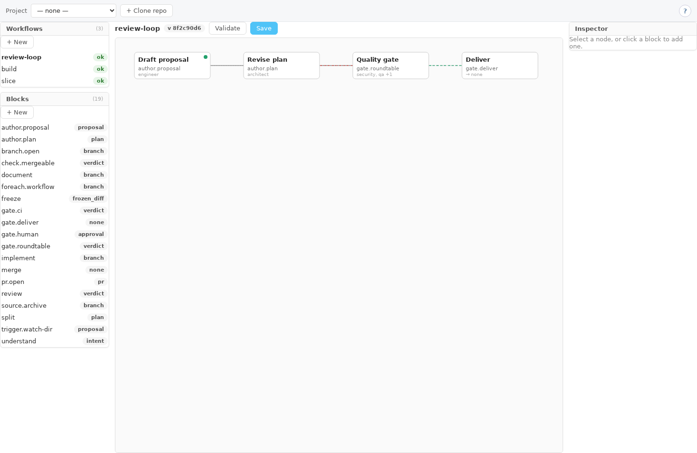
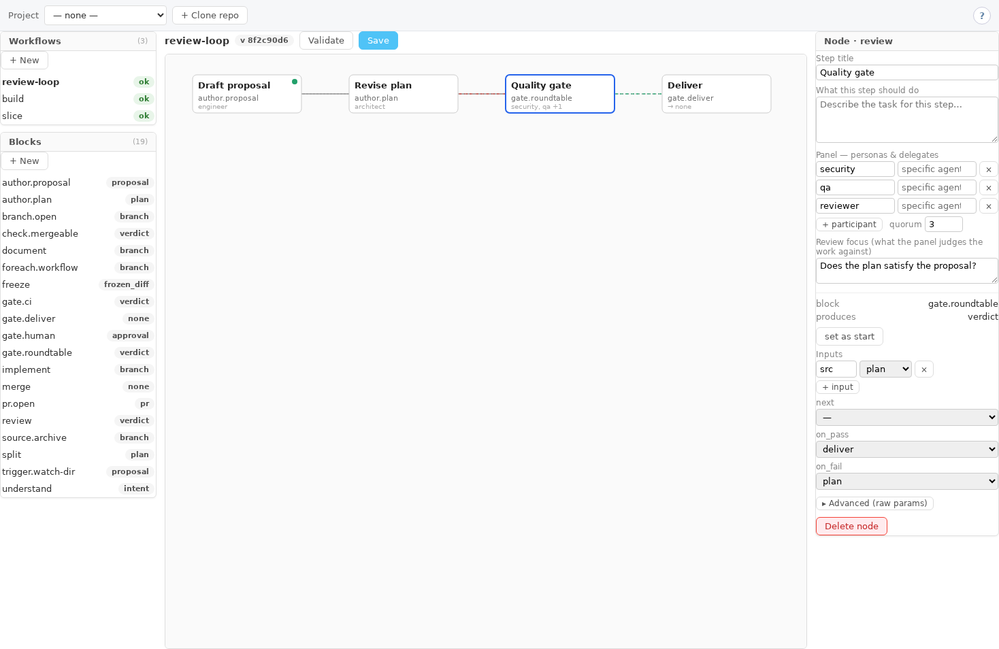

# Workflows

Use **Edit Workflows** to define a workflow graph. Use **Workflows** to submit a proposal and
operate a run. Definitions are instance-wide files under `$AIMEE_HOME/workflows`; the project picker
sets the current browser context but does not create a separate definition namespace per project.



## Choose a shipped workflow

The repository currently ships these definitions in [`config/workflows/`](../config/workflows/):

| Workflow | Use it for | Current path and terminal effect |
| --- | --- | --- |
| `build` | a full proposal-to-PR change | draft proposal, open a feature branch, plan, review the plan, split into child slices, review the assembled change, document it, then open a draft PR |
| `build-triggered` | the same lifecycle started by a watched proposal directory | starts at `trigger.watch-dir`; it is disarmed until that node has `params.workspace` |
| `slice` | one packet created by `build` | implement, freeze, roundtable review, open a slice PR, wait for CI, then merge into the parent feature branch |
| `managed-change` | a substantive manager-led change | understand, split, implement, review, roundtable, then `gate.deliver`; it does not open a PR |
| `hotfix` | a small change with the standard review quorum | understand, implement, review, roundtable, then `gate.deliver`, with shorter review budgets |
| `manual-review` | untrusted or machine-proposed input that must not implement itself | normalize the proposal and stop at `gate.human`; approval ends this run and does not automatically start `build` |

The root `build` workflow opens a draft PR and stops. A human must review it, mark it ready, and
decide whether to merge. A root PR with `params.base: trunk` or `default` targets the branch checked
out when the repository was admitted. That integration branch can intentionally differ from
`origin/HEAD`. Slice PRs use `params.base: feature` and are the only PRs the workflow may merge
automatically.

## Understand the graph

A definition contains a start node and a list of nodes. Each node names a block and can have four
kinds of configuration:

| Field | Meaning |
| --- | --- |
| `in` | typed data bindings from another node's single `out` port |
| `params` | block-specific settings such as persona, roundtable, quorum, or `max_rounds` |
| `next` | ordinary successful transition |
| `on_pass` / `on_fail` | pass and requested-change transitions, normally used by gates and reviews |

Control edges decide which node runs next. Input bindings decide which persisted artifact that node
reads. These are separate relationships. For example, a gate can run after `plan` through a control
edge and read `plan.out` through `in.src`.

The canvas renders `next` in gray, `on_pass` in green, `on_fail` in red, and input bindings as a
lighter dotted line. Dragging a card only changes the current canvas layout. Coordinates are not part
of the definition, so the editor lays out the graph again when it is reopened.

## Build a graph in the browser

1. Open **Edit Workflows**, then open a saved workflow or select **+ New**.
2. Select a block in the left palette. A new node is added but remains disconnected.
3. Select the node and set its title, task, persona, and optional delegate in the inspector.
4. Select **set as start** on the entry node.
5. Under **Inputs**, bind every required input name to the node that produces it.
6. Set `next`, `on_pass`, and `on_fail` to create the control graph.
7. Use **Advanced (raw params)** for parameters without a dedicated control.
8. Select **Validate**. Resolve every reported port, type, parameter, block, or edge error.
9. Select **Save**. If another editor saved first, reopen the definition and reapply the change
   against the new version.

The editor saves `name`, `start`, and `nodes`. It does not currently preserve top-level
`intent_tags` or `enforced`. Edit definitions that rely on those fields as YAML instead of saving
them through the visual editor.

## Create a bounded loop

A loop is a control edge back to the same node or to an earlier node. Use a self-loop for a transient
retry. Send review findings back to an author or implementation node when another artifact must be
produced before review runs again.

In the example below, **Quality gate** advances to `deliver` on approval and returns to `plan` when
the panel requests changes. The inspector exposes those targets directly.



To build this loop in the browser:

1. Select the review or gate node.
2. Set **on_pass** to the next stage after approval.
3. Set **on_fail** to the node that can address the feedback.
4. Open **Advanced (raw params)** and add a positive `max_rounds` value to the node that returns the
   requested-change result. For a plan-to-gate refinement loop, put it on the gate.
5. Confirm that the author node's output is bound into the gate, then validate and save.

This is a complete YAML version of that graph:

```yaml
name: review-loop
start: draft
nodes:
  - id: draft
    block: author.proposal
    next: plan
    on_fail: draft
    params:
      max_rounds: 3

  - id: plan
    block: author.plan
    in:
      proposal: draft.out
    next: quality_gate
    on_fail: plan
    params:
      max_rounds: 3

  - id: quality_gate
    block: gate.roundtable
    in:
      src: plan.out
    params:
      roundtable: default
      panel:
        required:
          - security
          - qa
          - reviewer
      quorum: 3
      max_rounds: 6
      focus: does this plan satisfy the proposal?
    on_pass: deliver
    on_fail: plan

  - id: deliver
    block: gate.deliver
    in:
      verdict: quality_gate.out
```

The current validator permits cycles and does not require an explicit cycle budget. At runtime,
`max_rounds` is the per-node repeat limit. A missing, zero, or negative value uses the default of 20.
Do not use the retired name `max_iters`.

When a review or roundtable keeps requesting changes, exhaustion parks the run as
`convergence_limit`. Three repeated rounds without changed review progress can park earlier as
`convergence_no_progress`. Other change/retry paths park as `retry_limit` when their node budget is
exhausted. A runner error, terminal block failure, or pending external condition can park or reject
without following `on_fail`, so `on_fail` is not a general exception handler. Run-level spend, turn,
wall-clock, concurrency, and resume limits remain additional backstops.

## Compose a graph from child workflows

`foreach.workflow` makes a graph call another saved graph once for each packet. The parent waits at
the node until every child is accepted, then emits the assembled feature branch.

```yaml
  - id: split
    block: split
    in:
      plan: plan.out
    next: slices
    on_fail: split

  - id: slices
    block: foreach.workflow
    in:
      packets: split.out
      feature: feature.out
    params:
      workflow: slice
      max_children: 8
      max_rounds: 3
    next: acceptance
    on_fail: split
```

The two required ports are `packets` from a `plan` artifact and `feature` from a `branch` artifact.
`params.workflow` defaults to `slice`; set it explicitly for a different child definition. The
default `max_children` is 16. Too many packets parks the parent as `fanout_limit`. A failed child
returns a change result to the parent's `on_fail` edge, where the example regenerates the packet set.

In the visual editor, a `foreach.workflow` node is drawn as a stacked callout. Choose the child in
the inspector and use **open** to move to that definition. The picker excludes the workflow currently
being edited.

## Definition and validation contract

The Go workflow service owns definitions, canonical version hashes, scheduling, durable state,
worktrees, gates, forge operations, and recovery. A run pins both the exact definition and resolved
block catalog it started with. Later edits affect new runs only.

Validation currently checks:

- one YAML document with known fields;
- a non-empty name and at least one node;
- unique node IDs matching `[A-Za-z][A-Za-z0-9_-]*`;
- an existing start node and existing transition targets;
- known blocks, required parameters, and required input ports;
- bindings in `producer.out` form whose producer exists;
- artifact types accepted by the receiving block;
- roundtable panel and quorum structure.

Validation does not prove that every node is reachable, require a cycle budget, or judge whether a
loop can make semantic progress. Make the start explicit and inspect both sides of every loop.

## Built-in blocks

Run `aimee workflow blocks` for the installed catalog. The current built-ins are:

| Block | Required input port and accepted artifact | Produces |
| --- | --- | --- |
| `trigger.watch-dir` | none | `proposal` |
| `author.proposal` | none; optional `proposal` | `proposal` |
| `understand` | none | `intent` |
| `author.plan` | `proposal` | `plan` |
| `split` | one of `intent` or `plan` | `plan` |
| `branch.open` | none | `branch` |
| `implement` | `plan`, accepting `plan` or `intent` | `branch` |
| `foreach.workflow` | `packets` as `plan` and `feature` as `branch` | `branch` |
| `document` | `branch` | `branch` |
| `source.archive` | `branch` | `branch` |
| `freeze` | `branch` | `frozen_diff` |
| `review` | `src` as `frozen_diff` or `branch` | `verdict` |
| `gate.roundtable` | `src` as `proposal`, `plan`, or `frozen_diff`; `roundtable` param | `verdict` |
| `gate.human` | `src` as `proposal`, `plan`, `branch`, `frozen_diff`, or `pr` | `approval` |
| `check.mergeable` | `pr` | `verdict` |
| `gate.ci` | `pr` | `verdict` |
| `gate.deliver` | `verdict`, accepting a `verdict` or `approval` artifact | `none` |
| `pr.open` | `src` as `proposal` or `frozen_diff` | `pr` |
| `merge` | `pr` | `none` |

## Custom blocks

Custom blocks live in `$AIMEE_HOME/workflows/blocks.yaml` and cannot shadow a built-in. The browser's
**Blocks + New** form creates delegate blocks with a persona, prompt, consumed artifact type, and an
output of either `branch` or `none`. A consuming custom block uses the input port named `in`.

Operator-managed command blocks are YAML-only. They remain disabled unless `allow_command` is set,
and require an absolute executable, a matching SHA-256 digest, and a bounded timeout.

Editing a custom block creates a new resolved execution version for future runs. A run already in
progress retains the old prompt and block contract.

## Start and inspect a run

The local definition commands read files and `$AIMEE_HOME/workflows`. The `run` and `status`
commands use the server:

```bash
aimee workflow blocks
aimee workflow new ~/.config/aimee/workflows/review-loop.yaml
aimee workflow validate ~/.config/aimee/workflows/review-loop.yaml
aimee workflow show ~/.config/aimee/workflows/review-loop.yaml
aimee workflow list

aimee workflow run review-loop \
  --proposal docs/proposals/pending/change.md \
  --repo /srv/repos/project \
  --watch
aimee workflow status <work-item-id> --events
```

The browser proposal composer also starts a run, but the current submit path always records it as
`autonomous` and requires a repository path visible to the server. See [Workflow Actions](WORKFLOW_ACTIONS.md)
for its exact controls.

## Configure triggers

The current Go trigger scanner supports `watch-dir` and its compatibility spelling `proposals`.
Other source names can be displayed by the UI but are reported as unsupported by this scanner.

You can configure a watched directory in either place:

- add a rule under `trigger_rules` in `aimee.yaml`, or edit it in the **Workflows** trigger panel;
- make `trigger.watch-dir` the workflow's start node and set its `params.workspace`.

A graph-native trigger without `params.workspace` is saved but disarmed. `params.dir` defaults to
`docs/proposals/pending`; `params.ref` defaults to the refreshed remote default ref; and
`params.max_spend_usd` sets the admitted run's spend ceiling. The scanner reads committed, visible
Markdown files from the selected git ref, deduplicates the proposal bytes with workflow and mode,
and retries admission on a later scan when the concurrency cap is full.

Trigger mode is persisted, but the current Go scheduler does not branch its advancement behavior on
`interactive` versus `autonomous`. Use `gate.human` or pause the run when operator approval must be a
hard boundary.

## Operate and recover

The engine persists transition and cost evidence around each external action. It can resume after a
process restart without switching an active run to a newly edited definition. Common safe stops
include human gates, CI or merge pending, roundtable availability, retry or convergence limits,
fan-out limits, spend limits, and integration conflicts.

Use the run's current stage, pause reason, version, timeline, and proposal before deciding to resume,
stop, or change the definition. See [Workflow Actions](WORKFLOW_ACTIONS.md) for browser controls,
[Autonomous development](AUTONOMOUS_DEVELOPMENT.md) for the build lifecycle, and the
[autonomy runbook](wfe-autonomy-runbook.md) for recovery.
