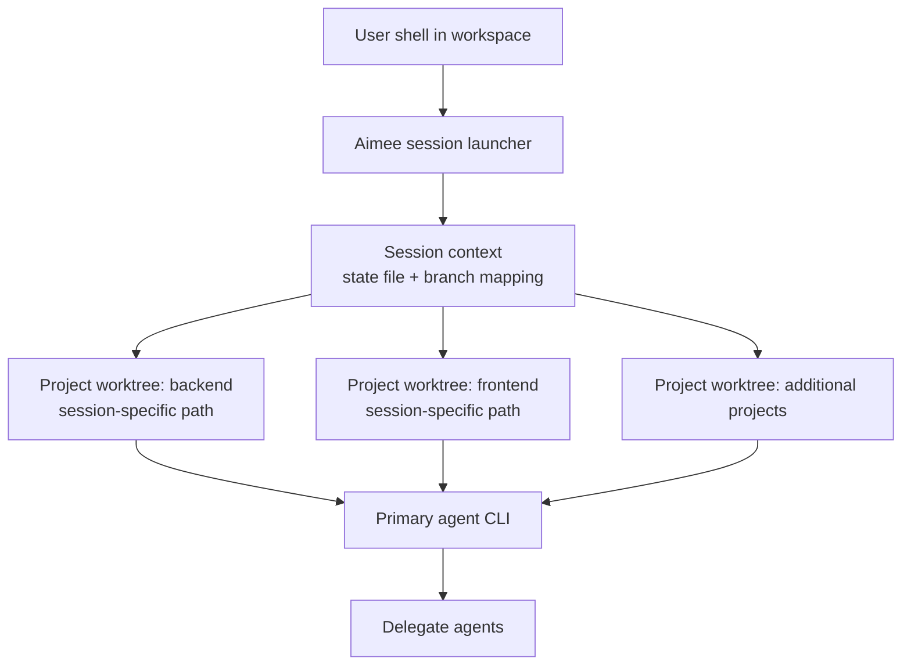

# Workspace Management

A workspace is a set of repositories aimee indexes and works across as one unit. You can register one directly with `aimee workspace add`, or describe it in an `aimee.workspace.yaml` manifest and let `aimee setup` provision it for you.

The manifest describes:

- the repositories that make up the workspace
- the dependencies each one needs
- the credentials you have to supply before it will build

`aimee setup` reads the manifest, clones what is missing, installs the dependencies, indexes the projects, and writes a starter `.aimee-rules`. Every session then runs in its own per-project git worktree, so two sessions never clobber each other.

## Manifest

Put an `aimee.workspace.yaml` file at the root of the directory you run `aimee setup` from.

```yaml
# aimee.workspace.yaml
repos:
  - url: git@github.com:org/backend.git
    path: backend            # clone destination, relative to this file; derived from the URL when omitted
  - url: git@github.com:org/frontend.git

dependencies:
  python:
    apt: [libpq-dev]
    pip: [requests, psycopg2-binary]
  node:
    npm: []                  # an empty list runs a bare `npm install`
  rust:
    cargo: [serde, tokio]

secrets:
  - name: GITHUB_TOKEN
    description: PAT with repo scope for the private mirrors

quickstart:
  index: true                # index the discovered projects (default: true)
  generate_rules: true       # write .aimee-rules from the detected stacks (default: true)
```

Every section is optional. A manifest with only a `repos:` block is enough to clone and index a multi-repo workspace.

### `repos`

The repositories to clone. Each entry needs a `url`; `path` is an optional clone destination resolved against the manifest's directory. When `path` is absent, the destination is derived from the URL (the trailing path component, with any `.git` suffix stripped). A repository that already exists on disk is left untouched.

### `dependencies`

Install commands, grouped by language for readability. The grouping key (`python`, `node`, `rust`, ...) is for your eyes only; aimee reads the package-manager keys underneath it and builds one command per manager:

| Key | Command |
|-----|---------|
| `apt` / `apt-get` | `apt-get install -y <packages>` |
| `pip` / `pip3` | `pip install <packages>` |
| `npm` | `npm install <packages>` (an empty list, or the bare entry `install`, runs `npm install` on its own) |
| `cargo` | `cargo add <packages>` |
| `brew` | `brew install <packages>` |
| anything else | `<manager> install <packages>` |

`aimee setup` runs these in order. A non-zero exit is reported as a warning rather than aborting the rest of provisioning.

### `secrets`

Credentials the workspace needs but that aimee will not create for you: API tokens, deploy keys, and the like. Each entry has a `name` and an optional `description`. `aimee setup` prints them as a checklist so you know what to put in place before the build will work. It does not store or fetch them.

### `quickstart`

Two booleans, both on by default:

- `index`: index the discovered projects into the code index.
- `generate_rules`: detect the project's stacks and write a starter `.aimee-rules`.

## Commands

Two commands manage workspaces day to day.

### `aimee setup` (alias `aimee quickstart`)

Run it from a directory that contains an `aimee.workspace.yaml`. It:

1. Initializes DB1 and config if they are missing.
2. Clones the repos declared in the manifest, skipping any that already exist.
3. Prints the required credentials so you can supply them.
4. Runs the dependency install commands.
5. Registers the current directory as a workspace if none is configured yet.
6. Discovers and indexes the projects under every registered workspace.
7. Writes `.aimee-rules` from the detected stacks, unless `generate_rules: false`.

With no manifest present it still works as a one-shot bootstrap: it registers the current directory, indexes whatever projects it finds, and generates rules.

### `aimee workspace`

Manage the registered workspace roots directly, without a manifest:

```bash
aimee workspace add <path>                         # register an existing directory and index its projects
aimee workspace add --repo <url> [--path <dest>]   # clone a repo, then register and index it
aimee workspace list                               # list workspace roots and the projects under each
aimee workspace remove <path>                      # unregister a root (the checkout on disk is left alone)
```

Registered roots live in `aimee.yaml` under `workspaces:`. Removing one only drops it from that list; it never deletes your checkout.

## Session Isolation

Each session gets its own git worktree for every project in the workspace, its own state file, and its own branch. Two concurrent sessions do not clobber each other.

This isolation applies to all session activity, including:

- file edits made by the primary agent
- delegate agent executions performed with `--tools`
- git operations carried out during the session

### Isolation model



### What happens when a session starts

When a session starts, aimee:

1. Creates a per-session worktree for each workspace project.
2. Maps the user's current directory to the matching worktree path for that session.
3. Launches the primary agent CLI with hooks active inside the worktree.

Read-only delegates invoked during the session use the parent session worktree directly, so review, validate, diagnose, explain, and summarize tasks see the exact checkout the primary agent is working in. Write-capable delegates get isolated sibling delegate worktrees rooted from that parent checkout, and their accepted changes are applied back to the parent worktree.

## Worktree Lifecycle

A workspace session uses git worktrees as disposable, isolated working copies for each project.

### Creation

At session start, aimee creates one worktree per project in the workspace. Each worktree is specific to the current session and is paired with session-local state and branch information.

This means different sessions can operate on the same repository at the same time without colliding in the same checkout.

### Usage

During the session, all repository operations are redirected into the session's worktree:

- the primary agent edits files in the worktree
- read-only delegate agents inherit and use the same parent worktree paths
- write-capable delegate agents use isolated sibling delegate worktrees
- hooks and git commands run against the worktree, not the shared base clone

aimee also maps the directory the user started from into the corresponding project worktree so commands continue to behave as expected from the user's perspective.

### Cleanup

When the session ends, the per-session worktrees can be removed without affecting the underlying repository clones.

Because each session has its own isolated copy, cleanup is straightforward: session-specific worktrees, branches, and state can be discarded independently of any other active session.

## Delegate Agents Across Workspaces

Delegate agents are configured globally, not per workspace. A single `agents.json` file defines all available delegate agents, and any workspace can use them.

Memory and rules are also shared across workspaces, with workspace-scoped recall for project-specific facts. That means delegates can use the broader knowledge base regardless of which workspace they are invoked from, while still preserving workspace-specific context where appropriate.
