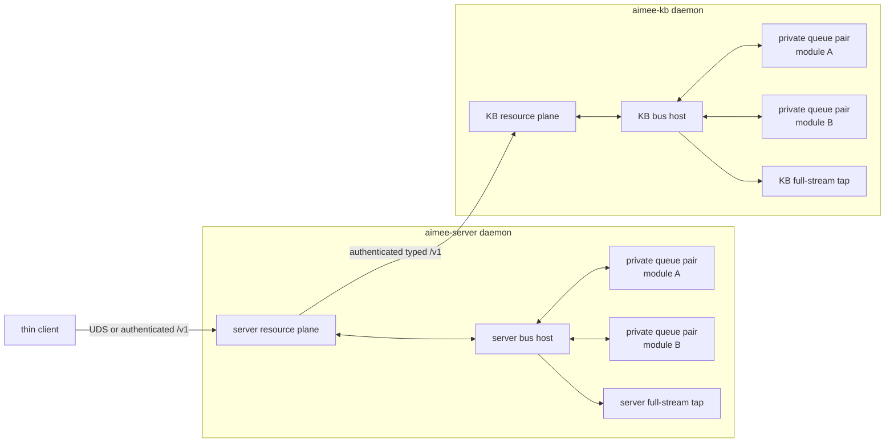

# Core C event bus

**Owner:** runtime core
**Paths:** `src/core/event_bus/`, `server-go/bus/`

`libaimee-core-event-bus.a` is the single POSIX implementation consumed by
`aimee-server` and `aimee-kb`. Each daemon hosts an independent local bus for
the modules in its own container. The thin client does not link it, and the bus
never carries server-to-KB or thinclient-to-server traffic.

The two hosts use the same library and wire contract but share no rings, arena,
sequence, or tap. Crossing the daemon boundary returns to authenticated network
transport through the resource planes.

## Owns

- wire frame and version negotiation;
- control, private queue-pair, and arena layouts;
- SPSC rings and bounded credits;
- client admission and reap;
- publish, subscribe, request/reply, cancellation, and typed absence;
- host sequence, observer routing, and full-stream tap;
- capture format and observational replay;
- local `SOCK_SEQPACKET` module attachment and descriptor grant;
- C/Go vectors and conformance.

## Does not own

- network transport between services;
- module business schemas beyond stable kind registration;
- credential or user authentication policy;
- WORM storage or external witnessing;
- workflow scheduling;
- deterministic module execution replay;
- hostile-code sandboxing.

## Contracts

Per-source FIFO is guaranteed. The host stamps global accepted order before routing. `publish` success
means accepted into the producer ring, not consumed or durable. Backpressure is bounded and declared
per kind. Arena references use generation and holder checks and are released on consumer completion
or reap.

The tap is the only core full-stream observer. Ordinary clients receive only authorized kinds.

Public headers live under `src/core/event_bus/include/aimee/core/event_bus`.
`bus_attach.h` is shared attach wire state, so an external module client does
not include the host implementation. `bus_endpoint.h` creates the local attach
socket; after `bus_client_attach_as` completes, the socket is no longer the data
path and the module uses only its mappings. Admission and event-kind grants are
daemon policy injected into the core host.

External C module repositories consume the host-free
`aimee-core-event-bus-client` target. Go modules use the pure-Go client and
process runtime under `server-go/bus`; it mirrors authenticated attach, AMOD
fragmentation, deadlines, cancellation, bounded concurrent handlers,
heartbeats, and host-epoch shutdown without cgo. The shared host runtime in `bus_runtime.c`
owns the listener, peer admission, heartbeat, and reap lifecycle. Server and KB
configure separate endpoints at `<config>/<daemon>-module-bus.sock` and separate
policies at `<config>/modules.d/<daemon>`; the environment can override those
with `AIMEE_MODULE_BUS_SOCKET` and `AIMEE_MODULE_POLICY_DIR`.

`src/modules/process-contracts.json` is also the implementation-language switch
for supervised processes. Twenty-three identities run in the Go multicall
executable in `server-go/cmd/aimee-module`: `config`, `memory`, `learning`,
`routing`, `delegates`, `tools`, `workspace`, `git`, `skills`,
`response-composition`, `execution-policy`, `governance`, `workflows`,
`roundtable`, `kb-synthesis`, `runtime-web`, `control-web`, `benchmarks`,
`sandbox`, `economizer`, `postgres`, `aimee`, and `egress`. Its basename selects
an isolated identity and one module package under `server-go/modules`. The runtime
bundle emits no C process source for those entries. Their C `module_adapter.c`
files serve only as wire-parity fixtures while the deeper module-owned C surfaces
are migrated in later batches. DB2 remains the separately supervised C process
in the current catalog and crosses the same bus admission and wire boundary.

Each migrated process owns one bounded decision and nothing around it:

- **workflows** owns the deterministic advance admission classification, and is
  not a second workflow lifecycle runtime. The server's interactive advance
  executor requests that classification over the event bus and refuses to mutate
  workflow state when the process call fails.
- **kb-synthesis** owns the pure grounding decision, leaving the curator worker,
  provider, and persistence lifecycle where they are.
- **runtime-web** owns RPC fault classification. The provider remains the owner of
  HTTPS, browser authentication, sessions, routing, proxy transport, and assets.
- **control-web** owns proxy-route authorization. HTTPS, OIDC/session handling,
  CSRF, credential selection, proxy transport, and assets remain provider-owned.

The server requests the runtime-web decision over the event bus and adds the
returned HTTP status to its RPC error envelope. The physical Go web provider
consumes that status with no local classification policy, and missing or invalid
module output remains a generic 502 transport failure.

Control web's physical Go provider imports the same policy package. The KB
console-admin containment is event-bus-only: the route layer asks the separately
supervised control-web module and fails closed if no valid decision arrives, and
the KB keeps no duplicate local allowlist.

Four more production paths refuse to decide locally when their process is absent:

- **benchmarks.** The live `memory.benchmark` RPC sends each bounded retrieval
  result set for MRR, NDCG@K, and recall@K scoring. An unavailable or invalid
  response fails the RPC with no in-process fallback. Offline harnesses keep their
  local primitives because they do not run inside either daemon.
- **skills.** The process serves both the review-nudge predicate and
  trigger-frontmatter matching. Guardrails resolves the skill file locally but
  requests the trigger decision over the bus, and transport or decode failure is
  treated conservatively as a match, so the advisory cannot be bypassed by losing
  the module.
- **learning.** Event `6145` returns the sink mask for each supported signal before
  the router mutates storage. Missing, failed, or malformed output aborts ingestion
  with no local routing fallback; the C signal policy exists only behind the parity
  handler and focused tests.
- **memory.** The context pre-injection path requests confidence from event `5893`.
  Missing, failed, or malformed output suppresses the envelope rather than falling
  back to a local `low` classification, and the formatter accepts only the three
  validated process-returned tiers.

Every strict `*.grant` policy binds one principal class/reference to an exact
absolute executable (resolved and compared with Linux `SO_PEERCRED` and
`/proc/<pid>/exe`), an expected UID, and explicit publish, subscribe, request,
and serve kind lists. The host installs all grants before returning mappings,
overwrites client-claimed source/principal fields, and returns a typed
capability-denied event when a module attempts undeclared fresh output.

The attach socket is mode `0600` and used only for the descriptor handshake.
All event traffic remains in the daemon's local shared mappings; there is no
server-to-KB bus and no cross-machine shared memory.

## Required checks

- wire unit tests and corrupt-frame rejection;
- C/Go golden vectors and live conformance;
- ring/arena ASAN and TSAN lanes;
- admission and cross-client isolation;
- flow control, overflow, cancellation, and reap;
- capture classification and byte-exact arena materialization;
- audit durability, retention, replay, and shutdown race;
- dispatch performance gate.

See [Event bus](../EVENT_BUS.md) for the working guide.
