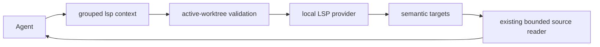
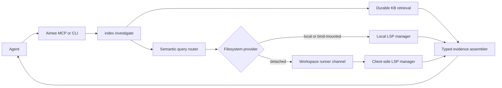

# Proposal: Live semantic context at the filesystem-authority boundary

- **State:** IN PROGRESS. S0 has a Linux/macOS PR-gate candidate and a frozen checked comparison.
  S1 remains closed until the macOS matrix leg passes on the PR commit. Later slices require a
  measured promotion decision.
- **Author:** JBailes with Codex
- **Date:** 2026-09-01
- **Charter roles:** Recall, Enforce, Execute, Evaluate-Optimize, Gate-Promote
- **Related:** [Code intelligence](../../CODE_INTELLIGENCE.md),
  [Agent-facing code intelligence effectiveness](../done/agent-facing-code-intelligence-effectiveness.md),
  [Language coverage](code-intelligence-language-coverage.md),
  [Surface-neutral retrieval](../done/surface-neutral-retrieval-substrate.md),
  [Remote-first session start](../done/remote-first-session-start.md),
  [Server-driven thin client](server-driven-thin-client.md), and
  [Thin-client capability advertisement](thin-client-capability-advertisement.md).

## Decision summary

Aimee should test whether a narrow, read-only semantic context operation improves coding outcomes
over the shipping product. The first candidate takes one or more exact source anchors and returns a
resolved definition or reference together with bounded current source, an optional containing-symbol
label, and freshness proof in one call. It complements, rather than replaces, the durable code graph
and knowledge service.

This proposal does not authorize a general headless IDE, opaque handles, a new local index, broad
language-method coverage, or remote-runner integration up front. S0 first records a truthful red
baseline. S1 implements the smallest local Linux/macOS experiment that can prove or disprove user
value. If that experiment does not beat production Aimee plus ordinary local inspection, the work
stops after retaining any independently useful correctness repairs.

The post-promotion target runs the semantic operation where the authoritative files live:

- **A local or bind-mounted worktree** uses the LSP manager in that filesystem-owning process.
- **A detached worktree** remains unsupported in S1. S3 may route the operation over the existing
  workspace runner channel and run it in the long-lived client serving that worktree.
- **An unavailable knowledge service** may still return explicitly labeled local LSP or structural
  evidence. It may not report the durable index as empty or healthy.
- **An unavailable Aimee server** leaves the existing local `index lsp-*` commands as a bounded
  escape hatch when their language server is configured. The installed agent guidance then falls
  back to ordinary local inspection for questions those exact operations cannot answer.

One command under the existing grouped `lsp` capability will serve the experiment. Compatibility
aliases may remain, but the product will not add a new flat MCP tool for every LSP method. `index
investigate` remains the first task-level operation. Automatic task routing is a later promotion,
not part of the value spike.

Rollout is gated by paired evaluation against the shipping `code_context_mode=on` path with the
same local search and file-read tools available in both arms. The gate measures task success,
semantic correctness, agent adoption, turns, freshness, context bytes, latency, setup success,
process footprint, and failure classification. The candidate must produce a material improvement,
not merely avoid regression. Token reduction alone is not an acceptance criterion.

## The product gap is integration, not a missing LSP client

Aimee already contains the main primitives:

- **LSP lifecycle.** [`lsp_manager.c`](../../../src/modules/lsp/lsp_manager.c) manages a bounded
  process pool per workspace and configured extension set.
- **Existing operations.** [`lsp.h`](../../../src/modules/lsp/lsp.h) exposes diagnostics,
  definition, references, and rename. The CLI publishes `index lsp-diag`, `index lsp-def`,
  `index lsp-refs`, and `index lsp-rename`.
- **Agent surface.** The MCP catalog exposes diagnostics, definition, and references as flat
  compatibility tools and as commands under the grouped `lsp` tool.
- **Filesystem authority.** The detached workspace provider and runner already marshal read,
  write, stat, list, and execution operations to the client serving a remote worktree.
- **Durable intelligence.** The knowledge service already owns symbols, calls, imports,
  cross-repository dependencies, co-change, lexical and vector evidence, memory links, project
  generations, and blast radius.

Those pieces do not yet form one reliable product path.

### Current limitations

- **Wrong execution location for remote workspaces.** Agent-facing MCP LSP handlers execute in
  `aimee-server`, resolve a configured server workspace, and construct local `file://` URIs. In the
  supported remote-thin-client topology, the current worktree may exist only on the client. A
  server-side language server can therefore see no tree, a stale mirror, or a path from a different
  authority.
- **No freshness proof.** Current definition and reference results contain a path, line, and column.
  They carry no content hash, document version, worktree identity, index generation, or statement
  that the language server observed the latest accepted write.
- **No document synchronization contract.** The manager does not send `didOpen`, `didChange`, or
  `didClose`. Language servers may notice saved files through their own watchers, but Aimee cannot
  distinguish current results from watcher lag.
- **No stable semantic identity.** A location becomes ambiguous after formatting or line movement.
  A caller must rediscover a symbol even when only its body changed.
- **Narrow read surface.** The current agent path lacks hover, implementation, type definition,
  document symbols, dependency navigation, and bounded body extraction. It returns locations and
  leaves the agent to spend another turn and another tool call reading them.
- **Text-shaped failures.** Missing configuration, timeout, unsupported platform, unavailable
  runner, stale document, and a valid zero-result response are not one machine-readable outcome
  family.
- **Platform mismatch.** The current manager reports unsupported on Windows, while Windows is a
  shipping thin-client platform. Capability advertisement must state that boundary instead of
  offering a path that can only fail.
- **Weak onboarding.** `lsp_servers` is configurable and the dashboard reports health, but code
  intelligence guidance does not explain when to use the live LSP path, how it relates to the
  durable graph, or which language servers are ready on the filesystem-owning host.

On 2026-09-01, both required repository-index entry points, `index investigate` and `index hybrid`,
failed because the configured `aimee-server` `/v1` endpoint was unreachable. The installed guidance
did not direct the agent to the already compiled local LSP operations. This observation motivates
the failure contract; it is not evidence that local LSP results replace a durable index.

## External observations and clean-room boundary

Two products provide useful product evidence without defining Aimee's architecture.

- **CogniRepo.** Its useful patterns are one-command setup, a single token-bounded `context_pack`,
  local operation, cross-agent session continuity, and a benchmark command users can run on their
  own repository. Its local trusted-user threat model, file-backed state, and static graph do not
  meet Aimee's team, authority, audit, or evidence requirements. CogniRepo is MIT licensed, but this
  proposal adopts product patterns rather than source. See the
  [CogniRepo repository](https://github.com/ashlesh-t/cognirepo) and its
  [metrics methodology](https://github.com/ashlesh-t/cognirepo/blob/main/docs/METRICS.md).
- **Context Engine.** Its useful patterns are a shared headless-IDE daemon, explicit semantic
  navigation, opaque handles, type-annotated slices, and dependency-source navigation. Its public
  preview is closed source, requires license verification, and restricts third-party benchmarking.
  No Context Engine code, protocol, handle encoding, or benchmark result may be copied into Aimee.
  The proposal relies only on published behavior and independently designed interfaces. See its
  [public documentation](https://context-engine.app/docs) and
  [preview terms](https://context-engine.app/terms).

The engineering baseline is Aimee's current source and independently produced fixtures. Product
names do not appear in public tool schemas, stored provenance, or operator configuration.

## Critical value assessment

The original draft described a coherent architecture but did not set a high enough product bar. It
treated several attractive implementation ideas as one roadmap before proving that agents complete
real work better with them. This revision separates the value hypothesis from optional machinery.

### Aimee already owns most of the CogniRepo value proposition

| Product pattern | Aimee today | Decision |
| --- | --- | --- |
| Durable code graph, semantic retrieval, memory, and cross-session context | Shipped through the KB, task-conditioned context, and memory surfaces | Do not add another local persistent index or context pack |
| Token-bounded task context | Shipping `code_context_mode=on` improved the checked paired result from 5/8 to 6/8 tasks and median wall time by 13.59%, while median input rose 1.14% | Treat this as the production baseline, not as work the proposal may claim |
| Exact definition and references | Present as lightly integrated LSP commands with location-only output | Test a combined semantic-plus-source workflow |
| Batched source reads | Present in `code_span_get` | Reuse it and add batching to the semantic request |
| One-command setup and reproducible self-measurement | General setup, doctor, and benchmark infrastructure exist; LSP-specific setup is weak | Add only what the S1 experiment proves necessary |
| Local operation during a service outage | Ordinary local inspection works; LSP commands may work when configured | Keep the fallback narrow and label the missing durable authority |

CogniRepo's published measurements do not justify a new Aimee subsystem. Its automated token metric
compares against all keyword-containing files, its targeted 40-60 percent estimate is not the same
external-repository measurement, and its latest published external precision table records a
probe/golden-set failure. Its strongest transferable evidence is that setup, a small default
surface, and a user-runnable benchmark affect adoption.

### Context Engine identifies a plausible workflow, not proven Aimee ROI

The useful hypothesis is not "LSP is better than grep." It is that one semantic call can disambiguate
an exact occurrence and return the source an agent would otherwise locate and read over several
turns. Overloads, interface implementations, re-exports, generated types, and selected dependency
versions are the task classes most likely to benefit.

Context Engine's public workflow also includes handles, type-annotated reads, dependency source,
batching, and eight semantic tools. Those features cannot be credited independently from its public
documentation, and its preview terms prohibit third-party benchmarking without written permission.
Aimee therefore evaluates its own independently designed candidate, not a competitor proxy.

### The current LSP code is a prototype baseline

The repository has useful protocol and lifecycle code, but it is not evidence of production semantic
quality:

- **Tests are mostly mechanical.** The integration fixture uses a fake server and verifies one
  definition response with an interleaved diagnostic. It does not run a real language server on a
  checked source corpus.
- **Cold diagnostics can report a false empty.** `lsp_manager_diagnostics` only reads already stored
  notifications and does not start or synchronize a server. Calling diagnostics first returns zero
  with no unavailable or not-started state.
- **Agent inputs select host paths.** MCP handlers accept absolute workspace and file strings, then
  the manager changes directory and builds `file://` URIs without binding them to the authenticated
  active worktree.
- **Freshness is unknown.** No document synchronization or version proof establishes that a result
  describes the accepted current file bytes.
- **Availability is unmeasured.** No language-server configuration ships by default, current
  documentation lists only the configuration shape, and readiness does not prove a configured
  executable can answer a fixture.
- **Concurrency and lifecycle are under-tested.** One global manager serves potentially concurrent
  MCP calls, while the tests do not exercise simultaneous requests, crashes, restart, or multiple
  worktrees with matching paths.

S0 must turn these observations into reproduced tests and evidence. Existing code reduces the cost
of the experiment; it does not lower the acceptance bar.

### Smallest credible value hypothesis

For a semantic-eligible task, a batched `lsp context` request given current `file`, `line`, and
`column` anchors will return exact semantic targets plus bounded current source in fewer agent turns
than production Aimee with ordinary search and reads, without reducing task success or crossing a
workspace boundary.

The S1 candidate is deliberately limited:

- definition and references only;
- local or proven bind-mounted worktrees on Linux and macOS;
- saved files only;
- one request containing up to 16 anchors;
- location, optional containing symbol, bounded source, content hash, and typed provider status; and
- no handles, hover, implementation, type annotations, dependency-cache traversal, automatic
  `index investigate` routing, or detached worktree execution.

This is enough to test semantic disambiguation, round-trip reduction, freshness, and adoption. A
larger feature set would make a positive result impossible to attribute and a negative result too
expensive to accept.

### Alternatives considered

| Option | Assessment |
| --- | --- |
| Keep shipping Aimee unchanged | Valid outcome if semantic-eligible tasks are rare or local tools already win; this is the S1 control and stop result |
| Adopt CogniRepo as a local sidecar | Reject: it duplicates Aimee's durable index, memory, and context path without solving Aimee's authority model |
| Integrate Context Engine as an optional provider | Potentially useful build-versus-buy path, but the preview does not authorize production reliance, redistribution, or third-party benchmarking; pursue only under a separate written agreement and provider-boundary review |
| Build feature parity with a headless IDE | Reject: cost and risk are high, attribution is weak, and most methods have no Aimee-specific outcome evidence |
| Run the narrow native S1 spike | Recommend: it reuses Aimee's LSP and bounded-source code, can be measured against the shipping product, and has an explicit stop gate |

## Goals

- **Prove incremental value.** Compare against shipping Aimee plus normal local inspection and stop
  unless semantic context materially improves a pre-registered task or efficiency endpoint.
- **Resolve exact live semantics.** Answer definition, reference, implementation, type, signature,
  and documentation questions from the language server attached to the current worktree. S1 proves
  only definition and references; later methods require their own promotion evidence.
- **Keep durable intelligence authoritative.** Preserve the knowledge service for natural-language
  discovery, history, cross-repository traversal, graph evidence, memory, and reviewed knowledge.
- **Run at filesystem authority.** Never ask a server-side process to infer semantics from a client
  path it cannot authoritatively read.
- **Prove freshness.** Bind every semantic response to a worktree, document identity, observed
  content version, and provider status.
- **Reduce agent round trips.** Batch anchors and return a bounded source-backed context slice with
  each accepted semantic location in the same response.
- **Degrade honestly.** Preserve `ok`, `empty`, `stale`, `unavailable`, `unauthorized`,
  `unsupported`, and `abstained` as separate outcomes.
- **Measure operational cost.** Attribute process count, memory, cold start, setup failure, and
  language-server availability instead of treating them as free.

## Non-goals

- **No replacement durable index.** The LSP overlay does not persist another organization graph,
  vector database, memory store, or code corpus.
- **No feature-parity roadmap.** Public competitor features are hypotheses, not a checklist. S1
  does not add every semantic method, dependency traversal, type annotation, or workspace command.
- **No opaque fusion.** Aimee does not mix an LSP answer into durable graph output without labeling
  its source, freshness, and authority.
- **No semantic write surface in the first release.** Rename, code actions, formatting, and
  workspace edits remain outside the new agent capability. The current CLI rename command is not a
  precedent for giving a model an unreviewed mutation path.
- **No unsaved editor buffers initially.** The first contract covers the accepted filesystem state.
  Editor-buffer synchronization requires a separate authenticated owner and version protocol.
- **No opaque handles in S1.** Current source hashes and response-local coordinates are sufficient
  to measure the first workflow. Handles require evidence that post-edit rediscovery is a material
  cost and that source-versioned coordinates cannot solve it more simply.
- **No bundled language-server fleet.** Aimee discovers or uses operator-configured language
  servers. It does not silently download executables or trust repository-provided commands.
- **No claim of universal language semantics.** Tree-sitter structure can cover a language whose
  configured LSP is absent. The response must say which leg answered.
- **No forced semantic call before every file read.** Literal inspection remains cheaper for a
  known short file or exact text search. The task router uses the overlay only when it has a useful
  anchor.
- **No public competitor benchmark without permission.** Evaluation compares Aimee modes and
  open, locally reproducible baselines. Closed-preview terms are respected.

## Invariants

1. **The current worktree owns live truth.** Durable indexed source is discovery and historical
   evidence. A semantic result for an active editing task comes from the filesystem authority that
   owns that worktree.
2. **The KB keeps durable ownership.** Live semantic state is process-local and disposable. It does
   not write code facts, memories, or graph edges directly into DB2.
3. **One result names one authority.** Every response carries stable project identity, worktree or
   checkout identity, provider kind, provider instance generation, document version, and freshness.
4. **No false empty.** A missing runner, failed language server, unsupported platform, timeout, or
   stale document cannot become an empty location list with `ok` status.
5. **No hidden broadening.** A project-local semantic failure cannot fall back to another checkout,
   another project, shared memory, or a dependency with the same symbol name.
6. **Source remains untrusted data.** Source, comments, hover text, dependency documentation, and
   diagnostics are context evidence, never instructions with policy authority.
7. **Read-only means no mutation.** The semantic agent capability cannot call rename, code action,
   format, execute-command, or apply a workspace edit.
8. **Handles are capabilities, not identities.** A handle is scoped to its session, principal,
   workspace, and provider generation. Possessing text that resembles a handle grants no broader
   workspace access.
9. **Failure leaves local coding available.** A KB or semantic provider outage does not block
   ordinary file inspection, editing, and tests. It only removes claims that depend on that provider.
10. **Capability advertisement is truthful.** Unsupported Windows behavior, missing binaries,
    failed initialization, and degraded providers change the advertised readiness before a call.

## Architecture

S1 uses the shortest path that can establish value:



Only after the S1 promotion gate passes does the target topology add task-level routing, durable
fusion, and remote filesystem authorities:



### The semantic router chooses the filesystem owner

This section describes the post-S1 target. S1 rejects detached worktrees as `unsupported` and does
not add a runner operation before local value is established.

The router receives a verified active project and worktree identity, not an arbitrary workspace
path from model arguments. It asks the workspace module for the provider that owns the active tree:

- **Local provider.** Execute through the local LSP manager only after canonical root containment
  proves that the file belongs to the active worktree.
- **Bind-mounted provider.** Treat the server path as authoritative only when the registered
  workspace explicitly proves that mount mapping. A matching string is not proof.
- **Detached provider.** Submit a typed `semantic.query` operation through the existing runner
  queue. The long-lived `aimee workspace serve` process owns the LSP manager and returns a bounded
  response. Raw server paths are never reinterpreted as client paths.
- **No provider.** Return `unavailable` with `dependency: workspace_runner` and a bounded retry hint.

The runner operation is declarative. Its closed request schema contains operation, project and
worktree identifiers, a workspace-relative file, a position or handle, requested views, token
budget, and observed document version. It contains no executable command, server path, language
server command, or free-form environment.

### The existing LSP manager becomes a provider implementation

The current manager remains the protocol implementation. It gains a narrow provider interface so
local and, after promotion, detached execution share one contract. S1 supports `definition` and
`references`; the remaining read operations are candidates whose value must be measured separately:

- **`definition`.** Resolve the canonical declaration selected at an exact source occurrence.
- **`references`.** Return semantic references with containing-symbol context and completeness
  metadata from the provider.
- **`implementation`.** Resolve interface, trait, protocol, and abstract-member implementations
  when the configured server supports it.
- **`hover`.** Return signature, type, parameter, and documentation supplied for the exact
  occurrence.
- **`outline`.** Return document symbols with bounded hierarchy and view costs.
- **`extract`.** Return a selected symbol's code, documentation, imports, or complete bounded view.
- **`diagnostics`.** Return current errors and warnings with the document version they describe.

Unsupported methods return `unsupported` with the provider capability that was absent. They do not
fall back to a different operation and keep the requested label.

### Saved-file synchronization proves freshness

The filesystem-owning process observes successful Aimee writes and external file changes. For each
managed document it maintains a monotonically increasing local version and content hash.

Before answering a semantic request, the provider ensures one of these conditions:

- **Synchronized.** The current hash has been sent through `didOpen` or `didChange`, and the response
  carries that version.
- **Disk-confirmed.** The language server documents that it reads saved files directly, and Aimee
  has completed a bounded post-write barrier before accepting the response.
- **Stale.** The provider cannot prove either condition and returns `stale`; it does not return the
  location as current.

The protocol does not promise that every language server responds within one fixed global delay.
Each configured server declares its synchronization mode and timeout, and readiness tests verify
that declaration on a fixture.

### Opaque handles are deferred until rediscovery cost is measured

S1 returns response-local coordinates plus whole-file content hashes and uses the existing bounded
source reader. That contract detects drift without adding a new session-state system. Evaluation
records how often an agent must rediscover a symbol after an edit and how many turns that costs.

Only a later proposal may promote opaque handles if the measured rediscovery cost is material and
source-versioned coordinates cannot recover cheaply. That proposal must define identity, expiry,
authorization, restart, ambiguity, and durable-reference behavior independently; this proposal does
not reserve a wire encoding or storage design.

## One agent-facing operation, not another tool catalogue

The grouped `lsp` capability remains the low-level expert surface. S1 adds `command: context`, whose
closed request contains `queries` with at most 16 `{operation,file,line,column}` anchors, a per-query
source-line budget, and a total response-byte budget. `operation` is `definition` or `references` in
S1. The response returns semantic locations, containing-symbol information when independently
resolved, and bounded source through the existing source-reader contract. Existing flat tools remain
compatibility aliases until normal deprecation removes them.

The operation does not accept a caller-selected absolute workspace. The authenticated session and
active-worktree binding select the root; every query file is workspace-relative and contained before
the provider sees it. A request without a verified active worktree returns a typed failure.

The result is useful only if it removes follow-up reads. Returning a location alone preserves the
current contract but does not count as S1 value.

After S1 promotion, the default path may become task-oriented:

1. `index investigate` resolves the active project and classifies the question.
2. Natural-language, historical, cross-repository, or unknown-symbol questions query the durable
   index first.
3. Exact file and position questions query the semantic overlay first.
4. A durable result that identifies a current-project location may be deepened through the overlay.
5. The typed assembler returns the accepted evidence under one token budget with each provider leg
   labeled separately.

The semantic envelope contains:

```json
{
  "status": "ok",
  "provider": "local_lsp",
  "project": "stable-project-id",
  "worktree": "session-worktree-id",
  "provider_generation": 4,
  "document": {
    "path": "src/example.c",
    "version": 12,
    "content_sha256": "...",
    "freshness": "current"
  },
  "results": [],
  "truncated": false,
  "token_count": 0
}
```

The exact serialization should derive from one descriptor and generated schema. The fields above
are the required semantic content, not a second hand-maintained schema.

### Local fallback is explicit degradation

When the KB is unavailable but Aimee can reach the active filesystem authority:

- **Exact semantic question.** Return `provider: local_lsp` when the configured LSP answers.
- **Structure-only question.** Return `provider: local_structural` when the shipped extractor can
  answer from current bytes.
- **Natural-language discovery without an anchor.** Return `abstained` or ask the agent to use
  bounded local text search. Do not pretend a local AST lookup is semantic retrieval.
- **Durable history or cross-repository question.** Return `unavailable`; no local fallback can
  supply the requested authority.

When the Aimee server itself is unreachable, installed guidance may use the existing local
`index lsp-def`, `index lsp-refs`, and `index lsp-diag` commands for exact anchored questions. If
they are unavailable or insufficient, it uses ordinary local inspection. The final answer must say
that Aimee's durable index was unavailable.

This fallback is intentionally narrower than CogniRepo's project-local database. Aimee does not add
a second persistent index to every thin client.

## Setup and product surface

S0 adds a read-only preflight command or fixture mode that reports whether an operator-configured
language server can start, initialize, synchronize one fixture, and answer the promoted methods. It
must not equate a configured command or running process with readiness.

Broader setup-wizard and doctor integration follows only after S1 demonstrates value. At that point
they report three independent readiness lines:

- **Durable code intelligence.** KB reachability, project generation, vector state, and indexed
  language capability.
- **Live semantics.** Filesystem authority, configured language servers, supported methods,
  process health, and synchronization state.
- **Local fallback.** Operations that remain usable if the KB or server is unavailable.

Setup may detect known language-server executables on `PATH` and propose configuration. It requires
operator confirmation before persisting a command. Repository files cannot select an executable,
arguments, network policy, or environment.

Generated agent guidance describes a small decision table:

| Starting evidence | First operation |
| --- | --- |
| Task description or unknown concept | `index investigate` |
| Exact `file:line:column` or visible identifier | grouped `lsp context` after promotion |
| Known symbol whose consumers matter | durable callers, then `lsp context` references if exactness matters |
| Cross-repository or historical question | durable index only |
| KB unavailable with an exact local anchor | local LSP fallback |
| All Aimee services unavailable | ordinary local inspection, with the outage reported |

The guidance does not require a context operation before every short or exact file read. Tool schema
overhead and agent turns count in evaluation.

## Security and trust

Language servers are executable programs pointed at potentially hostile repositories. The existing
manager starts configured binaries on the host and therefore expands Aimee's trusted computing
base. Promoting that path to a default agent capability requires an execution policy, not only a
tool schema.

- **Operator-owned executable.** The command and arguments come from authenticated operator or
  client-local configuration. Repository content cannot introduce or replace them.
- **Scrubbed environment.** Provider, forge, vault, bearer, and unrelated agent credentials are
  absent from the language-server environment. Only an explicit allowlist survives.
- **Scoped filesystem.** The process receives the active worktree and required dependency caches,
  not every configured workspace or server state directory.
- **Network posture.** Network is denied by default where the execution backend can prove that
  restriction. A language server requiring dependency access uses an explicit mediated profile.
- **No database authority.** The process receives no DB1, DB2, vault, audit, or management
  credential and cannot write durable knowledge directly.
- **Bounded resources.** Startup, request, idle lifetime, memory, process count, result bytes, and
  diagnostic counts are capped. Repeated crashes open a provider-specific circuit breaker.
- **Untrusted output.** Documentation, diagnostics, generated annotations, and source slices are
  marked as evidence from an untrusted code tool.
- **Read-only method allowlist.** The agent surface rejects `workspace/executeCommand`, rename,
  formatting, code actions, and workspace edits even when the server advertises them.
- **Path confinement.** Requests and returned locations are canonicalized against the active
  worktree and explicitly allowed dependency roots. A language server result outside both is
  withheld and audited.

If the current native client cannot enforce the promised environment, filesystem, or network
boundary for a configured language server, readiness reports `degraded` and names the unproved
property. Documentation must not call that execution sandboxed.

## Failure model

| Failure | Required result |
| --- | --- |
| KB transport unavailable | Local semantic path may answer; durable leg remains `unavailable` |
| Aimee server unavailable | Existing local LSP CLI may answer exact queries; no durable claim |
| No workspace runner | `unavailable`, dependency `workspace_runner` |
| Language-server binary missing | `unavailable`, dependency and configured command named safely |
| Unsupported LSP method | `unsupported`, requested method preserved |
| Request timeout | `unavailable`, retryability and bounded delay included |
| Provider crash loop | Circuit open; one bounded half-open recovery probe |
| Changed document not observed | `stale`, observed and current versions returned |
| Valid query with no semantic result | `empty` with current document proof |
| Returned path escapes allowed roots | `unauthorized`, result withheld and audited |
| Result exceeds byte or token budget | `ok` with `truncated: true`; omitted items are counted |
| Windows provider not implemented | Capability advertised `unsupported`; no attempted spawn |

An LSP outage does not open the KB circuit, and a KB outage does not restart language servers. The
two provider legs have separate readiness and recovery state.

## Delivery slices

### S0: Truthful baseline and experiment contract

- **Reproduce current failures.** Add red tests for cold-diagnostic false-empty behavior, arbitrary
  workspace selection, post-write staleness, unsupported Windows, crash/timeout classification, and
  detached-worktree mismatch.
- **Run real providers.** Exercise at least two real, pinned language servers on redistributed
  fixtures in CI or an immutable validation environment. The fake server remains a protocol test.
- **Record availability.** Measure configured-binary discovery, successful initialization, cold and
  warm latency, process count, and RSS. A missing binary is part of the denominator.
- **Freeze the comparison.** Pre-register tasks, baseline tools, prompts, models, versions,
  endpoints, and promotion metrics before implementing S1.
- **Document current behavior.** Add existing commands, configuration, host-path execution,
  platform boundary, and known failure semantics to current guides.
- **Do not enable new behavior.** Correctness or containment repairs may merge independently, but S0
  makes no semantic-value claim.

### S1: Local semantic-context value spike

- **Add one batched read.** Implement grouped `lsp context` for definition and references, returning
  optional containing-symbol labels and bounded source in the same response.
- **Bind active authority.** Resolve the workspace from authenticated session state, accept only
  workspace-relative files, canonicalize every input and returned path, and reject detached
  worktrees as unsupported.
- **Prove saved-file freshness.** Synchronize or establish a bounded saved-file barrier, then return
  the whole-file content hash used by the source slice. An unproved result is `stale`.
- **Use one typed envelope.** Preserve `ok`, `empty`, `stale`, `unavailable`, `unauthorized`,
  `unsupported`, and `abstained` through CLI and MCP compatibility paths.
- **Run the paired experiment.** Compare the candidate with production Aimee and the same local
  tools. Publish raw and summarized evidence.

### Stop gate after S1

No detached routing, automatic `index investigate` integration, new semantic methods, handles, or
general onboarding work begins unless S1 satisfies every safety gate and the material-value gate.
If it misses, retain only fixes that improve the existing LSP contract and close this proposal with
the negative result.

### S2: Productionize a promoted local workflow

- **Add readiness and setup.** Detect operator-installed servers, verify methods on a fixture, and
  report durable-index, live-semantic, and local-fallback readiness independently.
- **Integrate selectively.** Allow `index investigate` to call the promoted operation only for task
  classes that passed S1, with observe/on/rollback modes.
- **Prove process sharing.** Multiple agents reuse one healthy provider process per filesystem
  authority, workspace, and server definition.
- **Retain the baseline.** Continue comparing against ordinary local inspection so adoption drift
  cannot turn tool use into ceremonial overhead.

### S3: Extend authority only after local promotion

- **Route detached worktrees.** Add a closed `semantic.query` runner operation and rerun correctness,
  confinement, freshness, crash, and concurrency fixtures across different server/client paths.
- **Handle platform gaps truthfully.** Windows remains advertised unsupported until its native path
  passes the same contract; release parity tests exercise the advertised state.
- **Keep outage fallback narrow.** Local exact operations may answer when the KB is down, but no
  durable, historical, or cross-repository claim is synthesized.

### S4: Evaluate optional semantic methods independently

Hover, implementation, dependency-source navigation, type-annotated views, and opaque handles are
separate candidates. Each needs a task class, a cheaper baseline, an attributable implementation
slice, and the same stop decision. They do not inherit value merely because definition/reference
context passed.

## Evaluation design

The S1 benchmark uses repositories and fixtures Aimee may legally inspect and redistribute, two
pinned real language-server implementations, at least 30 semantic-eligible paired tasks, and at
least 15 control tasks where short-file or literal inspection should already be optimal. Each task
has a checked source answer and declared authority. Model, prompt, tools, configuration, server
binary hashes, source commits, and run order are pinned before the candidate arm runs.

The arms are:

1. shipping `code_context_mode=on` with ordinary local search, structure, source-span, and file-read
   tools;
2. the same production baseline plus the existing location-only LSP aliases; and
3. the same production baseline plus batched `lsp context`.

All arms receive identical non-LSP tools. The benchmark does not require an Aimee call, and a task
where the agent correctly avoids the candidate remains valid evidence.

S1 task families include:

- **Semantic disambiguation.** Overloads, same-named symbols, re-exports, interface dispatch, Go
  receiver methods, and C function-pointer targets for which literal search produces plausible
  distractors.
- **Reference-backed change.** A checked change whose correct edit set depends on semantic
  references rather than every textual match.
- **Fresh edits.** Body edits, formatting, inserted lines, signature changes, and external saved-file
  edits before a second semantic query.
- **Batching.** Two to sixteen related anchors whose serial lookup and reads would otherwise require
  several turns.
- **Control work.** Exact short files, unique symbols, documentation-only changes, and literal
  replacements where semantic startup or tool use should not help.
- **Failure injection.** Missing binary, unsupported method, timeout, provider crash, stale
  document, oversized response, path escape, and a valid current zero-result query.

Detached topology, dependency-source navigation, handles, hover, implementations, type annotations,
and additional languages enter later experiments only after S1 promotion.

Every arm reports:

- task success and exact-target correctness;
- reference recall and false-positive rate where a complete set is knowable;
- stale-result and false-empty counts;
- input, output, tool-schema, and preparation tokens or bytes;
- agent turns and tool calls;
- cold and warm latency;
- language-server process count and peak RSS;
- index, model, and provider preparation cost;
- configured-provider and cold-start success rates;
- outcome status and provenance; and
- whether the candidate was used before the decisive edit and whether the final answer cited
  evidence from the requested authority.

### Promotion thresholds

- **Authority isolation.** Zero cross-project, cross-worktree, or unauthorized dependency results in
  the adversarial suite.
- **Freshness.** Zero results labeled current when the provider observed an older document version.
- **Failure truth.** Zero unavailable, stale, unsupported, or unauthorized cases represented as
  `ok` plus an empty result.
- **Exact navigation.** All checked definition fixtures resolve the intended canonical target for
  each promoted language and pinned server.
- **Reference quality.** Each promoted language meets a stated recall and false-positive threshold
  on its checked fixture; the threshold and full denominator ship with the evidence.
- **Bounded context.** Every response respects its query, byte, line, item, and token caps and
  exposes truncation explicitly.
- **Availability.** Each promoted pinned server initializes, synchronizes, and answers the fixture
  in at least 95 percent of 20 clean cold starts on each claimed platform. Missing configuration is
  included, not reported as a successful empty result.
- **Adoption.** The candidate is used before the decisive edit in at least 80 percent of
  semantic-eligible tasks where the exact anchor is available. Control-task avoidance is reported
  separately and is not treated as failed adoption.
- **Material task value.** Against arm 1, arm 3 must either improve task success by at least five
  absolute percentage points with a paired 95 percent confidence interval excluding zero, or hold
  task success while reducing median agent turns by at least 20 percent and median total wall time
  by at least 10 percent on semantic-eligible tasks, with paired intervals excluding zero. Tool
  schema, provider startup, and preparation costs are included.
- **Control non-regression.** The candidate does not reduce control-task success and adds no more
  than one median tool call or five percent median wall time when the agent correctly avoids it.
- **Cross-platform truth.** Linux and macOS execute the promoted local path. Windows and detached
  worktrees advertise `unsupported` before invocation during S1.

The gate does not accept vendor-reported token savings, self-comparison against model memory, or a
naive baseline that counts every keyword-containing file as required context. Passing deterministic
correctness without passing material task value closes the experiment rather than authorizing S2.

## Compatibility and migration

- **Existing durable indexes remain valid.** No DB2 schema or graph migration is required for S0 or
  S1. Later durable attribution uses existing evidence contracts rather than storing live handles.
- **Existing LSP configuration remains readable.** New synchronization and sandbox fields receive
  conservative defaults and explicit readiness diagnostics.
- **Existing CLI commands remain.** Their output may gain structured status and provenance in JSON;
  successful human-readable location output remains recognizable.
- **Existing MCP aliases remain during deprecation.** The grouped tool is canonical. Generated help,
  installed skills, and compatibility aliases derive from one descriptor.
- **No automatic executable download occurs.** Setup recommendations require operator acceptance.

## Open questions

1. **Provider ownership.** Should the long-lived semantic provider live inside `aimee workspace
   serve`, or should a separate client-local supervised process survive CLI invocations and serve
   several registered worktrees?
2. **Synchronization.** Which language servers can satisfy a generic `didOpen` and `didChange`
   contract, and which require a server-specific saved-file barrier?
3. **Dependency roots.** Which package caches may be exposed by default, and how are their paths
   normalized without leaking unrelated user files?
4. **Windows.** Is the first Windows implementation native process and pipe management, or an
   explicitly optional helper with the same closed provider contract?
5. **Security posture.** Which native language servers can meet environment and network confinement
   without a container, and what readiness state applies when only credential scrubbing is proved?
6. **Product naming.** Should the grouped low-level surface remain `lsp`, or become `semantic` while
   retaining `lsp` as a compatibility alias? The task-level entry point remains `index investigate`
   either way.

## Status

IN PROGRESS. The critical review narrows authorization to S0 and the S1 local experiment. The value add
is not "Aimee has LSP" and not feature parity with another product. It is one attributable claim:
exact semantic targets plus current bounded source in one batched call improve semantic-eligible
coding work over shipping Aimee and ordinary local inspection.

The S0 Linux baseline and its cross-platform real-provider PR-gate candidate are implemented. gopls resolves the checked
definition and references but recorded a roughly 30-second warm reference request in the first
immutable observation. Pyright resolves the checked references but returns a definition shape the
current client does not parse. Both reproduce cold diagnostics as zero while no provider is active.
The 45-task corpus now pins real use-site anchors, independent definition oracles, saved-file shifts,
batch cases, controls, and typed failure overlays against one immutable source commit. Model,
prompt, tool-schema, provider, and schedule inputs are content-pinned. The checked S1 contract keeps
candidate implementation disabled only until the macOS observation passes. See
[`live-semantic-context-s0`](../../validation/live-semantic-context-s0.md).

S1 is the only authorized behavioral candidate after those S0 prerequisites are complete.
S2-S4 are contingent options, not committed scope. A negative S1 result is a successful experiment
outcome and closes the roadmap after independently useful correctness repairs.
