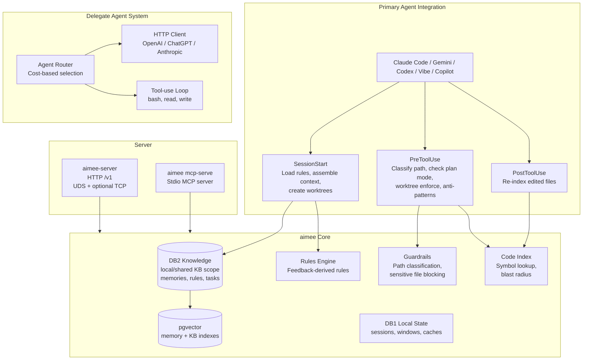
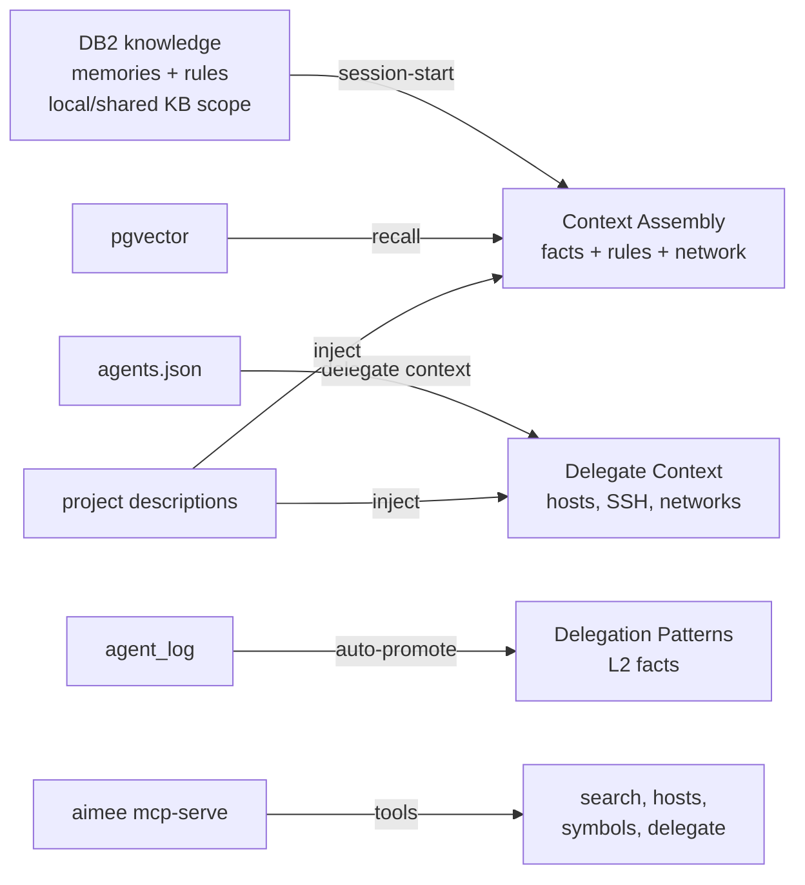
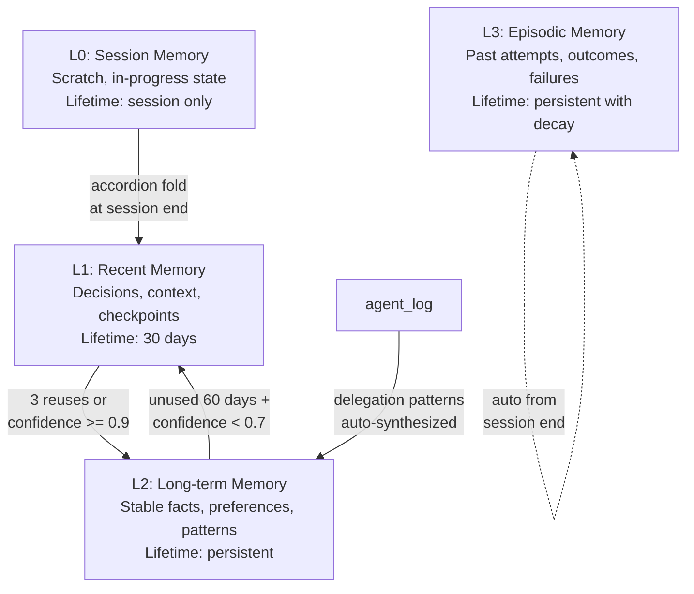
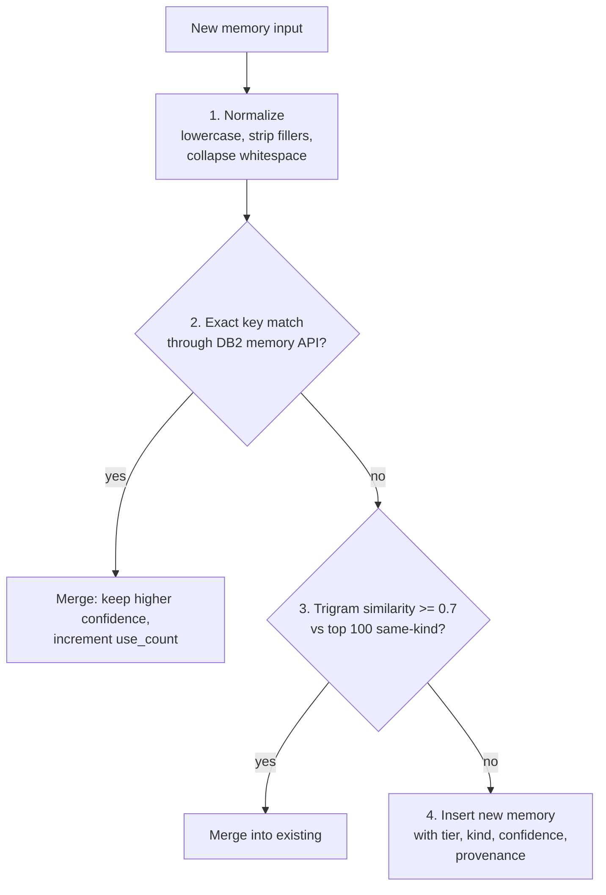
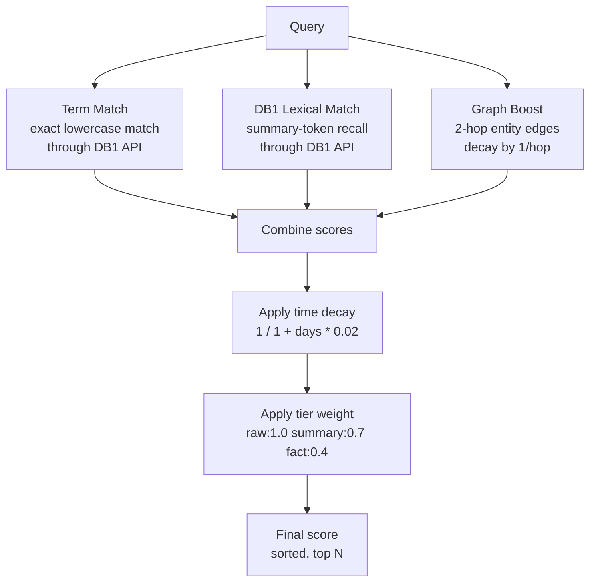
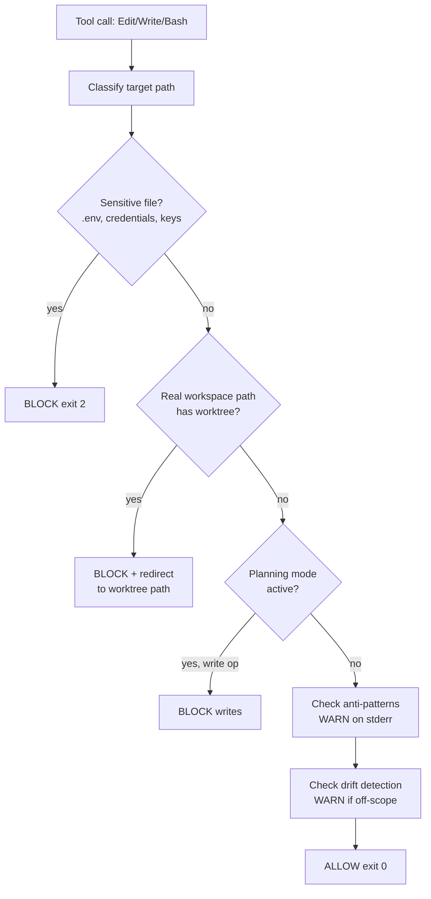
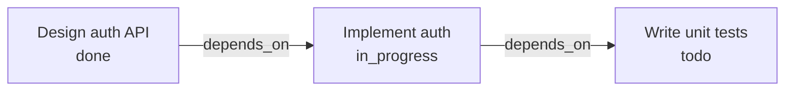
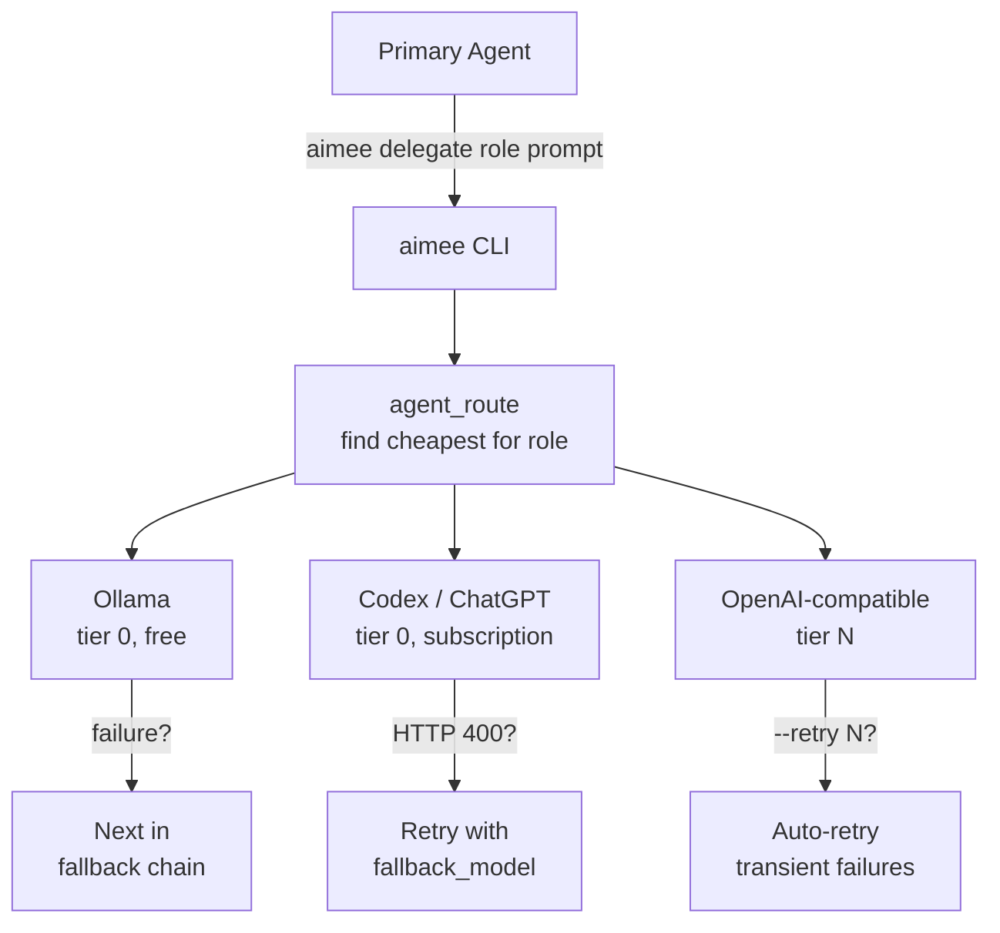
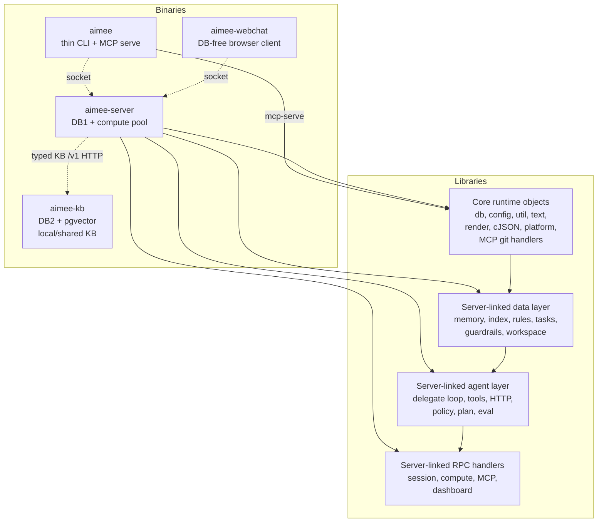
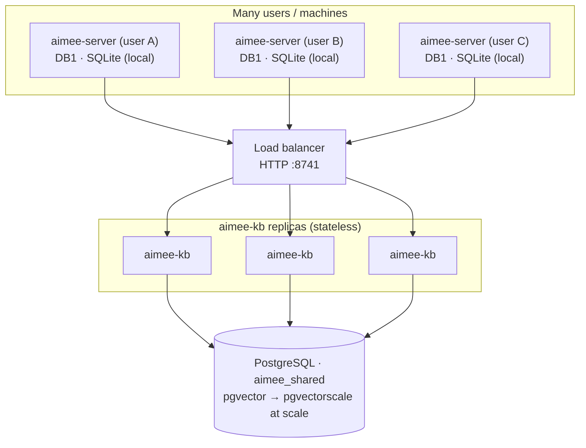

# aimee: Technical Reference

Architecture, internals, and build instructions. For usage and getting started,
see the [root README](../README.md) and the full [Manual](../MANUAL.md). For the
system-level architecture (process topology, trust/storage boundaries, request
lifecycles) see [docs/ARCHITECTURE.md](../docs/ARCHITECTURE.md). This document is
the code-level companion: module map, server internals, the RPC and HTTP
surfaces, the KB split, the build system, and testing.

aimee's core services are written in C11 for performance and minimal footprint. The current tree is a large C codebase (hundreds of `.c` files, plus generated headers and split `*.inc` units), shipped with the standalone Go `aimee-webchat` service plus `aimee`, `aimee-server`, and `aimee-kb`. Runtime DB ownership is pinned: clients are DB-free, the local server owns DB1 (sqlite), and KB owns DB2 (postgres + pgvector), which can be local or shared by deployment. MCP support is built into `aimee mcp-serve`.

## Architecture overview

aimee supports two agent roles. The **primary agent** is the AI coding surface the user interacts with (Claude Code, Gemini CLI, direct Codex, direct Mistral, Codex CLI legacy mode, Mistral Vibe, GitHub Copilot). aimee integrates through hooks, provider-CLI adapters, or direct primary-session adapters, intercepting tool calls, injecting memory and rules, enforcing guardrails, and managing session isolation. **Delegate agents** are sub-agents configured in `agents.json` that handle offloaded work via `aimee delegate <role> <prompt>`.



### Knowledge flow



## Module map

### Shared runtime (linked into owning binaries only)

These modules are linked only where their ownership boundary allows them. The
thin `aimee` and `aimee-webchat` targets do not link database,
`kb_client`, command, data, or agent objects.

| File | Responsibility |
|------|----------------|
| `config.c` | App config, `session_id()`, atomic writes |
| `util.c` | Core utilities, option parsing, security helpers |
| `text.c` | Text similarity, stemming, tokenization, search |
| `render.c` | JSON output, struct-to-JSON converters |
| `log.c` | Structured logging with level control |
| `platform_*.c` | Platform abstractions (events, IPC, random, process) |
| `client_integrations.c` | AI tool detection and hook registration |
| `mcp_tools.c` | MCP tool definitions and dispatch |
| `cJSON.c` | Vendored JSON parser |

### KB-owned data layer (linked into `aimee-kb`)

| File | Responsibility |
|------|----------------|
| `db2/db2.h` | DB2 project/workspace/global knowledge API |
| `db2/vector_status.h` | pgvector status and repair API |
| `memory_core.c` | High-level memory orchestration over DB2 + pgvector |
| `memory_logic.c` | Promotion, demotion, expiry, conflict detection, delegation pattern synthesis |
| `memory_assemble.c` | Context assembly, cache, compaction |
| `memory_scan.c` | Conversation scanning, JSONL parsing |
| `db2/memory_entity_graph.c` | Entity-relationship graph queries behind DB2 |
| `memory_advanced.c` | Anti-patterns, style learning, compaction |
| `cmd_index.c` | Code indexing CLI through aimee-kb |
| `extractors.c` | Source parsing, definition extraction (JS/TS/Python/Go) |
| `extractors_extra.c` | Language extractors (C#/Shell/CSS/Dart/C/C++/Lua) |
| `db2/rules.c` | Rule storage and tier classification behind DB2 |
| `db2/feedback.c` | Feedback recording and reinforcement behind DB2 |
| `guardrails.c` | Path classification, pre-tool safety checks, worktree enforcement |
| `workspace.c` | Workspace manifest parsing, provisioning, context generation |
| `db1/wm.c` | Session-scoped key-value store with TTL |
| `db2/tasks.c` | Project/workspace task graph |
| `db1/checkpoints.c` | Local checkpoints |

### Agent layer (directly linked into `aimee-server`)

| File | Responsibility |
|------|----------------|
| `server/agent_runtime.c`, `server/agent_loop.c` | Core delegate runtime and tool-use loop |
| `server/agent_policy.c` | Tool validation, policy, trace, metrics, env, manifest, contract |
| `server/delegate_prompt.c`, `server/delegate_routing.c` | Delegate prompt/context shaping and route selection |
| `server/agent_config.c` | Delegate config loading, routing, auth resolution |
| `server/agent_tools.c` | Tool execution (bash, read, write), checkpoints |
| `server/delegate_plan.c` | Delegate packet planning |
| `agent_eval.c` | Eval harness, task suites |
| `agent_coord.c` | Multi-delegate coordination, voting, directives |
| `server/server_compute*.c`, `server/server_jobs_aux.c` | Durable/background delegate jobs and compute dispatch |
| `server/delegate_openai.c`, `server/http_retry.c` | Provider HTTP shaping, retry, fallback |

### Server-side and legacy command modules (not linked into clients)

| File | Responsibility |
|------|----------------|
| `cmd_core.c`, `cmd_init.c`, `cmd_infra.c` | Core setup, lifecycle, and infrastructure helpers |
| `cmd_memory*.c` | Memory subsystem handlers and legacy/maintenance surfaces |
| `cmd_index.c`, `cmd_graph.c`, `cmd_kb*.c` | Code index, graph, and KB command handlers |
| `cmd_rules.c`, `cmd_review.c` | Rules and review-surface helpers |
| `cmd_hooks.c` | Primary agent integration: hooks, session-start context, wrapup |
| `cmd_roadmap.c`, `cmd_auto.c`, `cmd_autopilot.c` | Roadmap/autonomous implementation modules; not all are routed in the thin CLI |
| `cmd_skill.c`, `cmd_job.c`, `cmd_trigger.c` | Skill, coordinated-job, and automation helpers |
| `cmd_util.c` | Shared helpers: db open/close, subcommand dispatch |
| `dashboard.c` | Embedded HTTP dashboard server |

### Server binaries

| File | Responsibility |
|------|----------------|
| `cli_main.c` | Thin client entry point and local command fallbacks |
| `posix/cli_client.c`, `windows/cli_client.c` | Socket client libraries and explicit server start/restart fallback |
| `cli_mcp_serve.c` | MCP server entry point |
| `server/server.c` | dispatch table + server_dispatch (shared by the /v1 surface) |
| `server/server_main.c` | aimee-server entry point, signal handling |
| `server/server_auth.c` | Authentication (peer credentials, capability tokens) |
| `server_session.c` | Session management |
| `server_state.c` | Handlers: memory, index, rules, working memory, dashboard |
| `server_compute.c` | Async compute pool for delegate execution and tool calls |
| `compute_pool.c` | Thread pool |

### Header policy

`aimee.h` includes shared types and non-agent subsystem headers. Agent headers are NOT in `aimee.h`. Each `.c` file includes only the narrow agent headers it needs (`agent_types.h`, `agent_config.h`, `agent_exec.h`, etc.).

### Command pattern

Commands are registered in `main.c` as a `command_t` table. All handlers take `(app_ctx_t *ctx, int argc, char **argv)`. Complex commands use `subcmd_t` subtables with `subcmd_dispatch()`.

### Module decomposition roadmap

The largest source files are tracked for decomposition in waves (split the biggest modules first while preserving their public APIs).

**Current hotspots (>1000 lines, approximate):**

| File | Lines | Target wave |
|------|-------|-------------|
| `server/server_mcp.c` | ~1999 | Wave 3, split remaining MCP tool families from dispatch |
| `server/agent_tools.c` | ~1825 | Wave 2, split schema generation from tool execution |
| `server/kb_client.c` | ~1781 | Wave 4, split remaining KB client families |
| `server/kb_client_memory.c` | ~1457 | Wave 4, split remaining memory RPC wrappers |
| `memory_advanced.c` | ~1079 |, (single responsibility, acceptable size) |
| `posix/cli_client.c` | ~1073 |, (single responsibility, acceptable size) |

**Wave sequence:** Wave 1 (abstractions) → Wave 2 (tools/hooks) → Wave 3 (service/UI) → Wave 4 (data layer). Each wave is an independent PR.

## Memory system



### Memory kinds

| Kind | Description | Example |
|------|-------------|---------|
| `fact` | Verified information | "PostgreSQL runs on port 5432" |
| `preference` | User style/behavior | "User prefers concise responses" |
| `decision` | Choice with rationale | "Chose JWT over sessions: stateless" |
| `episode` | Past attempt narrative | "Session: refactored auth module" |
| `task` | Work item or goal | "Implement user authentication" |
| `scratch` | Temporary working data | Current task state |

### Deduplication pipeline

New memories pass through canonicalization before storage to prevent duplicates:



### Contradiction detection

When memories conflict, aimee detects the contradiction via negation asymmetry analysis and word similarity. Both conflicting memories get their confidence reduced (`*= 0.7`), with the conflict recorded in `memory_conflicts`.

### Temporal fact versioning

Facts change over time. The KB-side memory pipeline can supersede a fact: the old version gets a `#vN` suffix and `valid_until` timestamp, and the new version takes the canonical key with `valid_from`. Thin clients see this through routed memory responses rather than a direct storage command.

## Search

### Fact search

Fact search uses the high-level memory pipeline: DB2 supplies lexical and structured candidates, pgvector (inside DB2) supplies dense vector candidates, and the caller sees a ranked result set without depending on either path's query primitives.

### Window search

Conversation history search combines four scoring signals:



## Guardrails

Before every tool call from the primary agent or delegate agents, aimee classifies the target path:



### Guardrail modes

| Mode | Yellow/Amber | Red/Block |
|------|-------------|-----------|
| `approve` (default) | Silently allow | Block + inform |
| `prompt` | Block + inform | Block + inform |
| `deny` | Silently block | Silently block |

### Planning mode

When active, blocks all write operations (Edit, Write, MultiEdit, destructive commands). Read-only operations always allowed.

## Anti-pattern detection

aimee maintains a database of known bad patterns extracted from negative feedback rules (weight >= 50), failed decisions, and manual additions. Before every tool call, the pre-hook checks for matches and emits warnings on stderr (non-blocking).

## Drift detection

When a task is active (`state = "in_progress"`), aimee monitors whether tool calls stay within the task's scope. Scope is determined from key terms in the task title, referenced projects, and subtask titles. Off-scope edits trigger warnings on stderr.

## Task graph



Edge types: `depends_on`, `supersedes`, `decided_by`, `evidence_for`, `failed_because`, `blocks`. Decisions are logged with rationale and assumptions.

## Context assembly

aimee assembles different context for the primary agent and delegate agents. By injecting pre-assembled facts, rules, project descriptions, and network info at session start, agents avoid spending tokens on re-discovery.

### Primary agent context (32KB buffer)

Assembled by `build_session_context()` in `cmd_session_lifecycle.c`, printed to stdout at session start.
The default brief is scoped to the hook client's current working directory so it stays focused on
the active project. Set `AIMEE_SESSION_START_VERBOSE=1` to include broad diagnostic sections.

| Section | Source | Content |
|---------|--------|---------|
| Code Principles | `prompt_code_principles_text()` | Engineering rules that should apply everywhere |
| Aimee Context | hardcoded tips | Short reminders for index, memory, delegation, and brief inspection |
| Rules | `db2_rules_generate()` | Behavioral rules from feedback |
| Project Context | DB2 memory scope APIs | Project-scoped facts |
| Delegation | agent config | Delegate instructions + examples |
| Key Facts | `memory_list(L2, fact)` | Verbose only: top global facts |
| Network | `agents.json` | Verbose only: SSH entry, hosts, networks |
| Shared Context | DB2 memory scope APIs | Verbose only: global/shared memories |
| Recent Delegations | `agent_log` (last 5) | Verbose only: delegate success/failure history |
| Project Descriptions | `workspace_build_context()` | Verbose only: all indexed workspace descriptions |
| Capabilities | `build_capabilities_text()` | Verbose only: available aimee commands |

### Delegate agent context (16KB budget)

Assembled by `agent_build_exec_context()` / `agent_build_exec_context_ex()` in
the platform agent runtime, sent as system prompt:

| Section | Source | Content |
|---------|--------|---------|
| Custom Prompt | caller-provided | Task-specific instructions |
| Rules | `db2_rules_generate()` | Behavioral rules |
| Relevant Memory | `memory_find_facts()` | Top matching facts |
| Code Index | aimee-kb index RPCs | Relevant symbols |
| Network Access | `agents.json` | All hosts, SSH entry, networks |
| Working Memory | `wm_assemble_context()` | Session key-values |
| Active Tasks | `db2_task_list()` | In-progress work |
| Recent Failures | `agent_log` (5min window) | Last 3 failures |

## MCP server

The `aimee mcp-serve` command exposes knowledge as JSON-RPC 2.0 tools over stdio for MCP-compatible primary agents:

| Tool | Source | Returns |
|------|--------|---------|
| `search_memory` | `memory_find_facts()` (DB2 lexical + pgvector dense recall + reranking) | Matching facts by keyword and phrase |
| `list_facts` | `memory_list(L2, fact)` | All stored L2 facts |
| `memory_briefing` / `memory_recall` | KB memory briefing/recall RPCs | Structured task/session memory bundles |
| `get_host` | `agents.json` | Single host by name |
| `list_hosts` | `agents.json` | All hosts + networks |
| `find_symbol` | DB2 code-index API / aimee-kb RPC | Code symbol locations |
| `ast_grep_search` | bundled `sg` binary | Structural code-search matches |
| `preview_blast_radius` | DB2 code-index API / aimee-kb RPC | File dependency impact |
| `learning_review` / `session_search` / `autopilot` | server-side tools | Learning review, local session search, and internal autopilot actions |
| `ast_grep_search` | `sg --json` | Structural AST pattern matches |
| `delegate` | `popen("aimee delegate")` | Delegation result |
| `preview_blast_radius` | `index_blast_radius()` | File dependency impact |
| `record_attempt` | `agent_log` | Log a delegation attempt |
| `list_attempts` | `agent_log` | Recent delegation history |
| `delegate_reply` | `agent_log` | Follow-up on prior delegation |

Codex CLI legacy support is layered on top of the same `aimee mcp-serve`
command. When `~/.codex` is present, `install.sh` and `update.sh` refresh a
local marketplace entry, mirror the plugin payload, and write an activation
entry in `~/.codex/config.toml`. Direct Codex primary sessions use the
server-side primary session adapter instead of the CLI.

## Interaction style learning

aimee analyzes negative feedback for recurring patterns:

| Keywords detected 2+ times | Auto-generated preference |
|----------------------------|--------------------------|
| "verbose", "too long", "wordy" | "User prefers concise responses" |
| "too short", "more detail" | "User prefers detailed explanations" |
| "format", "structure" | "User wants consistent formatting" |

Learned preferences are stored as L2 memories and injected into both primary and delegate agent contexts.

## Delegate agent system



### Provider types

| Provider | Endpoint | Request format |
|----------|----------|---------------|
| `openai` (default) | `/v1/chat/completions` | `messages` array, `max_tokens` |
| `chatgpt` | `/backend-api/codex/responses` | `input` array, `instructions` |
| `anthropic` | `/v1/messages` | `messages` array, `system` (top-level) |

### Authentication

| Auth type | Config | Use case |
|-----------|--------|----------|
| `none` | `"auth_type": "none"` | Local Ollama |
| `bearer` | `"api_key": "$OPENAI_API_KEY"` | OpenAI, Together, Groq |
| `oauth` | provider-managed token file or helper | Codex/Gemini subscription |
| `x-api-key` | `"auth_cmd": "cat ~/.config/aimee/claude.key"` | Anthropic Claude |

### Delegate roles

| Role | Description |
|------|-------------|
| `code` | Write or edit code |
| `review` | Analyze code/plans |
| `explain` | Explain concepts |
| `refactor` | Restructure code |
| `draft` | Generate content |
| `execute` | Run agentic tasks (multi-turn tool-use) |
| `summarize` | Compress text |
| `format` | Reformat data |
| `search` | Find information |
| `reason` | Complex reasoning |

### Delegate options

| Flag | Description |
|------|-------------|
| `--tools` | Enable tool-use mode (bash, read_file, write_file) |
| `--retry N` | Auto-retry on transient failures |
| `--verify CMD` | Run CMD after delegation; exit 3 on failure |
| `--context-dir DIR` | Bundle directory into prompt |
| `--prompt-file PATH` | Read prompt from file |
| `--files F` | Pre-load comma-separated file contents |
| `--background` | Create a server-owned job and return job_id immediately |
| `--timeout N` | Override per-call timeout (ms) |

### Cross-verification

| Direction | Trigger | Action |
|-----------|---------|--------|
| Verify delegate output | Automatic after `aimee delegate` | Runs `verify_cmd` (build/test) |
| Delegate reviews supervisor diff | `aimee verify` | Sends diff to delegate for review |

## Database schema

```
Tier-owned schemas:

DB1: local sessions, windows, checkpoints, caches, delegate jobs, eval
     results, local secrets, local interaction/learning signals, and
     same-user runtime state owned by the local aimee-server.
DB2: memories, rules, KB metadata, tasks, decisions, code index metadata,
     learning records, project/workspace/global facts, and the pgvector
     collections + payload indexes derived from those records. DB2 belongs to
     aimee-kb and can be local or shared; local evidence is reflected or
     promoted there only when it is appropriate for the configured KB scope.
```

## Server architecture



Each layer depends only on layers below it. No circular dependencies.

### Server features

- HTTP `/v1` surface over `~/.config/aimee/aimee-http.sock` (+ optional localhost TCP)
- per-connection worker threads for the HTTP listener (never blocks the accept loop)
- 8-thread bounded compute pool for delegate executions, chat, and tool calls
- `SO_PEERCRED` authentication with 16 capability flags
- Trust levels: unattested (read-only), attested (full access via capability token)
- Rate limiting on auth failures
- Request dispatch through tier-owned DB APIs
- Graceful shutdown with SIGTERM

### Protocol methods (27+)

| Category | Methods |
|----------|---------|
| Server | `server.info`, `server.health` |
| Auth | `auth` |
| Hooks | `hooks.pre`, `hooks.post` |
| Sessions | `session.create`, `session.list`, `session.get`, `session.close` |
| Memory | `memory.search`, `memory.store`, `memory.list`, `memory.get` |
| Index | `index.find`, `index.blast_radius`, `index.list` |
| Rules | `rules.list`, `rules.generate` |
| Working memory | `wm.set`, `wm.get`, `wm.list`, `wm.context` |
| Dashboard | `dashboard.metrics`, `dashboard.delegations` |
| Workspace | `workspace.context` |
| Tool execution | `tool.execute` |
| Delegation | `delegate` |
| Streaming chat | `chat.send_stream` |

### Server lifecycle

The server is normally owned by service management: `install.sh` installs and enables systemd user units on Linux and launchd plists on macOS. The thin client no longer auto-spawns a server for ordinary RPC commands; `aimee server start` is an explicit unmanaged fallback, and `aimee server restart` is the explicit version-drift recovery path.

## Delegate agent configuration

Delegates are defined in `~/.config/aimee/agents.json`. Codex, Gemini, and
Mistral can use direct HTTP adapters. `codex-cli` and Claude use installed
provider CLIs, while `gemini-cli`, `mistral-cli`, and `mistral-plan` keep the
provider-CLI configuration shape but execute through native HTTP adapters
instead of launching the provider binaries. Gemini uses `GEMINI_API_KEY` or
`GOOGLE_API_KEY`; Mistral routes use `MISTRAL_API_KEY` or `~/.vibe/.env`.
These entries are still delegate agents; the user-facing primary agent is
configured separately by the launch, CLI chat, or webchat surface.
Provider-CLI routes that still launch a local CLI are available only when
`cli_cmd` resolves to an executable on `PATH` or an executable absolute path.
Native Gemini and Mistral routes are routable without a CLI on `PATH`.

```json
{
  "agents": [
    {
      "name": "codex",
      "provider": "codex",
      "backend": "provider-cli",
      "cli_kind": "codex",
      "cli_cmd": "codex",
      "roles": ["code", "review", "explain", "refactor", "draft", "execute"],
      "cost_tier": 0,
      "enabled": true
    },
    {
      "name": "claude",
      "provider": "claude",
      "backend": "tmux-cli",
      "cli_cmd": "claude",
      "roles": ["code", "review", "explain", "refactor", "draft", "execute"],
      "cost_tier": 1,
      "enabled": true
    },
    {
      "name": "gemini-cli",
      "provider": "gemini",
      "backend": "provider-cli",
      "cli_kind": "gemini",
      "roles": ["code", "review", "explain", "refactor", "draft", "execute"],
      "cost_tier": 0,
      "enabled": true
    },
    {
      "name": "mistral-cli",
      "provider": "mistral",
      "backend": "provider-cli",
      "cli_kind": "mistral",
      "roles": ["code", "review", "explain", "refactor", "draft", "execute"],
      "cost_tier": 0,
      "enabled": true
    },
    {
      "name": "mistral-plan",
      "provider": "mistral",
      "backend": "provider-cli",
      "cli_kind": "mistral-plan",
      "roles": ["code", "review", "explain", "refactor", "draft", "execute"],
      "cost_tier": 0,
      "enabled": true
    },
    {
      "name": "local-llama",
      "endpoint": "http://localhost:11434/v1",
      "model": "llama3.2",
      "auth_type": "none",
      "roles": ["summarize", "format", "draft"],
      "cost_tier": 0,
      "enabled": true
    }
  ],
  "default_agent": "codex",
  "fallback_chain": ["codex", "claude", "local-llama"]
}
```

## Storage paths

```
~/.config/aimee/
  aimee.yaml                # Workspaces, guardrail mode, primary agent provider
  agents.json               # Delegate agent config + network inventory
  aimee.db                  # DB1 local server/user/session state
  aimee-http.sock           # aimee-server /v1 HTTP Unix socket
  server.log                # Server debug log
  session-<id>.state        # Per-session state
  worktrees/<id>/<project>/ # Per-session git worktrees
  projects/<name>.md        # Auto-generated project descriptions
  tls/cert.pem, key.pem    # Self-signed TLS certs (webchat)

<project>/.mcp.json           # MCP server config (auto-generated)
<project>/.aimee/project.yaml # Per-project metadata (build, test, lint)
```

## Building

```bash
cd src
make                # Build DB-free clients (-> ../aimee, ../aimee-webchat)
make server         # Build server and KB binaries (-> ../aimee-server, ../aimee-kb)
make                # MCP serve is built into the aimee binary
make install        # Install aimee, aimee-webchat, aimee-server, and aimee-kb
make lint           # Check clang-format
make format         # Auto-fix formatting
make unit-tests     # Build and run all tests
make clean          # Remove build artifacts
```

### Dependencies

| Library | Purpose | Linking | Platform |
|---------|---------|---------|----------|
| SQLite3 | DB1 local store | `-lsqlite3` | `aimee-server` only |
| libpq | DB2 service access (incl. pgvector) | discovered with `pkg-config` | `aimee-kb` only |
| libm | Math functions | `-lm` | All |
| libpthread | Parallel delegates, server | `-lpthread` | Linux/macOS |
| libpam | PAM authentication | `-lpam` | Linux |
| libssl/libcrypto | TLS and auth provider support | `-lssl -lcrypto` | `aimee-server`, `aimee-kb` |
| libcurl | HTTP client (delegates) | `-lcurl` | `aimee-server` |
| cJSON | JSON parsing | Compiled in (vendored) | All |

### Code style

Enforced by `.clang-format`:

- 3-space indentation, no tabs
- Allman brace style
- `snake_case` functions, `SCREAMING_CASE` constants
- Right-aligned pointers (`char *str`)
- 100-character line limit
- No automatic include sorting

## Deployment and operations

Operator-facing install, Docker topologies, remote operation, scaling, and the
performance budget. (For getting started, see the
[root README](../README.md#get-started) and the
[Quickstart](../docs/QUICKSTART.md).)

aimee ships four artifacts: `aimee`, `aimee-webchat`, `aimee-server`, and
`aimee-kb`. The client and webchat talk only to the local `aimee-server`; runtime
state stays in server-owned DB1, knowledge lives behind `aimee-kb` in DB2 (local or
shared Postgres). The intended deployment runs the **services in Docker** and
installs only the **thin `aimee` CLI** on each developer machine, pointed at the
server.

### Performance

Hook checks sit in the critical path between the AI and every file edit, so they
must be fast.

| Operation | p50 | p99 |
|-----------|-----|-----|
| Hook pre-tool check | 1ms | 19ms |
| Session startup | 8ms | 13ms |
| Memory search | 7ms | 18ms |

### Install

#### 1. Run the server (Docker)

The combined image co-locates both binaries in one container. Postgres (pgvector)
and the embedder come up alongside it:

```bash
git clone https://github.com/RakuenSoftware/aimee.git
cd aimee
docker compose -f compose.combined.yaml up --build -d
```

The server fronts `/v1` over native TLS on `:8743` (default bearer `aimee-local-dev`;
self-signed cert, plaintext `:8740` is loopback-only) and reaches the in-container kb
on `:8741`. Confirm it's live (`-k` accepts the self-signed cert):

```bash
curl -k -H 'Authorization: Bearer aimee-local-dev' https://localhost:8743/v1/health
curl -k -H 'Authorization: Bearer aimee-local-dev' https://localhost:8743/v1/kb/status
```

**Combined vs. split.** The combined container (`compose.combined.yaml`) is the
default: one container to run and update. Split the binaries into separate
containers (`compose.server.yaml`) to scale, update, or place `aimee-server` and
`aimee-kb` independently (many servers → one shared kb). Both publish the same ports
and bearer. See [Run in Docker](#run-in-docker) for every topology.

> Set a real bearer for anything but local dev. `aimee-local-dev` is a loopback
> convenience; override it (and consider TLS termination) on any networked
> deployment.

#### 2. Install the thin client

Each developer installs only the `aimee` CLI and points it at the server. Prebuilt
binaries for **Linux, macOS, and Windows** are attached to every GitHub release;
download one, put it on your `PATH`, and skip the build. To build it yourself,
configure with `-DAIMEE_THIN_CLIENT=ON` (a C compiler is the only dependency; no
Go, libpq, or zstd); see [Build just the thin client](#build-just-the-thin-client).

Point the client at the server per-invocation, via the environment, or persist it:

```bash
# Per-invocation:
aimee --server https://my-host:8743 --server-token=aimee-local-dev status

# Or via environment (applies to every command):
export AIMEE_SERVER_URL=https://my-host:8743
export AIMEE_SERVER_TOKEN=aimee-local-dev
aimee status

# Or persist it (stored in <aimee_home>/remote.conf):
aimee remote set https://my-host:8743 aimee-local-dev
aimee remote status   # shows the resolved transport + a /v1/health probe
aimee remote clear    # revert to a local Unix socket
```

Precedence is `--server` flag > `AIMEE_SERVER_URL` env > persisted `remote.conf`.

`https://` URLs are supported on Linux/macOS builds (OpenSSL), with certificate
verification on by default. For a self-signed/private server, `aimee remote set`
pins its certificate on first use (trust-on-first-use) so verification then passes
with no further configuration; `aimee remote trust` re-pins after a cert rotation.
The Windows thin client is built without TLS and refuses `https://`; terminate TLS
at a reverse proxy and use its `http://` address.

**What a remote thin client can and can't do.** The remote transport drives the
**data/RPC plane**: `memory`, `kb`, `rules`, `index`, `sessions`, `notes`, and so
on. Interactive **`aimee chat` / `aimee launch` need a *co-located* server**: they
run the agent and its tools on the client host and chdir into a local worktree, so
they refuse a remote endpoint. **Writes are off by default over the network**
(leaked-bearer protection): a remote bearer is read/query only until the server opts
in via `aimee.api.remote_writes`; see
[Drive a remote server with the CLI](#drive-a-remote-server-with-the-cli).

#### 3. Configure your AI coding tool

On each developer machine, run `./configure-hooks.sh` (or `configure-hooks.ps1` on
Windows) from a checkout to register aimee's SessionStart/PreToolUse/PostToolUse
hooks and MCP server for every detected tool (Claude Code, Gemini CLI, Codex CLI,
GitHub Copilot). The hooks call the thin client, which reaches your server. The
source install (below) does this for you as its last step.

#### Single-box source install (no Docker)

To build and run everything on one host without containers:

```bash
git clone https://github.com/RakuenSoftware/aimee.git
cd aimee
./install-deps.sh   # system packages + PostgreSQL bootstrap (uses sudo)
./install.sh        # build + install + configure (no sudo)
```

`install-deps.sh` installs the system packages aimee builds against and bootstraps
the `aimee_shared` PostgreSQL database. Those are the only steps that need root.
`install.sh`
builds from source, installs binaries to `~/.local/bin/`, installs service units
where supported (systemd user units on Linux, launchd agents on macOS), enables
`aimee-kb` then `aimee-server`, and configures hooks + MCP for every detected tool.
If a dependency is missing, `install.sh` stops and points you back at
`install-deps.sh`. On **Windows**, aimee runs as the thin client only (server + kb
run in Docker or on Linux/macOS): run `install.ps1`, point it at your server with
`aimee remote set https://host:8743 <token>` (the server's `/v1` is TLS-only
off-loopback with a self-signed cert, which `remote set` pins automatically),
and run `configure-hooks.ps1`.

The C services (`aimee`, `aimee-server`, `aimee-kb`) need no Go. The browser UI
(`aimee-webchat`) is the only Go artifact and is **optional**: `install.sh` builds
it when a suitable Go toolchain is on `PATH` (see `webchat/go.mod` for the version)
and otherwise skips it with a note.

Source-build prerequisites (only needed if installing dependencies by hand):

| Package | Debian/Ubuntu | macOS |
|---------|---------------|-------|
| C compiler | `apt install build-essential` | Xcode CLT |
| pkg-config | `apt install pkg-config` | `brew install pkg-config` |
| SQLite3 (FTS5) | `apt install libsqlite3-dev sqlite3` | System SQLite |
| libpq | `apt install libpq-dev` | `brew install libpq` |
| libzstd | `apt install libzstd-dev` | `brew install zstd` |
| libcurl | `apt install libcurl4-openssl-dev` | `brew install curl` |
| PAM (webchat) | `apt install libpam0g-dev` | built-in |
| PostgreSQL + pgvector | `apt install postgresql postgresql-NN-pgvector` | `brew install postgresql pgvector` |
| ripgrep, universal-ctags | `apt install ripgrep universal-ctags` | `brew install ripgrep universal-ctags` |
| Go (optional, `aimee-webchat` only) | see `webchat/go.mod` | `brew install go` |

**Local or remote knowledge base.** `install.sh` asks whether to run `aimee-kb`
**locally** (default, backed by the local Postgres) or point at an existing
**remote** `aimee-kb` over HTTP. Remote persists `kb_client_url` (and an optional
bearer) to `aimee.yaml`, skips the local sidecar and Postgres, and `aimee-server`
reaches the remote kb on every launch. For a remote-only host, also skip the
database bootstrap: `AIMEE_KB_MODE=remote ./install-deps.sh`.

#### Verify

```bash
aimee version
aimee status
```

`aimee status` reports server, DB1, and kb health. Against a Docker server, set
`AIMEE_SERVER_URL`/`AIMEE_SERVER_TOKEN` (or `aimee remote set`) first. On a source
install, if `aimee status` can't reach the socket, start the service with
`systemctl --user start aimee-server` (systemd) or `aimee server start` (the
cross-platform fallback).

#### Build just the thin client

For packaging hosts that ship only the `aimee` CLI (no server, kb, gateway, or
webchat), configure with `-DAIMEE_THIN_CLIENT=ON`. That restricts the build to the
`aimee` target, so the box needs only a C compiler. Combine with `-DAIMEE_LEAN=ON`
for the size-optimized strip. Add OpenSSL on Linux/macOS to keep `https://` support;
skip it on Windows and terminate TLS at a reverse proxy.

**Linux / macOS:**

```bash
cmake -B build -DAIMEE_THIN_CLIENT=ON -DAIMEE_LEAN=ON \
      -DWITH_PAM=OFF -DWITH_LIBSECRET=OFF -DWITH_UI=OFF
cmake --build build --target aimee
```

**macOS (Homebrew OpenSSL is keg-only; point CMake at it):**

```bash
cmake -B build -DAIMEE_THIN_CLIENT=ON -DAIMEE_LEAN=ON \
      -DOPENSSL_ROOT_DIR="$(brew --prefix openssl@3)" \
      -DWITH_PAM=OFF -DWITH_LIBSECRET=OFF -DWITH_UI=OFF
cmake --build build --target aimee
```

**Windows (MinGW, no TLS; use a TLS-terminating proxy for `https://`):**

```bash
cmake -B build -G "MinGW Makefiles" \
      -DAIMEE_THIN_CLIENT=ON -DAIMEE_LEAN=ON \
      -DWITH_PAM=OFF -DWITH_LIBSECRET=OFF -DWITH_UI=OFF -DWITH_TLS=OFF
cmake --build build --target aimee
```

Point the resulting binary at a remote server with `--server http://host:port` or
`AIMEE_SERVER_URL`; precedence and TLS behavior match above.

### Scaling and multi-user deployment

Scaling follows the storage boundary: per-user state and shared knowledge live in
different processes and scale differently.



- **`aimee-server` is 1:1 with a user.** It owns local same-user state (DB1/SQLite)
  and authenticates by peer UID, so each developer runs exactly one server on their
  own machine. Single-tenant and local by design; never sharded or replicated.
- **`aimee-kb` is the shared, horizontally-scalable tier.** All durable state lives
  in Postgres; a KB process is otherwise a stateless request server plus background
  workers. One KB deployment serves many `aimee-server` instances; scale it by
  running **multiple `aimee-kb` replicas behind a load balancer** on HTTP `:8741`.
  The ingest/curator workers coordinate purely through Postgres
  (`FOR UPDATE SKIP LOCKED`), so adding replicas needs no external coordinator.
- **The database is standard Postgres.** Knowledge rows and their vector embeddings
  live in one database (`aimee_shared`) with the `pg_trgm` and `vector` (pgvector)
  extensions. Scale it like any Postgres: bigger instance, pooling, read replicas.
  For large vector corpora add **`pgvectorscale`** (StreamingDiskANN) on top of
  pgvector, with identical data and queries, so switching is a reindex, not a migration.
  Small and local installs stay on plain pgvector (HNSW).

See the [Manual](../MANUAL.md#275-scaling-and-multi-user-deployment) and
[Architecture](../docs/ARCHITECTURE.md) for full deployment topologies, and
[Scaling model](#scaling-model) below for the ingest-coordination internals.

### Run in Docker

Containers are the recommended deployment (developers then install only the
[thin client](#2-install-the-thin-client)). Four compose files ship; pick by
topology. They build from three images: **`aimee-server`** (`Dockerfile.server`),
**`aimee-kb`** (`Dockerfile`), and **`aimee-server+kb`** (`Dockerfile.combined`).
Every stack also brings up a `pgvector/pgvector:pg16` Postgres (DB2) and a CPU
embedder sidecar (`Dockerfile.embedder`); the kb auto-applies its DB2 schema on
first boot. The sidecar ships in two tiers (embedder + reranker baked into one
image): the default `aimee-embedder` (`pplx-embed-v1-0.6b`, 1024-dim, +
`ettin-reranker-400m`) and the higher-fidelity `aimee-embedder-4b`
(`pplx-embed-v1-4b`, 2560-dim, + `ettin-reranker-1b`). Switch with
`AIMEE_EMBEDDER_IMAGE` plus `embedding_dim: 2560` (or `AIMEE_EMBEDDING_DIM=2560`).
Trade-offs: [retrieval-stack.md](../docs/retrieval-stack.md#choosing-a-tier).

> **`docker compose ... up --build` needs no credentials.** The browser UI
> (`aimee-webchat`) is built into every image and on by default. Its frontend
> dependency (`@rakuensoftware/smoothgui`) is vendored in-repo
> (`frontend/vendor/`), so the build pulls nothing from a private registry and needs
> no npm token. Build with `--build-arg WITH_WEBCHAT=0` to ship server + kb only.
> At runtime the UI is on unless you set `AIMEE_WEBCHAT_ENABLED=0` (provide
> `AIMEE_WEBCHAT_USER`/`AIMEE_WEBCHAT_PASSWORD` for a PAM login). It serves HTTPS on
> `:8443`.

| File | Brings up | Use when |
|------|-----------|----------|
| `compose.combined.yaml` | **`aimee-server+kb`** (one container) + Postgres + embedder | **Recommended default**: both binaries co-located; server `/v1` over TLS on `:8743` (plaintext `:8740` loopback-only), kb `:8741` |
| `compose.server.yaml` | `aimee-server` + `aimee-kb` + Postgres + embedder | Split stack: scale/update/place server and kb independently; server `/v1` over TLS on `:8743` (plaintext `:8740` loopback-only), kb `:8741` |
| `compose.yaml` | `aimee-kb` + Postgres (pgvector) + embedder | The knowledge service (DB2 + vectors) on its own: building block for a shared/scaled kb |
| `compose.server-standalone.yaml` | `aimee-server` only (SQLite DB1, no kb) | DB1-backed `/v1` endpoints with no shared knowledge |

#### Combined server + kb (recommended)

```bash
docker compose -f compose.combined.yaml up --build -d
```

One `aimee-server+kb` container runs **both** binaries: the kb on loopback `:8741`
inside the container and the server fronting `/v1` over native TLS on `:8743`
(plaintext `:8740` is loopback-only) with `AIMEE_KB_API_URL=http://127.0.0.1:8741`.
Postgres + the embedder stay external. The TLS server and kb ports are published for
direct inspection (`-k` accepts the self-signed cert):

```bash
curl -k -H 'Authorization: Bearer aimee-local-dev' https://localhost:8743/v1/health
curl -k -H 'Authorization: Bearer aimee-local-dev' https://localhost:8743/v1/kb/status
curl 'http://localhost:8741/v1/health?status=1'   # in-container kb: DB + pgvector status
```

#### Split server + kb stack

```bash
docker compose -f compose.server.yaml up --build -d
```

`aimee-server` and `aimee-kb` run as separate containers (many servers → one shared
kb). The server fronts `/v1` over native TLS on `:8743` (plaintext `:8740` is
loopback-only) and reaches the kb over HTTP
(`AIMEE_KB_API_URL=http://aimee-kb:8741`); the kb owns Postgres + the embedder:

```bash
curl -k -H 'Authorization: Bearer aimee-local-dev' https://localhost:8743/v1/health
curl -k -H 'Authorization: Bearer aimee-local-dev' https://localhost:8743/v1/kb/status
```

Both server stacks mount a dedicated **`aimee-server-workspaces`** volume at
`AIMEE_WORKSPACES_DIR` (`/var/lib/aimee-workspaces`). A detached/`mirror` workspace
keeps its server-side bare mirror and reconstructed worktree there, so checkouts
survive container recreation; the image declares it a `VOLUME`, so even a plain
`docker run` persists them.

#### Knowledge base only

```bash
docker compose -f compose.yaml up --build -d
```

Brings up just `aimee-kb` + Postgres + embedder, serving `/v1` on `:8741`: the
building block behind a shared or horizontally-scaled kb that many servers point at:

```bash
curl http://localhost:8741/v1/health
curl 'http://localhost:8741/v1/health?status=1'   # DB + pgvector store status
curl http://localhost:8741/v1/capabilities
```

The LLM-backed synthesis/curator passes are wired but disabled until you point an
OpenAI-compatible endpoint at them: bring up a local llama.cpp server with
`docker compose -f compose.yaml --profile llm up` (the same flag works with the
combined and split stacks).

#### Managing the containers

The binaries run as **long-lived container processes** (PID 1), supervised by
Docker's restart policy:

```bash
docker compose -f compose.combined.yaml up -d        # start (detached); add --build after a code change
docker compose -f compose.combined.yaml ps           # container + health status
docker compose -f compose.combined.yaml logs -f      # follow logs (add a service name to scope)
docker compose -f compose.combined.yaml restart aimee-server-kb
docker compose -f compose.combined.yaml down         # stop + remove containers (named volumes persist)
docker compose -f compose.combined.yaml down -v      # also drop the data volumes (DESTROYS DB2 + state)
docker compose -f compose.combined.yaml pull && \
  docker compose -f compose.combined.yaml up -d           # update: pull the latest published image + recreate
docker compose -f compose.combined.yaml up -d --build     # alternative: rebuild from local source
```

The compose services point at the published `ghcr.io/rakuensoftware/aimee-*` images
(built and pushed on every merge to `main`), so `pull` fetches the latest release
without a local build. Pin a version (or a fork/registry) by overriding
`AIMEE_COMBINED_IMAGE` / `AIMEE_SERVER_IMAGE` / `AIMEE_KB_IMAGE` /
`AIMEE_EMBEDDER_IMAGE` (e.g.
`AIMEE_COMBINED_IMAGE=ghcr.io/rakuensoftware/aimee-server-kb:v0.2.41`).

Each container runs as a non-root user. Durable state lives in **named volumes**,
so `down`/recreate is safe and `down -v` is the only thing that erases data:

| Volume | Holds |
|--------|-------|
| `*-postgres` | DB2 (`aimee_shared`): all shared knowledge + vectors |
| `*-home` (`/var/lib/aimee`) | server/kb runtime state (DB1 SQLite, config) |
| `*-workspaces` (`/var/lib/aimee-workspaces`) | mirror-tier bare mirrors + reconstructed worktrees |
| `*-embedder-models` / `*-llm-models` | cached model weights |

The server's worker threads need a 64 MB stack, so every server container sets
`ulimits.stack: 67108864` (a plain `docker run` must pass
`--ulimit stack=67108864`). Override the baked `aimee-local-dev` bearer and any
config by mounting your own `aimee.yaml` at `/var/lib/aimee/aimee.yaml` (see
`compose.remote-writes.combined.yaml` for the pattern).

#### Verify a stack end to end

Each stack ships a smoke test that brings it up, waits for health, exercises the
live surface, then tears down. `e2e-matrix.sh` runs several at once and prints one
pass/fail table (run it on a Docker host):

```bash
scripts/aimee-kb-docker-smoke.sh --up --down                  # T1 kb-only
scripts/aimee-server-docker-smoke.sh --up --down              # T2 server + kb split
scripts/aimee-server-standalone-docker-smoke.sh --up --down   # T3 server standalone
scripts/aimee-combined-docker-smoke.sh --up --down            # T4 combined server+kb
scripts/e2e-matrix.sh --only T1,T2,T3,T4                      # all Docker topologies
```

`e2e-matrix.sh` also covers the local-install topologies (T5/T6) and the
cross-platform thin-client smoke; run `scripts/e2e-matrix.sh --help` for the list.

### Drive a remote server with the CLI

The [`--server` / `AIMEE_SERVER_URL`](#2-install-the-thin-client) path above is the
simplest way to reach a remote server. The same connection is also expressible at
the transport layer (used by `aimee workspace serve` and persisted `aimee.yaml`):

```bash
export AIMEE_API_CLIENT_TRANSPORT=http
export AIMEE_API_ENDPOINT=tcp:HOST:8740     # or unix:/path/to/aimee-http.sock
export AIMEE_API_BEARER=aimee-local-dev     # must match the server's bearer
aimee session list
aimee memory search "<query>"
```

The same settings persist in `aimee.yaml` (`aimee.api.client_transport`,
`aimee.api.client_endpoint`, `aimee.api.bearer_token`); the environment variables
override them. The TCP host may be a DNS name or an IPv4/IPv6 literal
(`tcp:[::1]:8740`).

This drives the **data/RPC plane** (`memory`, `kb`, `rules`, `index`, `sessions`,
`notes`, …). Interactive **`aimee chat` / `aimee launch` need a co-located server**:
they run the agent and its tools on the client host and chdir into a local worktree,
so they refuse a remote `tcp:` endpoint with a clear message.

**Remote writes are off by default** (leaked-bearer protection): over the TCP
listener a bearer is read/query/chat only, so mutating commands return 403. The
server opts in per `aimee.api.remote_writes`:

| `aimee.api.remote_writes` | Over the TCP listener |
|---------------------------|-----------------------|
| `off` (default) | **reads only**: any route needing a non-read capability is local-UDS-only (the detached-workspace plane, `workspace serve`/`add`/`remove`, is the deliberate exception, still bearer-gated) |
| `data` | + data-plane writes (`memory store`, `work …`, `rules delete`, `skill …`) |
| `full` | + exec/control (`delegate`, `cron`, `agent`, `provider`, `api`, …) and the `/v1/rpc` delegate/tool bridge (`CAPS_ALL`). **Trusted networks only**: a leaked bearer then permits remote code execution. |

The capability gate is fail-closed: a route is reachable over TCP only if its
required capability is satisfied *and* the tier permits its class. A scoped
`scope:…` bearer is query-only regardless of tier. The UDS path (a co-located
client) is always full access regardless of this setting.

## Repository layout

The C source lives in `src/`; the rest of the repository supports building,
testing, deploying, and documenting it.

| Path | Contents |
|------|----------|
| `src/` | All C sources. Hundreds of `.c` files plus generated headers and `*.inc` split units. |
| `src/db1/` | DB1 (SQLite) data layer, owned by `aimee-server`. |
| `src/db2/` | DB2 (Postgres + pgvector) data layer, owned by `aimee-kb`. |
| `src/server/` | `aimee-server` internals: event loop, auth, sessions, compute pool, HTTP /v1, KB client. |
| `src/kb/` | `aimee-kb` internals: service dispatch, ingest/curator workers, KB HTTP. |
| `src/gateway/` | Optional `aimee-gateway` (ambient presence: Telegram/ntfy/webhook, STT/TTS). |
| `src/linux/`, `src/mac/`, `src/windows/`, `src/posix/` | Platform abstractions (events, IPC, paths, process). |
| `src/headers/`, `src/shared/`, `src/vendor/` | Internal headers, shared helpers, vendored libs (cJSON). |
| `src/tests/` | C unit tests (`test_*.c`), `fuzz_corpus/`, `support/`, and `test_build_integrity.sh`. |
| `webchat/` | Standalone Go browser service (thin client to `aimee-server`). |
| `frontend/` | React 19 + Vite UI, bundled to a single HTML file for webchat. |
| `api/` | OpenAPI specs (`openapi-server-v1.yaml`, `openapi-v1.yaml`), the API contract. |
| `skills/` | Bundled process skills (markdown + frontmatter). |
| `session_templates/` | Multi-agent session templates (code-review, debate, design-critique, planning). |
| `plugins/` | Plugin interface + example plugin manifest. |
| `benchmarks/`, `tools/`, `data/` | Eval suites (`catalog.toml`, `suite/`, `targets/`), replay harnesses, dataset cache. |
| `scripts/` | Sidecars (embeddings, LLM chat, curator, synthesis, ranker, planner) + build/boundary check scripts. |
| `systemd/`, `service/`, `deploy/` | systemd user units, macOS launchd plists, container deploy config. |
| `docs/` | Reference docs + the `proposals/` lifecycle (`pending` → `reviews`/`accepted` → `done`/`rejected`). |

Generated headers (checked in, regenerated on build): `schema_data.h` (DB schema
constants), `agent_help_data.h` (CLI help text), `tool_prompts_data.h` (tool
prompt templates). The generators are the `gen_*.py` scripts in `src/`.

## Server internals

`aimee-server` fronts its `/v1` HTTP surface with a per-connection-worker accept
loop and a bounded compute pool. The accept loop only hands each connection to a
worker; any handler that may block runs on the compute pool.

### Listener and connections

- The HTTP listener (`src/server/server_http.c`) owns the accept loop over the
  `/v1` UDS (`~/.config/aimee/aimee-http.sock`) and the optional localhost TCP
  port, handing each accepted connection to its own detached worker thread.
- `server_run()` (`src/server/server.c`) no longer runs an accept loop (the
  legacy NDJSON RPC socket was removed) and simply parks until shutdown. The
  `server_conn_t` buffered read/write helpers (`conn_flush()` etc.) survive
  because the in-process `/v1` dispatch bridge reuses them with a stack-allocated
  connection.
- `--socket=PATH` is accepted for compatibility but ignored (only the pid file is
  derived from it); the server always serves `/v1` over `aimee-http.sock`.

### Concurrency model

- **HTTP listener threads:** the accept loop hands each connection to its own
  detached worker, so a slow or streaming request never blocks the listener.
- **Compute pool:** bounded worker threads run handlers that touch DB, network,
  subprocesses, or delegate inference. Sizing is tunable
  (`compute_threads`/`worker_threads`/`background_threads`/`session_threads`).
- **Compute budget gate:** `server_compute_budget_acquire/release` serializes
  heavyweight inference so concurrent delegates cannot exhaust resources.

### Authentication and capabilities

The local `/v1` UDS (`aimee-http.sock`) is filesystem-permission gated and fully
trusted: it reaches the entire dispatch surface with no token. The optional TCP
listener requires a configured bearer token (`server_http_authorize`,
constant-time compare). Authorization is a 16-bit capability mask declared per
method in a registry (`src/server/server_auth.c`); unknown methods default to
deny, and TCP connections are capability-scoped.

| Flag | Bit | Grants |
|------|-----|--------|
| `CAP_CHAT` | 0x0001 | chat streaming |
| `CAP_DELEGATE` | 0x0002 | delegate / inference |
| `CAP_TOOL_EXECUTE` | 0x0004 | tool invocation |
| `CAP_TOOL_BASH` | 0x0008 | bash tool |
| `CAP_TOOL_WRITE` | 0x0010 | file-write tools |
| `CAP_MEMORY_READ` | 0x0020 | memory recall/search |
| `CAP_MEMORY_WRITE` | 0x0040 | memory store |
| `CAP_RULES_READ` | 0x0080 | rules list |
| `CAP_RULES_ADMIN` | 0x0100 | rules delete/approve |
| `CAP_DESCRIBE_READ` | 0x0200 | graph describe |
| `CAP_DESCRIBE_ADMIN` | 0x0400 | graph describe mutation |
| `CAP_INDEX_READ` | 0x0800 | code-index reads |
| `CAP_INDEX_ADMIN` | 0x1000 | index scan/rebuild |
| `CAP_SESSION_READ` | 0x2000 | session / wm reads |
| `CAP_SESSION_ADMIN` | 0x4000 | session / tool mutation |
| `CAP_DASHBOARD_READ` | 0x8000 | dashboard metrics |

Composite sets exist for authenticated (all-but-index-admin) and read-only
callers. Auth failures are rate-limited per UID (5 / 60 s → cooldown); the HTTP
surface can rate-limit per source. SIGTERM/SIGINT drain pending I/O and record
unclean-exit forensics (`shutdown_forensics.c`) to DB1.

## RPC method catalog

The dispatch table in `src/server/server.c` currently registers 162 typed server
methods; the thin CLI maps supported commands to them in `cli_v1_routes.inc`
(144 routes/aliases at this revision). Commands implemented only in legacy
`cmd_*` modules are not user-facing until they have a typed route. By family:

| Family | Representative methods |
|--------|------------------------|
| Server / meta | `server.info`, `server.health`, `hud.status`, `workers` |
| Auth / launch | `auth`, `launch.run`, `init.run` |
| Sessions | `session.create/list/get/close/brief` |
| Memory | `memory.search/store/list/get/read`, `memory.recall` |
| Index / graph | `index.scan/find/list/blast_radius/structure/find_callers`, `graph.sync_code/explain`, `blast_radius.preview` |
| Knowledge base | `kb.search/build/update/status`, `kb.docs.push`, `kb.ingest(.status)` |
| Rules / collab | `rules.list/generate/delete`, `collab_rules.list(_active)/approve/reject/retire` |
| Skills / toolsets | `skill.list/show/lint/eval/create/edit/patch/archive/pin/unpin/lifecycle/autostub`, `toolset.list/show/resolve` |
| Working memory | `wm.set/get/list/context` |
| Work queue | `work.add/add_batch/claim/complete/fail/list/board/cancel/release/clear/gc/sync_proposals/stats` |
| Agents / delegation | `agent.list/add/local/remove/enable/disable/probe/setup(_poll)/episodes`, `delegate(.launch/.status/.log/.reply/.backend_list/.backend_exec)` |
| Chat | `chat.send_stream` |
| Jobs | `jobs.list/status/logs/cancel`, `job.start/list/status/cancel` |
| Attempts / episodes | `attempt.record/list`, `episode.list` |
| Dashboard / LSP | `dashboard.*`, `lsp.diagnostics_summary` |
| Workspace | `workspace.context/add/list/remove`, `worktree.gc` |
| Eval / dogfood | `eval.run/results`, `dogfood.tag/review/report` |
| Identity / config | `identity.show/snapshot/diff`, `aux.config_show/test` |
| Tools / MCP | `tool.execute`, `mcp.tools_list/audit/recheck/call` |
| Triggers / cron | `trigger.fire/list/status/cancel`, `cron.list/add/show/history/run/enable/disable/remove` |
| Providers / models | `provider.list/show/models/test/quota/get/set`, `provider.slot_acquire/release`, `model.list/show/refresh` |
| Insights / migrate | `insights.overview`, `migrate.v2` |

Request shape: `{"method": "...", "protocol_version": 2, ...params}`. Success:
`{"status": "ok", ...data}`. Error: `{"status": "error", "error": "...",
"message": "..."}`. Streaming methods emit NDJSON events ending in a final status
object. `auth` must precede any capability-gated call.

## HTTP /v1 seam

`src/server/server_http.c` and `server_api.c` implement a native HTTP /v1 REST
surface (OpenAI-compatible inference, run management, and read surfaces). UDS
callers authenticate by peer UID; TCP callers present a bearer token (optionally
`scope:`-prefixed to constrain capabilities, a scoped token is denied on
inference with 403). `X-Request-ID` is echoed and access-logged. The contract
lives in `api/openapi-server-v1.yaml`. `docs/gen/api-v1.md` is the generated
reference for the separate KB API (`api/openapi-v1.yaml`). See the
[Manual §24](../MANUAL.md#24-the-http-v1-api) for the server endpoint list.

## The KB split

`aimee-server` owns no DB2 SQL. It reaches DB2 through the **KB client**
(`src/server/kb_client*.c`), typed wrappers (memory, index, docs, agent,
dashboard, roadmap, notes, curiosity, status) that call `aimee-kb` over its
HTTP `/v1` API (`AIMEE_KB_API_URL`, port 8741). The legacy Unix-socket transport
was retired in #2747; HTTP is now the only KB transport. DB1 remains local to the server;
DB2 can be a local single-user KB or a shared KB, and server-side reflection or
promotion flows send only scoped knowledge artifacts across that boundary.
`aimee-kb` (`src/kb/`) owns the DB2 schema, the memory inference pipeline, the
vector collections, the code index, document ingest, and the curator. It exposes
43 HTTP /v1 endpoints
(`/v1/code/*`, `/v1/docs/*`, `/v1/search`, `/v1/ingest/*`, `/v1/entities/*`,
`/v1/reflections/*`, `/v1/maintenance/*`, `/v1/releases/*`), see
`api/openapi-v1.yaml`. The server no longer auto-starts the KB: `AIMEE_KB_API_URL`
must point at an already-running `aimee-kb` (started by its service unit, container,
or `aimee-kb --http-port`). `AIMEE_KB_NO_AUTOSTART` is now a deprecated no-op.

## Scaling model

The scaling boundary is the storage boundary: the per-user server and the shared
knowledge service scale independently and in different ways.

**`aimee-server` is 1:1 with a user.** It owns DB1 (local SQLite, same-user
runtime state) and authenticates by `SO_PEERCRED` peer UID, so it is single-tenant
and local by construction: one per OS login, never sharded or load-balanced. Its
only scaling axis is *vertical*: the compute pool and concurrency knobs
(`compute_threads` / `worker_threads` / `background_threads` / `session_threads`,
`concurrency.per_model`) raise a single user's in-flight delegate and tool-call
throughput.

**`aimee-kb` is the horizontally-scalable, many-user tier.** All durable state
lives in DB2 (Postgres); a KB process holds only connection pools and worker
loops, making each instance an effectively stateless request server over a shared
database. Many `aimee-server` instances (many users) reach one KB over HTTP `:8741`
(`AIMEE_KB_API_URL`). Critically, the background pipeline claims work straight off
DB2 with `FOR UPDATE SKIP LOCKED` (`db2_kb_ingest_queue_claim_next` in
`src/kb/kb_ingest_workers.c`; the curator drain in `kb_curator_extract_code.c`), so
concurrent KB replicas never double-claim a row; Postgres is the only
coordinator. The scale-out recipe is therefore: **run N `aimee-kb` replicas behind
a load balancer over one Postgres.**

**DB2 is standard Postgres.** It is one `aimee_shared` database with `pg_trgm` +
`vector` (pgvector), scaled with the normal Postgres playbook (instance sizing,
pooling, read replicas; `db2_pool_size` bounds each instance's pool, 1-32). Vector
search scales inside it: pgvector HNSW by default (and always for memory vectors),
with **pgvectorscale (StreamingDiskANN)** as an additive, opt-in scale-up for large
corpus tables. The index type is chosen per corpus table by
`db2.vector.corpus_index` (`auto`|`hnsw`|`diskann`) /
`db2.vector.corpus_diskann_threshold` (`pgvec_corpus_index_choose` in
`src/db2/pgvec_transport.c`); because the `vector` column and queries are identical
across index types, switching is an index-only reindex
(`aimee kb repair --reindex-corpus`), never a data migration. See the
[Manual §27.5](../MANUAL.md#275-scaling-and-multi-user-deployment).

## Build system internals

`src/Makefile` is canonical; `CMakeLists.txt` mirrors it for Windows (MinGW) and
macOS. Objects are partitioned into sets and linked into only their owning
binary:

| Binary | Object sets | Link flags |
|--------|-------------|------------|
| `aimee` | client + support + platform | `-lpthread` (no SQLite, no libpq) |
| `aimee-server` | server + kb_client + agent + data + cmd-stubs + core + db1 + platform + mcp_git | `-lsqlite3 -lssl -lcrypto -lpam` (no libpq); built `-DAIMEE_DB2_DISABLED` |
| `aimee-kb` | kb + kb-data + db2-pg + db2 + core + platform | `-lpq -lzstd -lssl -lcrypto` (no SQLite); built `-DAIMEE_DB1_DISABLED -DAIMEE_DISABLE_DB2_SQLITE_SHIM` |
| `aimee-webchat` | (Go) | `cd webchat && go build` |
| `aimee-gateway` | gateway + platform | `-lpthread -lssl -lcrypto` |

Common flags: `-Os -flto -ffunction-sections -fdata-sections -Wl,--gc-sections
-s`, `-Wall -Wextra -Werror`, dependency generation (`-MMD -MP`). Optional
features are pkg-config-gated: `-DWITH_PAM`, `-DWITH_LIBSECRET`. The version
string is embedded from `git describe`.

Boundary gates (run in CI): `make check-linking` (no SQLite in client, no libpq
in server, no SQLite in KB, verified with `ldd`/`otool` and `readelf` symbol
checks), `make module-boundary-check`, `make kb-target-isolation-check`,
`make kb-container-packaging-check`, plus `scripts/check_tier_deps.sh` and
`scripts/check-module-boundary.py`. Layer-include violations are caught by
`src/tests/test_build_integrity.sh` against the exemption table in
[OWNERS.md](../OWNERS.md).

## Testing and CI

- **Unit tests:** `make unit-tests` builds and runs `src/tests/test_*.c`.
- **Fuzzing:** `src/tests/fuzz_corpus/` seeds AFL/libFuzzer targets; the
  `fuzz-nightly.yml` workflow runs them on a schedule.
- **Build integrity:** `test_build_integrity.sh` enforces layering; the
  `make` boundary gates enforce storage isolation.
- **Benchmarks:** `benchmarks/` (driven by `catalog.toml`, `suite/runner.py`)
  and the replay harnesses in `tools/` cover memory recall, planning, reasoning,
  guardrails, and KB quality; `bench-smoke.yml` runs a smoke subset in CI. See
  [docs/BENCHMARKS.md](../docs/BENCHMARKS.md).
- **CI workflows:** `.github/workflows/`, `ci.yml` (build + tests + boundary
  gates), `bench-smoke.yml`, `fuzz-nightly.yml`, `release.yml`.
